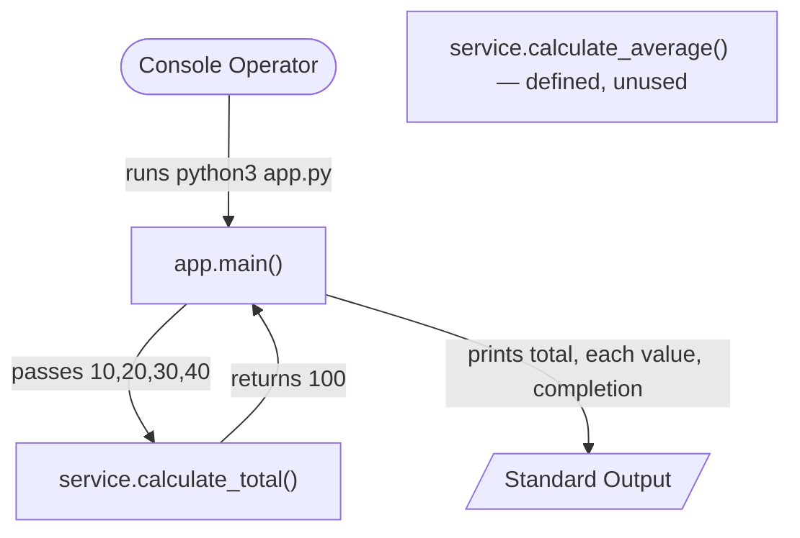
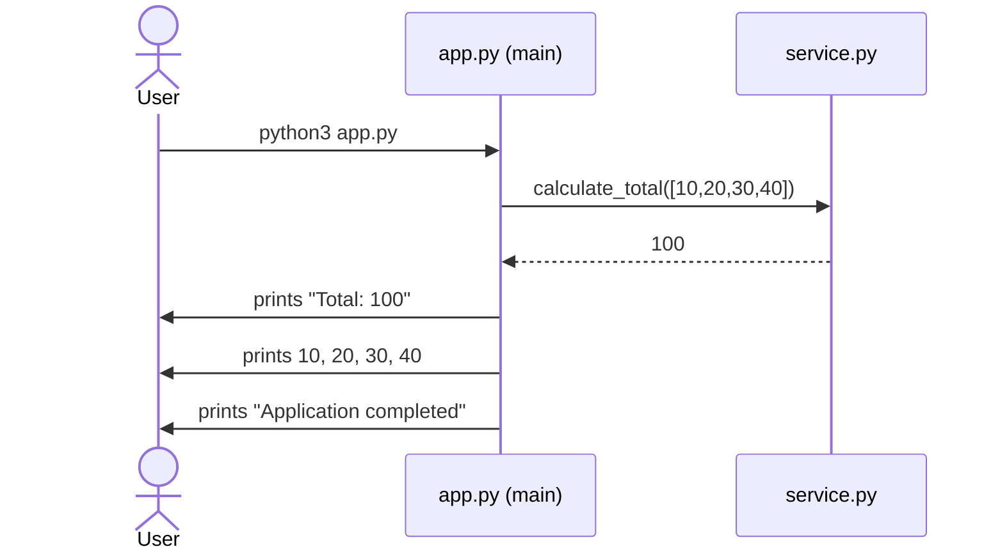

# repo_with_600K_LOC

> A minimal, dependency-free Python 3 console utility that sums a fixed list of integers and prints the total alongside each value.

## Table of Contents

- [Overview](#overview)
- [Architecture & Data Flow](#architecture--data-flow)
- [Requirements](#requirements)
- [Setup / Installation](#setup--installation)
- [Usage](#usage)
- [API Documentation](#api-documentation)
- [Inline Code Explanations](#inline-code-explanations)
- [Deployment Guide](#deployment-guide)
- [Troubleshooting](#troubleshooting)
- [Project Structure](#project-structure)

## Overview

This project is a small, deterministic console application. When run, it builds a fixed list of integers (`[10, 20, 30, 40]`), computes their sum, prints the total, echoes each individual value on its own line, and prints a completion message. It requires no configuration, no command-line arguments, no environment variables, and no third-party dependencies.

The codebase consists of two Python modules:

- **`app.py`** — the console entry point that orchestrates the workflow and writes to standard output. `Source: app.py:L1-L16`
- **`service.py`** — a pure arithmetic utility module providing `calculate_total` and `calculate_average`. `Source: service.py:L1-L15`

## Architecture & Data Flow

At runtime the operator invokes `app.py`, whose `main()` function delegates summation to `service.calculate_total()` and writes results to standard output. A second utility, `service.calculate_average()`, is defined and available but is **not currently called** by the application. `Source: service.py:L10-L14`

The single internal dependency edge is `app.py → service.calculate_total`, established by the unqualified import at `Source: app.py:L1`.

### Component / Data-Flow Diagram



### Runtime Sequence Diagram



## Requirements

- **Python 3** — minimum **3.6** (the code uses an f-string, `Source: app.py:L8`); verified on **CPython 3.12.3**.
- **No third-party dependencies.** `service.py` imports nothing and `app.py` imports only the local `service` module. There is no `requirements.txt`, `pyproject.toml`, `setup.py`, or `package.json`, and no virtual environment or `pip install` step is required.

## Setup / Installation

No build or dependency-installation step is needed.

1. Obtain the code (clone the repository or copy the files).
2. Ensure `app.py` and `service.py` are in the **same directory** (co-located). `app.py` uses an unqualified import (`from service import calculate_total`, `Source: app.py:L1`), so the two files must sit side by side on the import path.
3. Confirm Python 3 is available:

   ```bash
   python3 --version
   ```

There is nothing to install.

## Usage

Run the application from the directory that contains both files:

```bash
python3 app.py
```

Expected output (verified):

```text
Total: 100
10
20
30
40
Application completed
```

The total `100` is the sum of `10 + 20 + 30 + 40`. `Source: app.py:L3-L13`

## API Documentation

This project exposes a **module/function API only — there is no HTTP/REST API**, no web server, and no network endpoints.

| Callable | Signature | Module | Returns | Status |
|----------|-----------|--------|---------|--------|
| `calculate_total` | `calculate_total(numbers)` | `service` | Sum of `numbers` (`0` if empty) | In use |
| `calculate_average` | `calculate_average(numbers)` | `service` | Mean of `numbers` (`0` if empty) | Defined but **unused** |
| `main` | `main()` | `app` | `None` (prints to stdout) | Entry point |

### `service.calculate_total(numbers)`

Returns the sum of a sequence of numbers, accumulating from `0`; returns `0` for an empty input. `Source: service.py:L1-L7`

- **Parameters:** `numbers` — an iterable of numeric values.
- **Returns:** the accumulated total.
- **Example:**

  ```python
  from service import calculate_total

  calculate_total([10, 20, 30, 40])   # -> 100
  calculate_total([])                 # -> 0
  ```

### `service.calculate_average(numbers)`

Returns the arithmetic mean of a sequence of numbers, or `0` for empty/falsy input (guarding against division by zero); computes `calculate_total(numbers) / len(numbers)`. **This function is defined and available but is not currently called anywhere in the codebase.** `Source: service.py:L10-L14`

- **Parameters:** `numbers` — a sized iterable of numeric values (must support `len()`).
- **Returns:** the mean as a float, or `0` when the input is empty.
- **Example:**

  ```python
  from service import calculate_average

  calculate_average([10, 20, 30, 40])   # -> 25.0
  calculate_average([])                 # -> 0
  ```

### `app.main()`

Orchestrates the workflow: builds the fixed list, calls `calculate_total`, and prints the total, each value, and a completion message. Runs only under the `if __name__ == "__main__":` guard (`Source: app.py:L15-L16`); importing `app` does not execute it. `Source: app.py:L3-L13`

- **Parameters:** none.
- **Returns:** `None` (all output is a side effect on standard output).
- **Example:**

  ```bash
  python3 app.py
  ```

## Inline Code Explanations

Line numbers below reference the core executable statements of each module.

### `app.py`

```python
from service import calculate_total   # L1: import the summation helper from the local service module

def main():                           # L3: define the entry-point function
    numbers = [10, 20, 30, 40]        # L4: fixed input list (no external config/args)

    total = calculate_total(numbers)  # L6: delegate summation to the service module -> 100

    print(f"Total: {total}")          # L8: print the aggregate total (f-string)

    for number in numbers:            # L10: iterate the original list...
        print(number)                 # L11: ...printing each value on its own line

    print("Application completed")    # L13: print the completion marker

if __name__ == "__main__":            # L15: run main() only on direct execution
    main()                            # L16
```

### `service.py`

```python
def calculate_total(numbers):         # L1: summation helper
    total = 0                         # L2: accumulator starts at zero (=> 0 for empty input)

    for number in numbers:            # L4: iterate the input...
        total += number               # L5: ...adding each value to the running total

    return total                      # L7: return the accumulated sum


def calculate_average(numbers):       # L10: mean helper (currently unused)
    if not numbers:                   # L11: guard empty/falsy input...
        return 0                      # L12: ...return 0 instead of dividing by zero

    return calculate_total(numbers) / len(numbers)   # L14: mean = total / count
```

## Deployment Guide

This is a standalone script with no packaging, container, or cloud configuration.

- **Prerequisite:** a Python 3 interpreter (3.6+; verified on 3.12.3).
- **Invocation model:** run directly with `python3 app.py` from the directory that contains both `app.py` and `service.py`.
- **No packaging:** there is no wheel/`setup.py`/`pyproject.toml` build, no `Dockerfile`/container image, and no cloud or CI deployment configuration in the repository.
- **Optional containerization** (illustrative only — not part of the repository): a minimal image could copy both modules and run them, for example:

  ```dockerfile
  FROM python:3.12-slim
  WORKDIR /app
  COPY app.py service.py ./
  CMD ["python3", "app.py"]
  ```

## Troubleshooting

**`ModuleNotFoundError: No module named 'service'`**

`app.py` imports `service` with an unqualified import (`Source: app.py:L1`). This error means Python cannot find `service.py` on the import path. Fix it by ensuring `service.py` is in the **same directory** as `app.py` and by running the program from that directory (`python3 app.py`).

## Project Structure

```text
repo root
├── README.md         # This documentation hub
├── app.py            # Console entry point: main() + __main__ guard
├── service.py        # Arithmetic utilities: calculate_total, calculate_average
├── .blitzyignore     # Ignore rules (excludes *.csv)
└── large.csv         # Unused sample data — excluded via .blitzyignore; never read by the code
```

`large.csv` is **not** used by the application: it is excluded from tooling by `.blitzyignore` (`*.csv`, `Source: .blitzyignore:L1`) and is never opened or read by the code.
