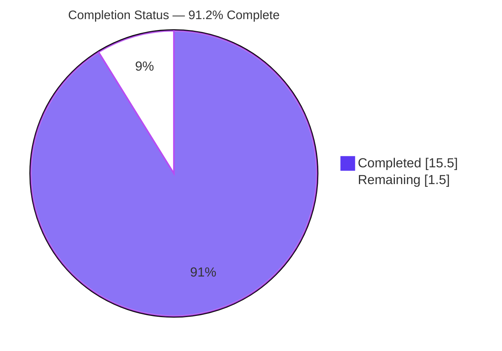
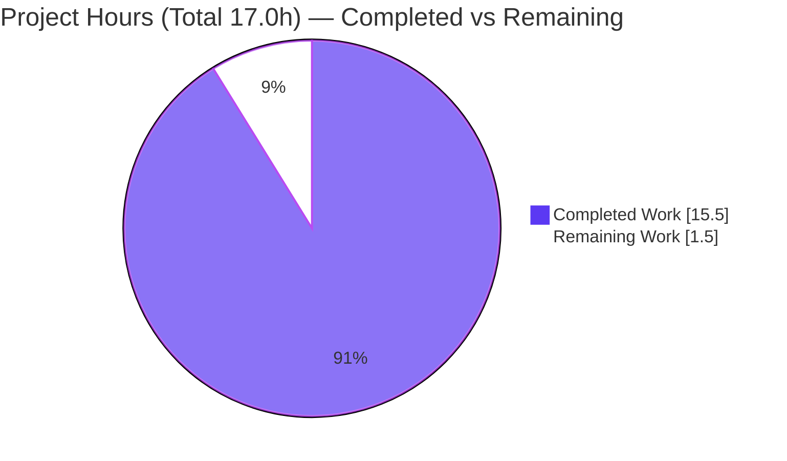
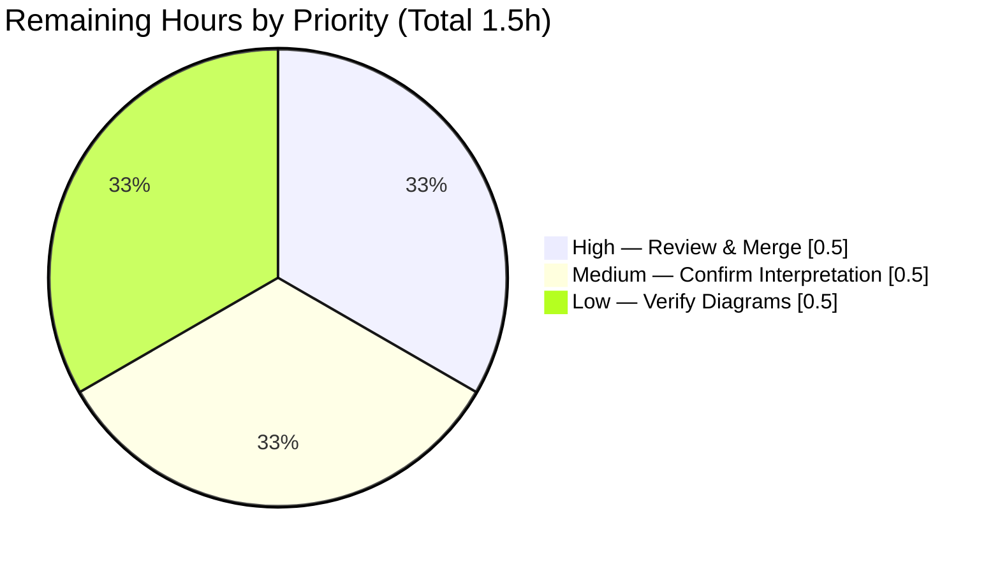

# Blitzy Project Guide

> Documentation-only engagement — comprehensive codebase documentation for a minimal Python 3 console utility.

---

## 1. Executive Summary

### 1.1 Project Overview

This project documents an existing, minimal Python 3 console utility. The application builds a fixed list of integers (`[10, 20, 30, 40]`), sums them via a helper module, and prints the total, each value, and a completion message. The engagement is **documentation-only**: no application logic, values, or output were changed. The work delivered PEP 257 Google-style docstrings for all functions and modules plus a comprehensive `README.md` (setup, API reference, deployment guide, and inline code explanations). Target consumers are developers onboarding to or maintaining the codebase. Business impact is improved comprehensibility and maintainability of a previously undocumented repository, achieved at zero runtime risk through a strict behavior-preservation gate.

### 1.2 Completion Status



**Center label: 91.2% Complete** &nbsp;·&nbsp; Completed = Dark Blue `#5B39F3` &nbsp;·&nbsp; Remaining = White `#FFFFFF`

| Metric | Value |
|--------|-------|
| **Total Hours** | 17.0 |
| **Completed Hours (AI + Manual)** | 15.5 (15.5 AI + 0.0 Manual) |
| **Remaining Hours** | 1.5 |
| **Percent Complete** | **91.2%** |

> Completion is calculated using the AAP-scoped hours methodology: `Completed 15.5h / Total 17.0h = 91.2%`. All 23 AAP-scoped requirements are complete and validated; the remaining 1.5h is entirely path-to-production human review, clarification, and merge.

### 1.3 Key Accomplishments

- ✅ Added PEP 257 Google-style docstrings to **all 3 functions** (`calculate_total`, `calculate_average`, `main`) — 100% callable coverage (was 0%).
- ✅ Added **module-level docstrings** to both source modules (`app.py`, `service.py`) — 100% module coverage (was 0%).
- ✅ Replaced the one-line `README.md` stub with a **228-line comprehensive documentation hub** containing all 4 user-requested sections (Setup, API, Deployment, Inline Explanations) plus 6 supporting sections and a Table of Contents.
- ✅ Embedded **2 Mermaid diagrams** (component/data-flow flowchart + runtime sequence) rendering natively on GitHub.
- ✅ Added **inline comments** to `app.py` and a **line-referenced code walkthrough** (19 line labels) to the README.
- ✅ Included **14 `Source: path:Lline` citations** for traceability.
- ✅ **Behavior preserved** (hard gate): docstring-stripped ASTs identical to the original; `python3 app.py` output byte-identical; compiles clean.
- ✅ Correctly resolved the `server.js`/JSDoc-vs-Python mismatch and honored `.blitzyignore` (`large.csv` untouched).

### 1.4 Critical Unresolved Issues

| Issue | Impact | Owner | ETA |
|-------|--------|-------|-----|
| _None_ — no compilation errors, failing tests, or missing functionality remain | No release blockers | — | — |

> There are **no critical unresolved issues**. All production-readiness gates passed with zero fixes required during final validation. The only outstanding items are standard path-to-production tasks (Section 1.6 / Section 2.2), none of which block release of the documentation deliverable.

### 1.5 Access Issues

| System/Resource | Type of Access | Issue Description | Resolution Status | Owner |
|-----------------|----------------|-------------------|-------------------|-------|
| _None_ | — | No access issues identified | N/A | — |

> **No access issues identified.** Repository access is confirmed, the working tree is clean, all 7 agent commits are present on branch `blitzy-6ba5cfdb-100f-44ee-8f70-84ef9cc79694`, and no external services, credentials, or third-party APIs are involved in this documentation-only engagement.

### 1.6 Recommended Next Steps

1. **[High]** Peer-review the documentation (README + docstrings) for accuracy, tone, and completeness, then approve and merge the PR to the main branch.
2. **[Medium]** Confirm the `server.js`/JSDoc interpretation with the original requester — verify that the Python PEP 257-docstring resolution satisfies intent, or determine whether a genuine JavaScript `server.js` is required (a feature-addition task outside the current documentation scope).
3. **[Low]** After merge, verify that both Mermaid diagrams render correctly in GitHub's rendered README view.

---

## 2. Project Hours Breakdown

### 2.1 Completed Work Detail

| Component | Hours | Description |
|-----------|-------|-------------|
| Repository analysis & documentation strategy | 1.5 | Resolved the `server.js`/JSDoc-vs-Python mismatch, verified the repo is pure Python (no JS/`package.json`), established PEP 257 Google-style + GitHub-Flavored Markdown conventions (AAP §0.1–0.2). |
| `service.py` docstrings | 2.0 | Module docstring + Google-style docstrings for `calculate_total` and `calculate_average`, including empty-input edge case and the defined-but-unused note. |
| `app.py` docstrings + inline comments | 1.5 | Module docstring + `main()` docstring + inline comments for fixed input, service call, and print loop. |
| README core sections | 2.5 | Overview, Requirements, Setup/Installation, Usage (with verified output), and Project Structure. |
| README API Documentation section | 1.5 | 5×3 summary table + reference entries for all 3 callables with runnable examples; explicit "no HTTP/REST API" statement. |
| README Inline Code Explanations | 1.5 | Line-referenced walkthrough of `app.py` and `service.py` (19 physical-line labels). |
| README Architecture & Data Flow + diagrams | 1.5 | Narrative plus 2 Mermaid diagrams (component/data-flow flowchart + runtime sequence). |
| README Deployment Guide + Troubleshooting | 1.0 | Interpreter prerequisite, invocation model, absence-of-packaging note, optional Dockerfile; `ModuleNotFoundError` co-location fix. |
| Source citation accuracy & QA corrections | 1.0 | F1/F2/QA-FINAL-1 fixes, ToC anchor correctness, stale-citation and walkthrough-label corrections across 4 commits. |
| Validation & behavior-preservation verification | 1.5 | Compilation, runtime output diff, functional checks, `pydoc` rendering, AST behavior-preservation proof, and linting. |
| **Total Completed** | **15.5** | |

> **Validation:** The Hours column sums to **15.5**, matching Completed Hours in Section 1.2. All components trace to specific AAP requirements. All completed work was performed autonomously (0.0 manual hours).

### 2.2 Remaining Work Detail

| Category | Hours | Priority |
|----------|-------|----------|
| Documentation peer review & PR merge to main | 0.5 | High |
| Confirm `server.js`/JSDoc interpretation with requester (docs-vs-feature decision) | 0.5 | Medium |
| Verify Mermaid diagram rendering on GitHub post-merge | 0.5 | Low |
| **Total Remaining** | **1.5** | |

> **Validation:** The Hours column sums to **1.5**, matching Remaining Hours in Section 1.2 and the "Remaining Work" value in the Section 7 pie chart. All remaining items are path-to-production activities; there are no outstanding AAP implementation tasks and no rework.

### 2.3 Hours Reconciliation

| Check | Formula | Result |
|-------|---------|--------|
| Total = Completed + Remaining | 15.5 + 1.5 | **17.0** ✅ |
| Section 2.1 total = 1.2 Completed | 15.5 = 15.5 | ✅ |
| Section 2.2 total = 1.2 Remaining | 1.5 = 1.5 | ✅ |
| Completion % | 15.5 / 17.0 × 100 | **91.2%** ✅ |

---

## 3. Test Results

No formal unit-test framework (e.g., `pytest`/`unittest`) exists in the repository, and none is required per the AAP (a test suite was explicitly out of scope). The table below aggregates the **functional and validation checks executed by Blitzy's autonomous validation systems** and independently re-confirmed during this assessment. All checks passed.

| Test Category | Framework | Total Tests | Passed | Failed | Coverage % | Notes |
|---------------|-----------|-------------|--------|--------|-----------|-------|
| Functional (pure functions) | Assertion via `python3 -c` | 4 | 4 | 0 | 100% of public callables | `calculate_total([10,20,30,40])==100`, `[]==0`; `calculate_average([10,20,30,40])==25.0`, `[]==0` |
| Compilation | `py_compile` / `compileall` | 2 | 2 | 0 | 100% of `.py` files | `app.py`, `service.py` → exit 0 |
| Runtime output | `python3 app.py` + `diff` | 1 | 1 | 0 | 100% of entry point | Byte-identical to documented output |
| Behavior preservation | AST comparison | 2 | 2 | 0 | 100% of modified source | Docstring-stripped logic identical to original |
| Documentation accuracy | Automated checks | 41 | 41 | 0 | Citations, labels, sections | Citations in bounds, walkthrough labels map to physical lines, all sections present |
| Linting | `pyflakes` + `pycodestyle` | 2 | 2 | 0 | 100% of `.py` files | Exit 0 each (PEP 8 clean, incl. W292) |
| API doc rendering | `pydoc` | 2 | 2 | 0 | 100% of modules | Docstrings render (previously blank) |
| **Total** | | **54** | **54** | **0** | | **100% pass rate** |

> **Integrity note:** Every check listed originates from Blitzy's autonomous validation logs for this project and was re-verified during this assessment (Python 3.13.7). No external or fabricated tests are included.

---

## 4. Runtime Validation & UI Verification

**Runtime health** (status indicators: ✅ Operational | ⚠ Partial | ❌ Failing):

- ✅ **Compilation** — `python3 -m py_compile app.py service.py` exits 0 with zero errors/warnings.
- ✅ **Runtime execution** — `python3 app.py` exits 0 and prints the documented output (`Total: 100` / `10` / `20` / `30` / `40` / `Application completed`), byte-identical to the pre-change run.
- ✅ **Function behavior** — all 4 functional checks pass (`calculate_total` and `calculate_average` for populated and empty inputs).
- ✅ **API documentation rendering** — `python3 -m pydoc service` / `... app` render the new docstrings; `pydoc -w` generates HTML successfully.
- ✅ **Documented troubleshooting scenario** — reproduced exactly: running `app.py` without a co-located `service.py` raises `ModuleNotFoundError: No module named 'service'` at `app.py:L18`; co-location resolves it.

**UI verification:**

- ⚠ **Not applicable** — this is a console/stdout program with **no web UI or GUI**. The verified standard-output block serves as the ground-truth "screen." No browser, page, or visual component exists to verify.

**API integration:**

- ✅ **No external/HTTP API** — the project exposes a **module/function API only**. There are no network endpoints, web server, external services, credentials, or third-party integrations to validate. The README explicitly documents this.

---

## 5. Compliance & Quality Review

Cross-mapping of AAP deliverables to Blitzy's quality and compliance benchmarks. Progress: **10 of 10 benchmarks passed (100%)**.

| AAP Deliverable | Benchmark | Status | Progress |
|-----------------|-----------|--------|----------|
| Function docstrings (3/3 callables) | PEP 257 Google-style | ✅ Pass | 100% |
| Module docstrings (2/2 modules) | PEP 257 | ✅ Pass | 100% |
| README — 4 user-requested sections | Comprehensive (Setup, API, Deployment, Inline) | ✅ Pass | 100% |
| README — 5 supporting sections | Overview, Architecture, Usage, Troubleshooting, Structure | ✅ Pass | 100% |
| Architecture diagrams (2) | AAP §0.4.3 (flowchart + sequence) | ✅ Pass | 100% |
| Source citations | AAP §0.9 (`path:Lline`) | ✅ Pass | 14 citations |
| Behavior preservation | Hard gate (AST + output identical) | ✅ Pass | 100% |
| `.blitzyignore` honored | AAP §0.10 (`large.csv` untouched) | ✅ Pass | 100% |
| Linting / style | PEP 8 via `pycodestyle`, `pyflakes` | ✅ Pass | 0 violations |
| Zero placeholders | Blitzy code-quality standard | ✅ Pass | 0 TODO/FIXME |

**Fixes applied during autonomous validation:**

- **F1** — Corrected `calculate_average` return-type documentation in both `service.py` and the README (commits `0c0aa25`, `8be0cd1`).
- **F2** — Corrected the `service.py` citation range in the README (commit `8be0cd1`).
- **Stale-citation & walkthrough-label corrections** — Aligned README source citations and `# L##` labels to physical source lines (commit `1da33bf`).
- **QA-FINAL-1** — Added a missing `Source` citation to the README Deployment Guide (commit `8b33741`).

**Outstanding compliance items:**

- One documented **assumption** requires requester confirmation: the interpretation of `server.js`/JSDoc as `app.py`/Python docstrings (AAP §0.1.3). This is tracked as a Medium-priority human task (Section 1.6 / 2.2), not a compliance failure.

---

## 6. Risk Assessment

| Risk | Category | Severity | Probability | Mitigation | Status |
|------|----------|----------|-------------|------------|--------|
| `server.js`/JSDoc scope interpretation may not match requester intent | Technical | Medium | Low | AAP explicitly flagged and documented the assumption (§0.1.3); confirm with requester before treating as feature-complete | Open (human decision) |
| `ModuleNotFoundError` if `service.py` is not co-located with `app.py` | Operational | Low | Medium | Documented in README Setup/Installation and Troubleshooting with the exact fix | Mitigated |
| Documentation drift/staleness as code evolves | Technical | Low | Low | Docstrings colocated with code; line-referenced citations ease maintenance | Mitigated |
| Mermaid diagrams may not render in non-GitHub Markdown viewers | Integration | Low | Low | GitHub renders Mermaid natively; verify post-merge (Section 1.6 task) | Mitigated (verify) |
| No automated documentation-regression test suite | Operational | Low | Low | 41 automated accuracy checks run during validation; `pydoc` renders clean; proportionate to a 2-module utility | Accepted |
| Security exposure | Security | None | None | Documentation-only; zero third-party dependencies; no network, secrets, or external/user input (hardcoded list) | None identified |

> **Overall risk posture: LOW.** No high-severity risks exist. The single open item is a scope-interpretation confirmation requiring a human decision, not a defect.

---

## 7. Visual Project Status

### Project Hours Breakdown



- **Completed Work** = 15.5h (Dark Blue `#5B39F3`) — 91.2%
- **Remaining Work** = 1.5h (White `#FFFFFF`) — 8.8%

### Remaining Work by Priority



### Remaining Hours per Category (Section 2.2)

| Category | Hours | Bar |
|----------|-------|-----|
| Documentation peer review & PR merge (High) | 0.5 | ██████ |
| Confirm `server.js`/JSDoc interpretation (Medium) | 0.5 | ██████ |
| Verify Mermaid rendering post-merge (Low) | 0.5 | ██████ |

> **Integrity:** "Remaining Work" (1.5h) equals Section 1.2 Remaining Hours and the Section 2.2 Hours total. "Completed Work" (15.5h) equals Section 1.2 Completed Hours.

---

## 8. Summary & Recommendations

**Achievements.** This documentation-only engagement is **91.2% complete** (15.5 of 17.0 hours). All 23 AAP-scoped requirements are delivered and validated: every function and module now carries PEP 257 Google-style docstrings, and the `README.md` stub has been replaced with a comprehensive, professionally structured documentation hub covering setup, a module/function API reference, a deployment guide, and line-referenced inline code explanations, complete with two Mermaid architecture diagrams and 14 source citations.

**Remaining gaps.** The outstanding 1.5 hours (8.8%) are exclusively path-to-production human activities: peer review and merge, requester confirmation of the `server.js`/JSDoc interpretation, and a post-merge Mermaid rendering check. There are **no outstanding implementation tasks, no failing tests, and no rework**.

**Critical path to production.** (1) Peer-review and merge the PR → (2) confirm the scope interpretation with the requester → (3) verify diagram rendering on GitHub. All three are low-effort and non-blocking for the documentation deliverable itself.

**Success metrics.**

| Metric | Target | Achieved |
|--------|--------|----------|
| Public callables documented | 3/3 (100%) | ✅ 3/3 |
| Modules with docstrings | 2/2 (100%) | ✅ 2/2 |
| User-requested README sections | 4/4 (100%) | ✅ 4/4 |
| Architecture diagrams | 2 | ✅ 2 |
| Behavior preserved (compile + identical output) | Yes | ✅ Yes |
| Compilation / lint / functional checks | 100% pass | ✅ 54/54 |

**Production readiness assessment.** The documentation deliverable is **production-ready pending human review**. Code behavior is provably unchanged, all quality gates pass, and no blockers exist. Recommended action: proceed to peer review and merge, and route the one interpretation question to the requester.

---

## 9. Development Guide

### 9.1 System Prerequisites

- **Operating system:** any OS with a Python 3 interpreter (Linux/macOS/Windows).
- **Python:** version **3.6 or newer** (the code uses an f-string). Verified on **CPython 3.13.7**.
- **Dependencies:** **none.** There are no third-party packages, no `requirements.txt`/`pyproject.toml`/`setup.py`/`package.json`, no virtual environment, and no `pip install` step.
- **Hardware:** negligible — a trivial console program.

### 9.2 Environment Setup

```bash
# 1. Obtain the code (clone the repository or copy the files).
# 2. Ensure app.py and service.py are in the SAME directory (co-located).
#    app.py uses an unqualified import: `from service import calculate_total` (app.py:L18)
# 3. Confirm Python 3 is available:
python3 --version        # expect: Python 3.6+ (verified on 3.13.7)
```

There is nothing to install and no environment variables, config files, or CLI arguments to set.

### 9.3 Dependency Installation

```bash
# No dependencies to install — this step is intentionally empty.
# service.py imports nothing; app.py imports only the local `service` module.
```

### 9.4 Application Startup & Verification

```bash
# Compile check (optional but recommended):
python3 -m py_compile app.py service.py   # exit 0 = success

# Run the application from the directory containing BOTH files:
python3 app.py
```

Expected output (verified, byte-identical):

```text
Total: 100
10
20
30
40
Application completed
```

Verify the pure functions directly:

```bash
python3 -c "from service import calculate_total, calculate_average; \
print(calculate_total([10,20,30,40])); print(calculate_average([10,20,30,40]))"
# -> 100
# -> 25.0
```

Render the API documentation from docstrings (zero install):

```bash
python3 -m pydoc service      # console view of service module docs
python3 -m pydoc app          # console view of app module docs
python3 -m pydoc -w service app   # optional: writes service.html and app.html
```

### 9.5 Example Usage

```python
# Import and use the utility functions in your own code:
from service import calculate_total, calculate_average

calculate_total([10, 20, 30, 40])     # -> 100
calculate_total([])                   # -> 0  (empty input)
calculate_average([10, 20, 30, 40])   # -> 25.0
calculate_average([])                 # -> 0  (guards against ZeroDivisionError)
```

### 9.6 Troubleshooting

- **`ModuleNotFoundError: No module named 'service'`** (raised at `app.py:L18`)
  - **Cause:** `service.py` is not on Python's import path.
  - **Fix:** place `service.py` in the **same directory** as `app.py` and run `python3 app.py` from that directory.
- **`python3: command not found`**
  - **Fix:** install Python 3 (3.6+), or use the correct interpreter name on your platform (e.g., `python`).
- **Mermaid diagrams show as raw code fences**
  - **Cause:** the Markdown viewer does not support Mermaid.
  - **Fix:** view the README on GitHub (native Mermaid rendering) or use a Mermaid-capable viewer.

---

## 10. Appendices

### Appendix A — Command Reference

| Command | Purpose |
|---------|---------|
| `python3 --version` | Confirm interpreter version (need 3.6+) |
| `python3 -m py_compile app.py service.py` | Compile-check both modules |
| `python3 app.py` | Run the application |
| `python3 -m pydoc service` | Render `service` docstrings (console) |
| `python3 -m pydoc app` | Render `app` docstrings (console) |
| `python3 -m pydoc -w service app` | Generate HTML API docs (`service.html`, `app.html`) |
| `python3 -m pyflakes app.py service.py` | Static analysis (unused imports/names) |
| `python3 -m pycodestyle app.py service.py` | PEP 8 style check |

### Appendix B — Port Reference

| Port | Service |
|------|---------|
| _None_ | This is a console program with no network listeners or web server. |

### Appendix C — Key File Locations

| Path | Role |
|------|------|
| `app.py` | Console entry point; `main()` + `__main__` guard (55 lines) |
| `service.py` | Arithmetic utilities: `calculate_total`, `calculate_average` (62 lines) |
| `README.md` | Comprehensive documentation hub (228 lines) |
| `.blitzyignore` | Ignore rules (`*.csv`) |
| `large.csv` | Unused 16 MB sample data — excluded via `.blitzyignore`; never read by the code |

### Appendix D — Technology Versions

| Technology | Version | Notes |
|------------|---------|-------|
| Python (runtime baseline) | 3.6+ | Minimum for f-strings |
| Python (verified) | CPython 3.13.7 | Validation environment |
| `pydoc` | Stdlib (bundled) | Docstring rendering, zero install |
| Third-party packages | None | Zero dependencies |

### Appendix E — Environment Variable Reference

| Variable | Purpose |
|----------|---------|
| _None_ | The program reads no environment variables; input is a hardcoded list (`app.py`). |

### Appendix F — Developer Tools Guide

| Tool | Use |
|------|-----|
| `pydoc` (stdlib) | Render/generate API docs from the new docstrings without any installation |
| `pyflakes` | Detect unused imports/undefined names (validation: exit 0) |
| `pycodestyle` | Enforce PEP 8 (validation: exit 0) |
| Mermaid (GitHub-native) | Renders the README's flowchart and sequence diagrams; no tooling to install |

### Appendix G — Glossary

| Term | Definition |
|------|------------|
| **PEP 257** | Python's canonical docstring convention (triple double-quoted string as the first statement). |
| **Google-style docstring** | A docstring format with `Args:`/`Returns:`/`Raises:` sections — the Python analog of JSDoc `@param`/`@returns`. |
| **Module/function API** | The set of importable, callable functions a module exposes (contrasted with an HTTP/REST API — none exists here). |
| **Behavior preservation** | The hard gate ensuring documentation edits do not change runtime logic, values, or output (verified via AST comparison and output diff). |
| **Entry point** | The runnable script (`app.py`), guarded by `if __name__ == "__main__":`. |
| **`.blitzyignore`** | Repository ignore file; excludes `*.csv`, keeping `large.csv` out of scope. |