# Technical Specification

# 1. Introduction

## 1.1 Executive Summary

The system documented in this Technical Specification is a **minimal, self-contained Python console application** that computes and reports a basic arithmetic aggregate over a fixed list of integers. The entire tracked codebase consists of three source artifacts at the repository root — `app.py` (16 lines), `service.py` (14 lines), and a single-line `README.md` — organized as a thin executable entry point plus a local arithmetic utility module. The application has **no third-party dependencies**, no build or packaging manifests, no configuration files, and no subpackages.

**Project overview.** The project separates a thin orchestration/presentation layer (`app.py`) from a reusable computation layer (`service.py`). On execution, `app.py` constructs the fixed list `[10, 20, 30, 40]`, delegates summation to `service.calculate_total`, and writes the resulting total, each individual value, and a completion message to standard output. The `service.py` module additionally defines a `calculate_average` function; this function is present in the codebase but is **not currently imported or invoked** by the entry point. Running the program (`python3 app.py`) produces deterministic output — the total `100`, the four input values on separate lines, and the message `Application completed` — and exits successfully.

**Core problem being solved.** The repository contains **no business-problem statement, requirements documentation, or domain context**; the `README.md` provides only the repository name (`# repo_with_600K_LOC`) with no description, usage, or architecture notes. Judged strictly from the code, the artifact functions as a **demonstration / reference implementation** of a well-structured Python console program: it illustrates the separation of computation logic (a dependency-free "service" module) from program orchestration and console output (an entry-point module), using a standard `if __name__ == "__main__":` execution guard. It addresses the narrow, self-contained task of aggregating a list of numeric values and presenting the result to a console operator.

**Key stakeholders and users.** No stakeholder register, ownership metadata, or user documentation is present in the repository. Based solely on how the code is structured and invoked, the applicable actors are inferred from the execution model rather than from any documented role definitions:

| Actor / Role | Basis in Repository | Interaction |
|--------------|--------------------|-------------|
| Console operator / end user | `app.py` `main()` + `__main__` guard | Runs `python3 app.py`; reads stdout output |
| Developer / maintainer | `service.py` public functions (`calculate_total`, `calculate_average`) | Reuses and extends the arithmetic utility module |

**Expected business impact and value proposition.** Because the repository is a minimal example with no stated commercial objectives, the value proposition is technical and illustrative rather than commercial: it provides a small, readable, dependency-free reference that models clean separation of concerns, deterministic behavior, and a reusable pure-function utility layer. It carries no runtime infrastructure cost (no external packages or services) and is trivial to execute in any standard Python 3 environment.

> **Note on naming vs. content.** The repository directory and `README.md` title are labeled `repo_with_600K_LOC`, but the actual tracked source comprises approximately 30 lines of Python across two files. This specification documents the repository **as it actually exists**; the "600K LOC" label is not reflected by any code, module, or dependency present in the repository.


## 1.2 System Overview

This overview describes the system's context, its high-level capabilities and components, and the criteria by which its correct operation can be verified. All statements are grounded in the repository's actual contents: the entry point `app.py`, the utility module `service.py`, and the `README.md` identifier file. The repository contains no other source, configuration, or documentation from which additional context could be drawn.

### 1.2.1 Project Context

**Business context and market positioning.** The repository provides no business, market, or product-positioning information. There is no requirements document, design note, or descriptive `README` content — `README.md` contains only the heading `# repo_with_600K_LOC`. Consequently, the system is best characterized from its code as a **standalone, single-purpose console utility / reference example** rather than a product positioned within a market segment. No positioning claims can be substantiated from the repository, and none are asserted here.

**Current system limitations (replacement/upgrade context).** There is no evidence that this codebase replaces or upgrades a prior system: no legacy modules, migration scripts, deprecation notices, versioning metadata, or changelog exist. The git history consists of five commits that only add the current files (`Initial commit`, `Add files via upload`, and the `Create app.py` / `Create service.py` / `Create .blitzyignore` commits). The project should therefore be treated as a self-contained artifact with no documented predecessor.

**Integration with the existing enterprise landscape.** The application performs **no external integration**. `service.py` has no imports whatsoever, and `app.py` imports only the local `service` module (`from service import calculate_total`). There are no network calls, database clients, message brokers, filesystem reads/writes, environment-variable lookups, or third-party SDKs. Notably, the code does **not** read the repository's `large.csv` data file (a `*.csv` artifact excluded from analysis by `.blitzyignore`); no CSV parsing or file I/O appears anywhere in the code. The system's only "interface" is standard output.

### 1.2.2 High-Level Description

**Primary system capabilities.** The application's behavior is fully deterministic and confined to numeric aggregation plus console reporting:

| Capability | Evidence in Code |
|------------|------------------|
| Sum a list of integers | `service.calculate_total` accumulates from `0` over `numbers` and returns the total |
| Report the total and each input value to the console | `app.py` prints `Total: {total}`, then each number on its own line |
| Emit a deterministic completion signal | `app.py` prints `Application completed` and exits with status `0` |
| Compute an arithmetic mean (present but not wired) | `service.calculate_average` returns `0` for falsy input, else `calculate_total(numbers) / len(numbers)` |

**Major system components.** The system comprises two Python modules with a single directional dependency between them:

| Component | File | Responsibility |
|-----------|------|----------------|
| Console entry point | `app.py` | Orchestration and presentation: builds the fixed input list, invokes the service, writes results to stdout, guarded by `__main__` |
| Arithmetic utility module | `service.py` | Pure computation: `calculate_total` (used) and `calculate_average` (defined, currently unused) |

The following diagram summarizes the components and the runtime data flow:

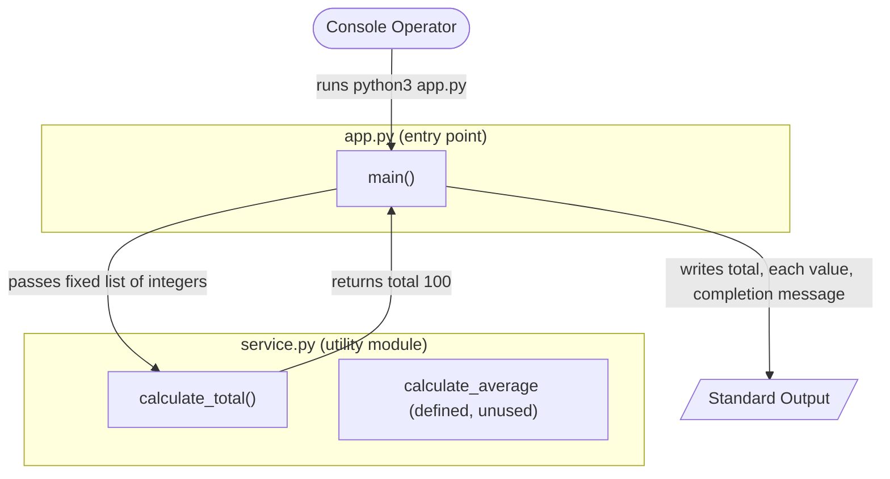
```mermaid
flowchart TD
    subgraph Entry["app.py (entry point)"]
        Main["main()"]
    end
    subgraph Service["service.py (utility module)"]
        Total["calculate_total()"]
        Average["calculate_average (defined, unused)"]
    end
    Operator(["Console Operator"]) -->|runs python3 app.py| Main
    Main -->|passes fixed list of integers| Total
    Total -->|returns total 100| Main
    Main -->|writes total, each value, completion message| Out[/"Standard Output"/]
```

**Core technical approach.** The implementation is **procedural/functional Python 3** with no object orientation (no classes are defined) and **zero external dependencies**. It applies a clean separation of concerns: pure, side-effect-free arithmetic functions live in `service.py`, while all input construction and output side effects are isolated to `app.py`. The `if __name__ == "__main__":` guard ensures `main()` runs on direct execution but not on import, allowing `app.py` to be imported without triggering console output. The single in-repository dependency edge is `app.py` → `service.calculate_total`.

### 1.2.3 Success Criteria

The repository defines **no formal objectives, KPIs, SLAs, performance targets, or acceptance tests** — there is no test suite, CI configuration, or metrics instrumentation. The criteria below are therefore **observable, verifiable behaviors derived directly from the code and a confirmed execution run**, not documented business targets.

| Criterion | Category | Verification Basis |
|-----------|----------|--------------------|
| `python3 app.py` completes with exit status `0` | Measurable objective | Confirmed by execution |
| Output is exactly `Total: 100`, then `10`/`20`/`30`/`40`, then `Application completed` | Measurable objective | Confirmed stdout of the run |
| `calculate_total([10, 20, 30, 40])` returns `100` | Correctness factor | Accumulator summation in `service.py` |
| The local `service` module imports successfully for `app.py` | Critical success factor | `from service import calculate_total` resolves |

**Critical success factors** reduce to correctness and resolvability: the `service` module must be importable from `app.py`'s location, `calculate_total` must correctly sum its input, and a Python 3 interpreter must be available. **Key performance indicators are not defined anywhere in the repository**; any performance or business KPIs would need to be introduced as new requirements rather than documented from existing evidence.


## 1.3 Scope

This scope statement is bounded strictly by what the repository implements today. The codebase is small and fully enumerable (`app.py`, `service.py`, `README.md`), so in-scope items are those directly realized in code, and out-of-scope items are those absent from the code, absent from configuration, or explicitly excluded from analysis (e.g., `*.csv` via `.blitzyignore`).

### 1.3.1 In-Scope

**Core features and functionalities.** The delivered functionality is the numeric-aggregation-and-report workflow implemented across the two modules:

| Aspect | In-Scope Detail |
|--------|-----------------|
| Must-have capabilities | Integer-list summation via `service.calculate_total`; printing the total and each individual value; emitting an `Application completed` message |
| Primary user workflow | Execute `python3 app.py`; observe the deterministic stdout sequence and exit status `0` |
| Essential integrations | None required — fully self-contained; the only dependency is the local import `from service import calculate_total` |
| Key technical requirements | A Python 3 interpreter; `service.py` co-located with `app.py` so the local module import resolves |

**Implementation boundaries.** The system operates within tightly constrained boundaries derived from the code:

| Boundary Dimension | Coverage |
|--------------------|----------|
| System boundary | Single-process console application; input hard-coded as `[10, 20, 30, 40]` in `app.py`; sole output channel is standard output |
| User groups covered | Console operator (executes the program); developer/maintainer (reuses the `service` module functions) |
| Geographic / market coverage | Not applicable — no localization, regional, currency, or market-specific logic exists |
| Data domains included | In-memory list of integers only; no persistent, external, or user-supplied data domains |

### 1.3.2 Out-of-Scope

**Explicitly excluded features and capabilities.** The following are not implemented anywhere in the repository:

| Excluded Capability | Basis for Exclusion |
|---------------------|---------------------|
| Dynamic or user-supplied input (CLI arguments, stdin, files) | Input is hard-coded in `app.py`; there is no `sys.argv`, `input()`, or file-reading code |
| Average calculation within the running application | `service.calculate_average` is defined but never imported or invoked by `app.py` |
| Data-file processing | No file I/O exists; `large.csv` is excluded by `.blitzyignore` (`*.csv`) and is not referenced by any code |
| Persistence, logging, error handling, validation, and configuration | No such code, files, environment usage, or dependencies are present |

**Future phase considerations.** The repository contains **no roadmap, backlog, or TODOs**, so no future work is formally planned. The code does, however, expose two latent extension points that are documented here only as observations, not commitments: (1) the already-defined but unused `service.calculate_average` could be wired into the entry point, and (2) the hard-coded input list could be parameterized. Neither is implemented today.

**Integration points not covered.** There is no integration with databases, network or HTTP APIs, message brokers, external services, or the filesystem (including CSV data sources). Standard output is the only external touchpoint.

**Unsupported use cases.** The following are outside the current implementation: processing arbitrary or streamed datasets; handling non-numeric or malformed input gracefully; computing averages via the application; large-scale, high-throughput, or concurrent execution; and any interactive, networked, or persistent operation.


## 1.4 References

The following repository artifacts and verifications were examined as evidence for this Introduction. No web sources were required or consulted.

**Files inspected**

- `app.py` — Established the console entry point: `main()`, the hard-coded input list `[10, 20, 30, 40]`, the import `from service import calculate_total`, the stdout sequence (`Total: {total}`, each value, `Application completed`), and the `if __name__ == "__main__":` guard.
- `service.py` — Established the local arithmetic module with no imports: `calculate_total` (used by `app.py`) and `calculate_average` (defined but unused), and their empty-input behaviors.
- `README.md` — Established that repository documentation consists solely of the H1 `# repo_with_600K_LOC`, with no description, usage, or architecture content.
- `.blitzyignore` — Established the exclusion rule `*.csv`, under which `large.csv` is treated as off-limits and excluded from all analysis and documentation.

**Folders inspected**

- `` (repository root) — Established the complete structure: exactly three source files (`app.py`, `service.py`, `README.md`) plus `.blitzyignore`, with no subfolders, no build/packaging manifests, and zero third-party dependencies.

**Repository metadata and verifications**

- `.git/` (commit history) — Established a five-commit history that only adds the current files and confirmed that no other source files have ever been tracked on the `600K_01` or `main` branches; used to conclude there is no predecessor system.
- Runtime execution of `python3 app.py` — Confirmed the deterministic output (`Total: 100`, then `10`/`20`/`30`/`40`, then `Application completed`) and a `0` exit status cited in Sections 1.2.3 and 1.3.1.


# 2. Product Requirements

## 2.1 Feature Catalog

This catalog enumerates the discrete, independently testable capabilities that are actually implemented in the repository. The codebase is fully enumerable — two Python modules (`app.py`, `service.py`) plus a single-line `README.md`, with no third-party dependencies, manifests, tests, or configuration — so the feature set is small and completely determined by direct code inspection. Three features are identified, mapped one-to-one onto the concrete code artifacts observed in Section 1.2.2 (High-Level Description):

- **F-001 — Numeric Total (Sum) Calculation** (`service.calculate_total`)
- **F-002 — Numeric Average (Mean) Calculation** (`service.calculate_average`, defined but not wired into the running application)
- **F-003 — Console Application Orchestration & Reporting** (`app.main` plus the `__main__` guard)

No additional features are asserted. The repository contains no business-problem statement, requirements document, roadmap, or domain context (`README.md` holds only the heading `# repo_with_600K_LOC`), so the "Business Value" and "User Benefits" fields below are framed technically and illustratively — consistent with Section 1.1, which characterizes the artifact as a demonstration / reference implementation rather than a market-positioned product. Where the repository provides no evidence for a field, that absence is stated plainly rather than filled with assumptions.

**Feature metadata overview**

| Feature ID | Feature Name | Category | Priority |
|------------|--------------|----------|----------|
| F-001 | Numeric Total (Sum) Calculation | Core Computation / Arithmetic Utility | Critical |
| F-002 | Numeric Average (Mean) Calculation | Core Computation / Arithmetic Utility | Low |
| F-003 | Console Application Orchestration & Reporting | Application Entry Point / Presentation | Critical |

**Status and source of truth**

| Feature ID | Status | Primary Source | Exercised by `python3 app.py`? |
|------------|--------|----------------|-------------------------------|
| F-001 | Completed | `service.py` (lines 1–7) | Yes — invoked via `calculate_total(numbers)` |
| F-002 | Completed (implemented, not integrated) | `service.py` (lines 10–14) | No — defined but never imported/invoked |
| F-003 | Completed | `app.py` (lines 3–16) | Yes — this is the entry point |

Priority rationale (evidence-based): F-001 and F-003 are rated **Critical** because they are the only capabilities exercised in the delivered runtime workflow — `app.py` fails to import without `calculate_total`, and without `main()` there is no runnable program. F-002 is rated **Low** because it is a latent capability: `app.py` performs `from service import calculate_total` only and never references `calculate_average` (see Section 1.3.2, which documents this as an out-of-scope, unused function).

### 2.1.1 F-001: Numeric Total (Sum) Calculation

**Feature metadata**

| Attribute | Value |
|-----------|-------|
| Unique ID | F-001 |
| Feature Name | Numeric Total (Sum) Calculation |
| Feature Category | Core Computation / Arithmetic Utility |
| Priority Level | Critical |
| Status | Completed |

**Description**

- **Overview:** A pure, side-effect-free function `calculate_total(numbers)` in `service.py` that computes the arithmetic sum of the elements of an input iterable. It initializes an accumulator to `0`, iterates over `numbers` adding each element, and returns the accumulated total. An empty (or falsy) iterable yields `0`.
- **Business Value:** The repository states no business objective. Judged from the code, this function is the reusable computation core on which the runnable application depends; its value is technical and illustrative — a dependency-free "service" primitive that models clean separation of computation from presentation (Section 1.1).
- **User Benefits:** For the developer/maintainer actor, it provides a small, reusable pure function that can be imported and composed. For the console operator, it produces the aggregate value (`100`) that the application reports to standard output.
- **Technical Context:** Defined in `service.py`, lines 1–7, with no imports and no type declarations. It is a single-pass accumulation loop (O(n) in the number of elements). It operates on any iterable whose elements support the `+=` operator against an integer accumulator — verified to accept lists and tuples, and to treat booleans as integers; floats are supported (`calculate_total([1.5, 2.5])` returns `4.0`). It is consumed by `app.py` (`from service import calculate_total`) and reused internally by `calculate_average` (F-002).

**Dependencies**

| Dependency Type | Detail |
|-----------------|--------|
| Prerequisite Features | None |
| System Dependencies | A Python 3 interpreter (execution confirmed under CPython 3.12); no standard-library imports are used |
| External Dependencies | None — zero third-party packages |
| Integration Requirements | Consumed by F-003 through the local import `from service import calculate_total`; requires `service.py` to be resolvable on the import path (co-located with `app.py`) |

### 2.1.2 F-002: Numeric Average (Mean) Calculation

**Feature metadata**

| Attribute | Value |
|-----------|-------|
| Unique ID | F-002 |
| Feature Name | Numeric Average (Mean) Calculation |
| Feature Category | Core Computation / Arithmetic Utility |
| Priority Level | Low |
| Status | Completed (implemented, not integrated) |

**Description**

- **Overview:** A pure function `calculate_average(numbers)` in `service.py` that computes the arithmetic mean. It returns `0` for any falsy input; otherwise it delegates to `calculate_total(numbers)` and divides by `len(numbers)`, returning the quotient (a float for non-empty numeric input — e.g., `calculate_average([10, 20, 30, 40])` returns `25.0`).
- **Business Value:** None is stated in the repository. This is a latent extension point: Section 1.3.2 records it as defined-but-unused, and identifies "wiring `calculate_average` into the entry point" as an observed (uncommitted) extension opportunity.
- **User Benefits:** Available to the developer/maintainer as a reusable mean utility. There is **no end-user benefit at runtime today**, because the entry point neither imports nor invokes it.
- **Technical Context:** Defined in `service.py`, lines 10–14. It depends on `calculate_total` (F-001) for the numerator and on the built-in `len()` for the denominator. The guard `if not numbers:` is a *falsy* check — it returns `0` for an empty list/tuple, `0`, `None`, an empty string, or `False`, thereby avoiding a division-by-zero on empty collections. It performs no I/O and mutates no state.

**Dependencies**

| Dependency Type | Detail |
|-----------------|--------|
| Prerequisite Features | F-001 (Numeric Total) — `calculate_average` calls `calculate_total` for the numerator |
| System Dependencies | A Python 3 interpreter; for truthy inputs the argument must support `len()` (a sized iterable) |
| External Dependencies | None |
| Integration Requirements | Not integrated into the running application; exercising it would require adding an import and call in `app.py` (F-003). No such wiring exists today. |

### 2.1.3 F-003: Console Application Orchestration & Reporting

**Feature metadata**

| Attribute | Value |
|-----------|-------|
| Unique ID | F-003 |
| Feature Name | Console Application Orchestration & Reporting |
| Feature Category | Application Entry Point / Presentation |
| Priority Level | Critical |
| Status | Completed |

**Description**

- **Overview:** The console entry point `main()` in `app.py` orchestrates the end-to-end workflow: it constructs the fixed input list `[10, 20, 30, 40]`, delegates summation to `calculate_total` (F-001), and writes a deterministic report to standard output — the line `Total: 100`, then each of the four values on its own line, then `Application completed`. An `if __name__ == "__main__":` guard invokes `main()` only on direct execution.
- **Business Value:** None is stated in the repository. This layer provides the runnable, self-contained demonstration of the system — the concrete workflow a console operator can execute (Section 1.3.1).
- **User Benefits:** The console operator runs `python3 app.py` and receives an immediate, deterministic textual report with a successful (`0`) exit status. The import guard lets a developer import `app` without triggering console side effects.
- **Technical Context:** Defined in `app.py`, lines 3–16. Its input is hard-coded (there is no CLI-argument, `stdin`, or file input), and standard output is its sole output channel. It carries the only in-repository dependency edge, `app.py → service.calculate_total`, and produces `stdout` side effects while performing no persistence, logging, or error handling.

**Dependencies**

| Dependency Type | Detail |
|-----------------|--------|
| Prerequisite Features | F-001 (Numeric Total) — `main()` requires `calculate_total` to compute the reported total |
| System Dependencies | A Python 3 interpreter; `service.py` co-located with `app.py` so the local module import resolves |
| External Dependencies | None |
| Integration Requirements | Depends on successful import of the local `service` module; emits results exclusively to standard output. Does not read `large.csv` or any file (no file I/O exists; `*.csv` is excluded via `.blitzyignore`). |

## 2.2 Functional Requirements

This subsection decomposes each feature into testable functional requirements using the identifier format `F-XXX-RQ-YYY`. Every acceptance criterion is grounded in behavior verified by directly reading and executing the code (see Section 1.2.3, Success Criteria). Because the repository defines **no formal performance targets, SLAs, or KPIs** (confirmed in Section 1.2.3) and performs **no input validation** (relies on Python duck typing), the "Performance Criteria" and "Validation Rules" fields report the *observed* behavior and the *absence* of formal controls rather than inventing targets.

**Requirement versioning.** All requirements below are baselined at **v1.0** against the current repository state (the five-commit history described in Section 1.4). The repository contains no changelog, issue tracker, or prior requirement records, so no earlier requirement versions exist to track.

### 2.2.1 F-001 Requirements — Numeric Total (Sum) Calculation

**Requirement details**

| Requirement ID | Description | Priority | Complexity |
|----------------|-------------|----------|------------|
| F-001-RQ-001 | Compute and return the arithmetic sum of the elements of an input iterable of numbers | Must-Have | Low |
| F-001-RQ-002 | Return the additive identity `0` when the input iterable is empty/falsy | Must-Have | Low |

**Acceptance criteria**

| Requirement ID | Acceptance Criteria (verified) |
|----------------|-------------------------------|
| F-001-RQ-001 | `calculate_total([10, 20, 30, 40])` returns `100`; `calculate_total([1.5, 2.5])` returns `4.0`; `calculate_total((1, 2, 3))` returns `6` |
| F-001-RQ-002 | `calculate_total([])` returns `0` |

**Technical specifications**

| Aspect | Specification |
|--------|---------------|
| Input Parameters | `numbers` — a single positional parameter; any iterable whose elements support `+=` against an integer accumulator (lists, tuples verified; booleans counted as integers) |
| Output / Response | A single numeric return value (the sum); type follows Python numeric promotion (`int` for integer inputs, `float` when any element is a float) |
| Performance Criteria | No formal target defined in the repository. Observed algorithm is a single O(n) accumulation pass over the iterable; trivial for the four-element application input |
| Data Requirements | Operates entirely on the in-memory iterable passed by the caller; no persistent, external, or file-based data (does not read `large.csv`) |

**Validation rules**

| Category | Rule (as implemented) |
|----------|----------------------|
| Business Rules | Summation starts from `0`, so an empty iterable yields `0` (additive identity) |
| Data Validation | None performed. Non-iterable input raises `TypeError: 'int' object is not iterable`; a non-numeric element raises `TypeError: unsupported operand type(s) for +=`. Errors are unhandled and propagate to the caller |
| Security Requirements | None applicable — no untrusted input, no I/O, no secrets; input is supplied in-process by the caller |
| Compliance Requirements | None specified in the repository |

### 2.2.2 F-002 Requirements — Numeric Average (Mean) Calculation

**Requirement details**

| Requirement ID | Description | Priority | Complexity |
|----------------|-------------|----------|------------|
| F-002-RQ-001 | Compute and return the arithmetic mean (sum ÷ count) for a non-empty numeric iterable | Should-Have | Low |
| F-002-RQ-002 | Return `0` for any falsy input, guarding against division by zero on empty collections | Must-Have | Low |

**Acceptance criteria**

| Requirement ID | Acceptance Criteria (verified) |
|----------------|-------------------------------|
| F-002-RQ-001 | `calculate_average([10, 20, 30, 40])` returns `25.0`; `calculate_average([2, 3])` returns `2.5`; `calculate_average([7])` returns `7.0` |
| F-002-RQ-002 | `calculate_average([])` returns `0`; `calculate_average(0)` returns `0` |

**Technical specifications**

| Aspect | Specification |
|--------|---------------|
| Input Parameters | `numbers` — a single positional parameter; for truthy inputs it must be a sized iterable (supports `len()`) whose elements are summable by `calculate_total` |
| Output / Response | A single numeric return value: `0` for falsy input, otherwise a `float` quotient (`calculate_total(numbers) / len(numbers)`) |
| Performance Criteria | No formal target defined. Observed cost is one O(n) pass via `calculate_total` plus a single division; not exercised at application runtime |
| Data Requirements | In-memory iterable supplied by the caller; no persistent or external data |

**Validation rules**

| Category | Rule (as implemented) |
|----------|----------------------|
| Business Rules | `if not numbers:` returns `0` — a falsy check that treats empty list/tuple, `0`, `None`, empty string, and `False` alike, preventing division by zero |
| Data Validation | None performed. Non-iterable input raises `TypeError` (not iterable); a truthy but non-numeric input (e.g., `'abc'`) raises `TypeError` from the summation step |
| Security Requirements | None applicable — pure computation, no I/O, no untrusted input |
| Compliance Requirements | None specified in the repository |

### 2.2.3 F-003 Requirements — Console Application Orchestration & Reporting

**Requirement details**

| Requirement ID | Description | Priority | Complexity |
|----------------|-------------|----------|------------|
| F-003-RQ-001 | Construct the fixed input dataset `[10, 20, 30, 40]` and compute its total via the service layer | Must-Have | Low |
| F-003-RQ-002 | Emit the deterministic report to standard output and exit successfully | Must-Have | Low |
| F-003-RQ-003 | Execute `main()` only on direct invocation, remaining side-effect-free on import | Should-Have | Low |

**Acceptance criteria**

| Requirement ID | Acceptance Criteria (verified) |
|----------------|-------------------------------|
| F-003-RQ-001 | On run, `main()` builds `[10, 20, 30, 40]` and obtains `100` from `calculate_total(numbers)` |
| F-003-RQ-002 | `python3 app.py` prints exactly `Total: 100`, then `10`, `20`, `30`, `40`, then `Application completed`, and exits with status `0` |
| F-003-RQ-003 | The `if __name__ == "__main__":` guard is present; importing `app` does not invoke `main()` or produce console output |

**Technical specifications**

| Aspect | Specification |
|--------|---------------|
| Input Parameters | None — no CLI arguments, `stdin`, environment variables, or file inputs; the dataset is hard-coded in `main()` |
| Output / Response | Six lines of text to standard output (total, four values, completion message); process exit status `0` |
| Performance Criteria | No formal target defined. Work is one `calculate_total` call plus six `print` statements over a fixed four-element list |
| Data Requirements | A single hard-coded in-memory list `[10, 20, 30, 40]`; no persistent or external data source is read |

**Validation rules**

| Category | Rule (as implemented) |
|----------|----------------------|
| Business Rules | The reported total must be produced by the shared `calculate_total` service (single source of truth); output order is total → each value → completion message |
| Data Validation | None performed; the fixed, in-code dataset is trusted and never externally supplied |
| Security Requirements | None applicable — no untrusted input, no file/network I/O, no credentials or secrets |
| Compliance Requirements | None specified in the repository |

## 2.3 Feature Relationships

This subsection documents only the relationships that are clearly evident in the source code. The repository has exactly one in-repository dependency edge at the module level (`app.py → service.calculate_total`) plus one internal call within the service module (`calculate_average → calculate_total`); no other integration exists (no databases, network, message brokers, or filesystem — see Section 1.2.1).

### 2.3.1 Feature Dependencies Map

The following diagram shows the dependency and call relationships among the three features and the external actor/output. A solid arrow denotes an active runtime dependency; the dashed arrow denotes the internal call from the currently unused `calculate_average`.

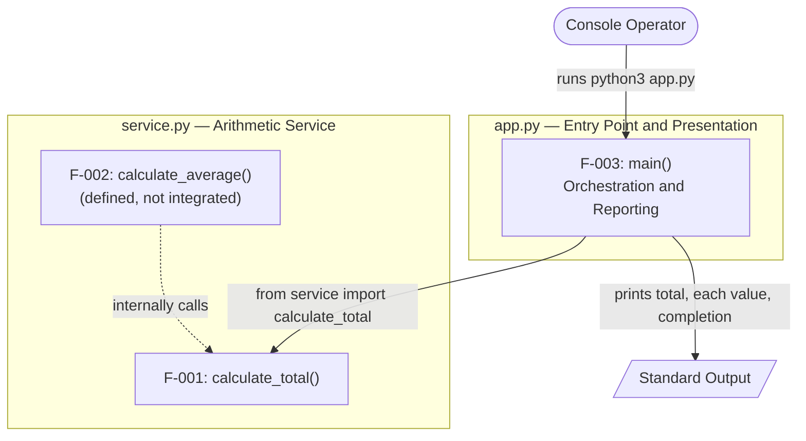
```mermaid
flowchart TD
    Operator(["Console Operator"])
    subgraph AppLayer["app.py — Entry Point and Presentation"]
        F003["F-003: main()<br/>Orchestration and Reporting"]
    end
    subgraph ServiceLayer["service.py — Arithmetic Service"]
        F001["F-001: calculate_total()"]
        F002["F-002: calculate_average()<br/>(defined, not integrated)"]
    end
    Stdout[/"Standard Output"/]
    Operator -->|"runs python3 app.py"| F003
    F003 -->|"from service import calculate_total"| F001
    F002 -.->|"internally calls"| F001
    F003 -->|"prints total, each value, completion"| Stdout
```

Key observations from the map:

- **F-003 depends on F-001** through the import `from service import calculate_total` and the call in `main()`. This is the only edge exercised end-to-end when the application runs.
- **F-002 depends on F-001** internally (`calculate_average` invokes `calculate_total`), but **no feature depends on F-002** — the entry point never imports or calls it, so F-002 is a leaf with no inbound runtime edge.
- There is **no dependency from F-003 to F-002**; the mean capability is disconnected from the runnable workflow.

### 2.3.2 Integration Points

| Integration Point | Type | Description |
|-------------------|------|-------------|
| `from service import calculate_total` | Internal module import (`app.py` → `service.py`) | The sole cross-module linkage; binds F-003 to F-001 and requires `service.py` to resolve on the import path |
| `calculate_average` → `calculate_total` | Internal function call within `service.py` | Reuses F-001 as the numerator source for F-002 |
| `print(...)` to standard output | Outbound presentation channel | F-003's only external touchpoint; six lines of text plus exit status `0` |
| External systems (DB, network, files) | None | No such integrations exist; `large.csv` is not read by any code and is excluded via `.blitzyignore` |

### 2.3.3 Shared Components

| Shared Component | Provided By | Consumed By |
|------------------|-------------|-------------|
| `service.py` module | Arithmetic service module | `app.py` (F-003) via import; internally by F-002 |
| `calculate_total()` function (F-001) | `service.py` | F-003 (application total) and F-002 (average numerator) — reused by two callers |

`calculate_total` is the single most-shared unit in the system: it is both the application's computation primitive and the building block of the average function, making it the focal point of the dependency graph.

### 2.3.4 Common Services

The repository exposes one common service layer: **`service.py`**, a dependency-free arithmetic utility module. It centralizes numeric computation (`calculate_total`, `calculate_average`) and is the shared "service" that the presentation layer (`app.py`) consumes. This separation — pure computation in `service.py`, orchestration and I/O in `app.py` — is the core architectural pattern described in Section 1.2.2. No other common/shared services (configuration, logging, persistence, authentication) exist in the codebase.

## 2.4 Implementation Considerations

This subsection records the technical constraints, performance, scalability, security, and maintenance considerations that follow from the observed implementation. The repository defines no formal non-functional targets (no SLAs, KPIs, or performance budgets — Section 1.2.3), so the considerations below describe the *properties and limits inherent in the code as written*, not documented requirements.

### 2.4.1 F-001 — Numeric Total (Sum) Calculation

| Consideration | Detail |
|---------------|--------|
| Technical Constraints | Requires a Python 3 interpreter; no type hints (duck-typed `numbers`); correctness depends on elements supporting `+=` against an integer accumulator; no error handling |
| Performance Requirements | None formally specified; a single O(n) accumulation pass; effectively instantaneous for the application's four-element input |
| Scalability Considerations | Single-threaded, in-memory iteration; scales linearly with element count but holds all caller-supplied elements in memory; no streaming, batching, or parallelism |
| Security Implications | Minimal — pure function, no I/O, no untrusted input, no secrets. The only exposure is an unhandled `TypeError` propagating to the caller on malformed input (an availability, not confidentiality, concern) |
| Maintenance Requirements | No automated tests or CI exist; the function is small and single-responsibility. It is shared by F-002 and F-003, so any change to its contract has two downstream consumers |

### 2.4.2 F-002 — Numeric Average (Mean) Calculation

| Consideration | Detail |
|---------------|--------|
| Technical Constraints | Requires Python 3; depends on `calculate_total` (F-001) and the built-in `len()`, so truthy inputs must be sized iterables (pure generators/streams are unsupported); no type hints or error handling |
| Performance Requirements | None specified; one O(n) pass through `calculate_total` plus a single division; not on the application's runtime path |
| Scalability Considerations | Same in-memory, single-pass profile as F-001, with the added constraint that the input must support `len()` |
| Security Implications | Minimal — pure function, no I/O. A truthy but non-numeric input (e.g., a non-empty string) raises an unhandled `TypeError` from the summation step |
| Maintenance Requirements | Latent/unused code: not imported by the entry point and not covered by any test, so it risks silent drift. The `if not numbers:` falsy guard also returns `0` for `0`, `None`, `''`, and `False`, which may surprise future maintainers; activating it would require wiring into `app.py` and adding tests |

### 2.4.3 F-003 — Console Application Orchestration & Reporting

| Consideration | Detail |
|---------------|--------|
| Technical Constraints | Requires `service.py` co-located so the local import resolves; input is hard-coded (`[10, 20, 30, 40]`); standard output is the only channel; behavior gated by the `if __name__ == "__main__":` guard |
| Performance Requirements | None specified; constant, trivial workload — one `calculate_total` call and six `print` calls |
| Scalability Considerations | Single-process, single-run design with no concurrency and a non-parameterized dataset; not intended for large, streamed, or high-throughput workloads (Section 1.3.2) |
| Security Implications | Minimal — no untrusted input, no file/network I/O, no credentials; the trusted, in-code dataset removes injection-style exposure |
| Maintenance Requirements | No tests or CI; output correctness is coupled to exact literal strings and ordering, making the report format brittle if changed without care. The `__main__` guard keeps the module import-safe, which aids future testability; the module depends on F-001 remaining importable |

## 2.5 Traceability Matrix

This matrix traces every functional requirement to its implementing feature, its exact source location, and the method by which it was verified. Verification is either **Executed** (confirmed by running code and observing output) or **Inspection** (confirmed by reading the source).

### 2.5.1 Requirement-to-Source Traceability

| Requirement ID | Feature | Source (file: lines) | Verification Method and Result |
|----------------|---------|----------------------|--------------------------------|
| F-001-RQ-001 | F-001 | `service.py`: 1–7 | Executed — `calculate_total([10,20,30,40])` = `100` |
| F-001-RQ-002 | F-001 | `service.py`: 2, 7 | Executed — `calculate_total([])` = `0` |
| F-002-RQ-001 | F-002 | `service.py`: 14 | Executed — `calculate_average([10,20,30,40])` = `25.0` |
| F-002-RQ-002 | F-002 | `service.py`: 11–12 | Executed — `calculate_average([])` = `0`; `calculate_average(0)` = `0` |
| F-003-RQ-001 | F-003 | `app.py`: 4, 6 | Executed — `main()` builds `[10,20,30,40]`, obtains `100` |
| F-003-RQ-002 | F-003 | `app.py`: 8–13 | Executed — stdout matches expected six lines; exit status `0` |
| F-003-RQ-003 | F-003 | `app.py`: 15–16 | Inspection — `if __name__ == "__main__":` guard present |

### 2.5.2 Feature-to-Requirement Coverage Summary

| Feature | Requirements | Must-Have Count | Exercised at Runtime |
|---------|--------------|-----------------|----------------------|
| F-001 | F-001-RQ-001, F-001-RQ-002 | 2 | Yes |
| F-002 | F-002-RQ-001, F-002-RQ-002 | 1 | No (defined, not integrated) |
| F-003 | F-003-RQ-001, F-003-RQ-002, F-003-RQ-003 | 2 | Yes |

### 2.5.3 Links to Related Specifications and Process Flowcharts

| Requirements Artifact | Related Specification / Flowchart |
|-----------------------|-----------------------------------|
| Feature-to-component mapping (all features) | Section 1.2.2 High-Level Description — capability and component tables, and the runtime data-flow flowchart |
| Feature dependencies map | Section 2.3.1 Feature Dependencies Map (this document) |
| In-scope workflow and boundaries (F-001, F-003) | Section 1.3.1 In-Scope |
| Unused-capability and non-integration notes (F-002) | Section 1.3.2 Out-of-Scope |
| Acceptance criteria / success basis (all features) | Section 1.2.3 Success Criteria |
| Evidence files and runtime verification | Section 1.4 References; Section 2.6 References (this document) |

### 2.5.4 Assumptions and Constraints

The requirements in this section rest on the following explicit assumptions and constraints, all derived from the repository state:

- **Assumption — runtime environment:** A Python 3 interpreter is available (execution confirmed under CPython 3.12). No interpreter version is pinned anywhere in the repository (no manifest exists).
- **Assumption — module co-location:** `service.py` resides alongside `app.py` so that `from service import calculate_total` resolves; there is no packaging metadata to enforce this.
- **Constraint — fixed input:** The application dataset is hard-coded as `[10, 20, 30, 40]`; there is no mechanism to supply alternative input (no CLI arguments, `stdin`, or file input).
- **Constraint — no validation or error handling:** Requirements assume well-formed numeric iterables; malformed input produces unhandled `TypeError`s rather than validated error responses.
- **Constraint — F-002 not integrated:** The average feature's requirements describe a defined-but-unwired capability; they are not exercised by the delivered application.
- **Constraint — no formal non-functional targets:** No SLAs, KPIs, or performance budgets exist in the repository; performance-related statements describe observed algorithmic behavior only.

## 2.6 References

The following repository artifacts, verifications, and specification sections were used as evidence for this Product Requirements section. No web sources were required or consulted.

**Files inspected**

- `app.py` — Established F-003: the console entry point `main()`, the hard-coded input list `[10, 20, 30, 40]`, the import `from service import calculate_total` (which does *not* import `calculate_average`), the stdout report sequence (`Total: {total}`, each value, `Application completed`), and the `if __name__ == "__main__":` guard.
- `service.py` — Established F-001 (`calculate_total`, lines 1–7) and F-002 (`calculate_average`, lines 10–14), including the accumulator-from-`0` summation, the `if not numbers:` falsy guard, and the reuse of `calculate_total` inside `calculate_average`.
- `README.md` — Established that the repository provides no requirements, domain, or business context (only the H1 `# repo_with_600K_LOC`), informing the technical/illustrative framing of the Business Value and User Benefits fields.
- `.blitzyignore` — Established the `*.csv` exclusion rule under which `large.csv` is off-limits and confirmed no code reads it (basis for the "no file I/O / no external data" statements).

**Folders inspected**

- `` (repository root) — Established the complete structure: exactly three source files (`app.py`, `service.py`, `README.md`) plus `.blitzyignore`, with no subfolders, no build/packaging manifests, no tests, and zero third-party dependencies.

**Repository metadata and runtime verifications**

- `__pycache__/service.cpython-312.pyc` — Confirmed the module has been executed under CPython 3.12 (basis for the runtime-environment assumption).
- `.git/` (commit history) — Established the five-commit history (`Initial commit`, `Add files via upload`, `Create app.py`, `Create service.py`, `Create .blitzyignore`) supporting the requirement-versioning baseline (v1.0) and the absence of prior requirement records.
- Runtime execution of `python3 app.py` — Confirmed the deterministic output (`Total: 100`, then `10`/`20`/`30`/`40`, then `Application completed`) and exit status `0`, verifying F-003-RQ-001 and F-003-RQ-002.
- Function probes of `service.py` — Verified F-001/F-002 acceptance criteria (`calculate_total([10,20,30,40])`=`100`, `calculate_total([])`=`0`, `calculate_total([1.5,2.5])`=`4.0`, `calculate_average([10,20,30,40])`=`25.0`, `calculate_average([])`=`0`, `calculate_average([2,3])`=`2.5`) and the unhandled-`TypeError` edge behavior underpinning the validation-rule statements.

**Technical specification sections cross-referenced**

- Section 1.1 Executive Summary — Product framing as a demonstration/reference implementation; actor roles.
- Section 1.2 System Overview — Capability and component tables (1.2.2), runtime data-flow flowchart (1.2.2), and the "no formal objectives/KPIs/SLAs" basis (1.2.3).
- Section 1.3 Scope — In-scope workflow and boundaries (1.3.1) and out-of-scope items including the unused `calculate_average` (1.3.2).
- Section 1.4 References — Corroborating evidence inventory and runtime verification.

# 3. Technology Stack

## 3.1 Programming Languages

The system is implemented in a single programming language: **Python 3**. Both executable modules — the console entry point `app.py` and the arithmetic utility module `service.py` — are pure Python, and the only other tracked file (`README.md`) is Markdown used solely as a repository identifier. No other programming, scripting, templating, or query language appears anywhere in the repository. This single-language footprint is consistent with the "procedural/functional Python 3 … with zero external dependencies" characterization recorded in Section 1.2.2.

**Language inventory by component**

| Component | File(s) | Language | Runtime / Version Evidence |
|-----------|---------|----------|----------------------------|
| Console entry point | `app.py` | Python 3 | Executed under CPython 3.12 |
| Arithmetic utility module | `service.py` | Python 3 | `__pycache__/service.cpython-312.pyc` — CPython 3.12 bytecode |
| Repository identifier | `README.md` | Markdown | Not applicable — single H1 line, no runtime role |

**Observed version.** The repository pins no language version in any manifest — there is no `pyproject.toml`, `setup.py`, `.python-version`, or `runtime.txt`. The authoritative version signal is the compiled bytecode cache `__pycache__/service.cpython-312.pyc`, whose `cpython-312` tag and magic header (`cb0d0d0a`) identify **CPython 3.12**; the interpreter observed in the environment is **CPython 3.12.3**. The lowest language level the source is actually compatible with is bounded by its use of an f-string literal — `print(f"Total: {total}")` in `app.py` — a syntax introduced in **Python 3.6**; no construct requiring a higher minimum was observed.

**Selection rationale (as evidenced by the code).** The codebase is a ~30-line procedural/functional program with no classes and no external dependencies (Section 1.2.2). Python 3 aligns naturally with this profile: its interpreted, "batteries-included" model lets the two modules run directly with no compilation or packaging step, its high-level built-ins (`print`, `len`, f-strings) express the entire program without any library, and a Python 3 interpreter is the only prerequisite for execution (Sections 1.3.1 and 2.4). These are the properties the implementation actually exhibits; the repository contains no design note stating an author's intent beyond what the code demonstrates.

**Constraints and dependencies.**

- **Interpreter requirement.** A **Python 3 interpreter** is required to run the program (Sections 1.3.1, 2.4); there is no compiled binary, packaged wheel, or alternative runtime.
- **Module co-location.** `app.py` performs an unqualified local import, `from service import calculate_total`, so `service.py` must be **co-located on the import path** (same directory). There is no package structure (`__init__.py`) and no installable distribution.
- **Invocation model.** Neither module carries a shebang line or an encoding declaration, so they are intended to be launched explicitly through the interpreter (`python3 app.py`) rather than executed as self-standing files.
- **Security posture.** The stack is a single, memory-managed, interpreted language with no native extensions, no foreign-function interface, and no third-party or compiled binaries; the only generated artifact is the local `.pyc` bytecode cache produced automatically by CPython on import.

## 3.2 Frameworks & Libraries

**No application frameworks are present in this system.** There is no web framework (e.g., Flask or Django), no CLI framework, no test framework, no ORM, and no asynchronous or data-processing framework. This is verified two ways: the repository declares no dependency manifest of any kind, and the complete import graph consists of a single intra-project statement — `from service import calculate_total` in `app.py` (Section 1.2.1). Consequently, none of the frameworks that a conventional template might assume (web framework, cloud SDK, AI framework, etc.) apply here.

**Standard library / built-in usage.** The program relies exclusively on the **Python Standard Library and language built-ins** bundled with the CPython 3.12 runtime — and, more precisely, only on the *built-in namespace*: it issues **no `import` of any standard-library module** (no `os`, `sys`, `json`, `csv`, `argparse`, `logging`, or others). The specific facilities exercised are:

| Facility | Type | Where Used | Purpose |
|----------|------|-----------|---------|
| `print()` | Built-in function | `app.py` | Write the total, each value, and completion message to standard output |
| `len()` | Built-in function | `service.py` | Divisor for the mean in `calculate_average` |
| f-string formatting | Language syntax (Python 3.6+) | `app.py` | Render `Total: {total}` |
| `for … in` iteration | Language construct | `app.py`, `service.py` | Accumulate the sum and print each input value |

**Versions & compatibility.** Because no external libraries are declared, there are no third-party library versions to manage and no version-conflict surface. The only versioned dependency is the interpreter together with its bundled standard library, both at **CPython 3.12.x** (observed **3.12.3**). The standard library is not versioned independently — it is released in lockstep with the interpreter — so compatibility holds for any CPython that supports f-strings (**≥ 3.6**) and is validated at **3.12**.

**Justification.** For a program of this size and single responsibility — numeric aggregation plus console reporting — a zero-framework, standard-library-only approach is appropriate and matches the deliberate "zero external dependencies" design recorded in Section 1.2.2. It minimizes the maintenance and security surface (no framework CVEs, no dependency-upgrade treadmill), keeps the artifact fully self-contained, and allows the program to run on any Python 3 interpreter without an install or build step.

## 3.3 Open Source Dependencies

**The system has no third-party or open-source runtime dependencies.** A whole-repository search found no dependency manifest and no lockfile of any ecosystem — specifically no `requirements.txt`, `pyproject.toml`, `Pipfile`/`Pipfile.lock`, `poetry.lock`, `setup.py`/`setup.cfg`, `package.json`, `package-lock.json`, or `yarn.lock`. Correspondingly, no external package registry (PyPI, npm, or any other) is consulted, and no vendored/bundled third-party code exists in the tree.

| Dependency Aspect | Status | Evidence |
|-------------------|--------|----------|
| Declared runtime dependencies | None | No manifest file present anywhere in the repository |
| Lockfile / pinned versions | None | No `*.lock` file present |
| Package registry usage | None | No manifest referencing PyPI/npm/etc.; no install step |
| Vendored third-party source | None | Tree contains only `app.py`, `service.py`, `README.md` |
| Import of third-party modules | None | Sole import is the local `from service import calculate_total` |

The only "dependency" of the application is the local module edge `app.py → service.calculate_total`, which is first-party source within the same repository rather than an external package. The Python **standard library** relied upon (Section 3.2) ships with the CPython 3.12 interpreter and is therefore not an independently distributed open-source dependency.

**Security implications.** With zero external packages, the system carries **no third-party software supply-chain exposure**: there are no transitive dependencies to audit, no dependency CVEs to track, no lockfile integrity to maintain, and no registry-compromise or typosquatting vector. This is a direct security benefit of the minimal design, at the cost of any functionality such libraries would otherwise provide (none of which this program requires).

## 3.4 Third-Party Services

**The application integrates with no third-party services at runtime.** As established in Section 1.2.1, the code makes no network calls and uses no SDKs, and its only "interface" is standard output. The categories a conventional integration template might expect are therefore all absent here:

| Service Category | Present? | Evidence / Notes |
|------------------|----------|------------------|
| External APIs / integrations | No | No HTTP client, socket, or SDK usage; no network I/O anywhere in the code |
| Authentication services (e.g., Auth0) | No | No identity, login, token, or session logic; the program has no users or protected resources |
| Monitoring / APM / logging services | No | No metrics, tracing, or logging instrumentation; no `logging` import (Section 3.2) |
| Cloud services (e.g., AWS, GCP, Azure) | No | No cloud SDK, credentials, endpoint configuration, or infrastructure code |
| Message brokers / queues | No | No broker client or messaging code (Section 1.3.2) |

**Runtime touchpoint.** The single external touchpoint at execution time is the process's **standard output stream**, a local operating-system facility rather than a networked third-party service. No outbound connections are opened and no remote endpoints are contacted.

**Source-control host (development/tooling layer only).** The one external system associated with the repository is its **Git remote host, GitHub**, where the `origin` remote is configured. This is a development/collaboration touchpoint for storing and sharing source, not a runtime dependency of the application.

**Security implications.** Because there is no runtime network activity, external API, or credential usage, the application presents **no outbound attack surface and stores no service secrets in its tracked source files** (`app.py`, `service.py`, `README.md` contain no keys, tokens, or endpoints). Any credential used to reach the GitHub remote lives in local Git configuration outside the tracked application code and must continue to be managed there rather than committed to the repository.

## 3.5 Databases & Storage

**The system uses no database and no persistent storage of any kind.** There is no relational database, no NoSQL store (e.g., MongoDB), no caching layer (e.g., Redis or Memcached), and no object/blob storage (e.g., Amazon S3). This is consistent with Section 1.3.2, which records that persistence and configuration are out of scope and that "no such code, files, environment usage, or dependencies are present."

| Storage Concern | Technology | Status / Evidence |
|-----------------|-----------|-------------------|
| Primary database | None | No database client/driver or connection code |
| Secondary database | None | No secondary datastore of any kind |
| Caching layer | None | No cache client or in-process cache structure |
| Object / file storage | None | No filesystem reads or writes in any module |
| Persistence strategy | In-memory only | Data exists solely for the process lifetime |

**Data persistence strategy.** The application's data model is a single **hard-coded, in-memory Python list**, `[10, 20, 30, 40]`, constructed in `app.py` at runtime (Section 1.3.1). It is transient: it is created when `main()` runs, consumed by `service.calculate_total`, reported to standard output, and discarded when the process exits. Nothing is read from or written to durable storage, so there is no schema, no migration, no connection pool, and no data-at-rest to secure.

**Note on the CSV artifact.** The repository contains a data file, `large.csv`, but it is **not part of the storage architecture**: it is excluded from analysis by `.blitzyignore` (`*.csv`) and, critically, **no code reads it** — there is no file I/O or CSV parsing anywhere in `app.py` or `service.py` (Sections 1.2.1 and 1.3.2). It therefore imposes no database, storage, or parsing dependency on the system.

**Security implications.** With no datastore and no persistence, the system has **no data-at-rest, no connection credentials, and no query surface**, eliminating entire classes of exposure (injection, credential leakage, backup/exfiltration risk). The only data handled is the trusted, in-code literal list.

## 3.6 Development & Deployment

The development and deployment surface is intentionally minimal: the toolchain is limited to a Python 3 interpreter and Git, and there is no build, containerization, or CI/CD machinery. This matches Section 2.4, which records that "No automated tests or CI exist."

| Aspect | Technology / Status | Version | Evidence |
|--------|---------------------|---------|----------|
| Language runtime & dev tool | CPython interpreter | 3.12.3 (bytecode tagged `cpython-312`) | `__pycache__/service.cpython-312.pyc` |
| Version control | Git | 2.43.0 (observed client) | `.git/` present; `origin` remote on GitHub |
| Build system | None | — | No `Makefile`, build backend, `tox`/`nox`, or packaging config |
| Containerization | None | — | No `Dockerfile`, `docker-compose`, or image/orchestration manifests |
| CI/CD | None | — | No `.github/workflows/` and no other pipeline configuration |
| Editor / lint / format config | None | — | No `.editorconfig`, linter, or formatter configuration files |

**Development tools.** The complete toolset is (1) the **CPython 3.12.3** interpreter, which serves as both the development and execution runtime, and (2) **Git** (observed client **2.43.0**) for version control, with the `origin` remote hosted on **GitHub**. No editor, linter, formatter, type-checker, or test-runner configuration is committed to the repository.

**Build system.** There is **no build system**. Python is interpreted, so the program requires no compilation, bundling, packaging, or dependency-resolution step. The only build-like artifact is the `__pycache__/service.cpython-312.pyc` bytecode file, which CPython generates automatically when `service.py` is first imported; it is a runtime cache, not a managed build output.

**Containerization.** There is **no containerization**. No `Dockerfile`, `docker-compose` file, OCI image definition, or Kubernetes/orchestration manifest exists in the repository.

**CI/CD.** There is **no CI/CD pipeline**. The repository has no `.github/workflows/` directory (no GitHub Actions) and no configuration for any other system (GitLab CI, CircleCI, Jenkins, Travis). There is also no automated test suite for a pipeline to execute (Section 2.4).

**Execution / deployment model.** Deployment reduces to placing the two co-located source files on a host with a Python 3 interpreter and running `python3 app.py`; the program then produces its deterministic standard-output sequence and exits with status `0` (Sections 1.2.3 and 1.3.1). No installation, environment variables, configuration files, or external services are involved. The end-to-end tooling, runtime, and execution flow is summarized below:

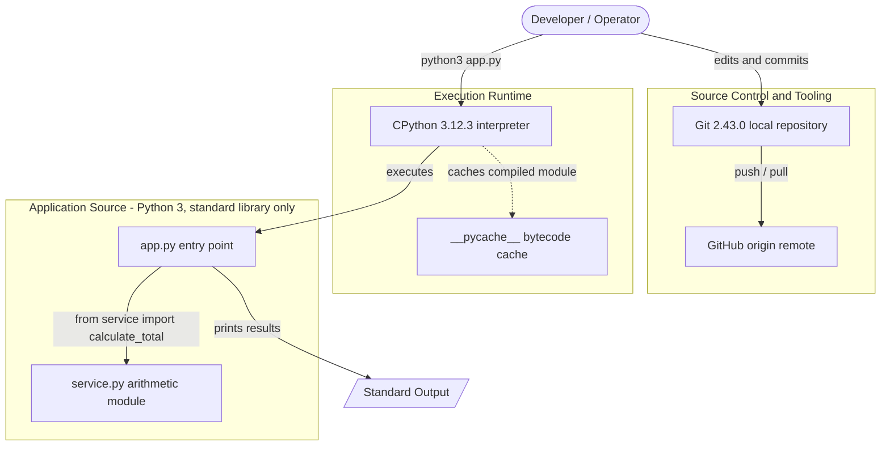
```mermaid
flowchart TD
    Dev(["Developer / Operator"])
    subgraph Tooling["Source Control and Tooling"]
        Git["Git 2.43.0 local repository"]
        GH["GitHub origin remote"]
    end
    subgraph Runtime["Execution Runtime"]
        CPy["CPython 3.12.3 interpreter"]
        Pyc["__pycache__ bytecode cache"]
    end
    subgraph AppCode["Application Source - Python 3, standard library only"]
        AppPy["app.py entry point"]
        SvcPy["service.py arithmetic module"]
    end
    Stdout[/"Standard Output"/]

    Dev -->|edits and commits| Git
    Git -->|push / pull| GH
    Dev -->|python3 app.py| CPy
    CPy -->|executes| AppPy
    CPy -.->|caches compiled module| Pyc
    AppPy -->|from service import calculate_total| SvcPy
    AppPy -->|prints results| Stdout
```

**Security implications.** The absence of a build and CI/CD layer means there are **no pipeline secrets, no build-time dependency resolution, and no container image supply chain** to secure. The tracked source files contain no credentials or endpoints (Section 3.4), so the development and deployment path introduces no secret-management burden beyond keeping any local Git remote credentials outside the repository.

## 3.7 References

The following repository artifacts and technical-specification sections were examined as evidence for this Technology Stack section.

**Files examined**

- `app.py` — Established Python 3 as the entry-point language; the sole import statement (`from service import calculate_total`); f-string usage (`print(f"Total: {total}")`) fixing the Python 3.6+ language floor; the hard-coded in-memory list `[10, 20, 30, 40]`; and standard output as the only runtime touchpoint.
- `service.py` — Confirmed a dependency-free Python module with no imports; use of the `len()` built-in; and the absence of frameworks, third-party libraries, and I/O.
- `README.md` — Confirmed it is a single-line Markdown identifier (`# repo_with_600K_LOC`) providing no setup, dependency, build, or configuration documentation.
- `.blitzyignore` — Established the single ignore pattern `*.csv`, excluding `large.csv` from analysis; used to confirm the CSV artifact is off-limits and not part of the storage architecture.
- `__pycache__/service.cpython-312.pyc` — Provided the authoritative runtime-version signal (CPython 3.12 bytecode, magic `cb0d0d0a`) and the sole build-like artifact (auto-generated bytecode cache).

**Folders / repository metadata examined**

- Repository root (`""`) — Confirmed the complete tracked source set (`app.py`, `service.py`, `README.md`) with no subfolders and no dependency, build, container, or CI manifests.
- `.git/` — Confirmed Git as the version-control system and the `origin` remote hosted on GitHub (development/tooling layer only).

**Technical-specification sections cross-referenced**

- 1.2 System Overview — "Procedural/functional Python 3 … with zero external dependencies"; two-module architecture; stdout-only interface; absence of KPIs/SLAs/tests/CI.
- 1.3 Scope — In-scope technical requirement of a Python 3 interpreter with co-located `service.py`; out-of-scope persistence, logging, error handling, validation, and configuration.
- 2.4 Implementation Considerations — "Requires a Python 3 interpreter"; "No automated tests or CI exist"; per-feature constraints for F-001/F-002/F-003.

**External / web sources**

- None. No external web sources were consulted; all findings are grounded in the repository contents and cross-referenced specification sections above.

# 4. Process Flowchart

## 4.1 System Workflows

This section documents the operational workflows that are actually realized in the repository. The system is a single-process, dependency-free Python 3 console application whose entire runtime behavior is the synchronous execution of `python3 app.py` (established in Sections 1.2 System Overview and 2.1 Feature Catalog). Because the codebase contains no server, scheduler, message consumer, network listener, or file reader, there is exactly **one** end-to-end runtime workflow — the console execution path (feature **F-003**, orchestrating **F-001**) — plus **one latent, never-invoked** computation path (`service.calculate_average`, feature **F-002**).

Every workflow claim below is grounded in `app.py`, `service.py`, and a confirmed execution run. No SLAs, queues, retries, or external systems are asserted, because none exist in the repository; where the prompt calls for a workflow category that is absent, that absence is stated plainly with its supporting evidence rather than invented.

### 4.1.1 Core Business Processes

The single core business process is the **Numeric Aggregation & Console Reporting** workflow. It is implemented by feature **F-003** (`app.main`, the entry point and orchestrator) and delegates its one computation step to feature **F-001** (`service.calculate_total`). The process is entirely deterministic: given the hard-coded input `[10, 20, 30, 40]`, it always produces the same six lines of output and exits with status `0`.

**End-to-end user journey.** There is exactly one actor in the runtime path — the *Console Operator* — plus a *Developer/Maintainer* who may import the modules (Section 1.3.1). The operator's journey is:

| Step | Action | Component | Requirement |
|------|--------|-----------|-------------|
| 1 | Operator invokes `python3 app.py` | Console / OS shell | F-003-RQ-002 |
| 2 | The `if __name__ == "__main__":` guard evaluates and calls `main()` on direct execution | `app.py` | F-003-RQ-003 |
| 3 | `main()` constructs the fixed dataset `[10, 20, 30, 40]` | `app.py` | F-003-RQ-001 |
| 4 | `main()` invokes `calculate_total(numbers)`, which sums the list to `100` | `service.py` | F-001-RQ-001 |
| 5 | `main()` prints `Total: 100` to standard output | `app.py` | F-003-RQ-002 |
| 6 | `main()` iterates the list, printing each value (`10`, `20`, `30`, `40`) on its own line | `app.py` | F-003-RQ-002 |
| 7 | `main()` prints `Application completed`; the process returns and exits with status `0` | `app.py` | F-003-RQ-002 |

**High-level system workflow.** The following diagram captures the complete runtime control flow from invocation to exit, including the two decision points that exist in the entry point (`__main__` guard and the print loop) and the system boundary between `app.py` (orchestration/presentation) and `service.py` (computation):

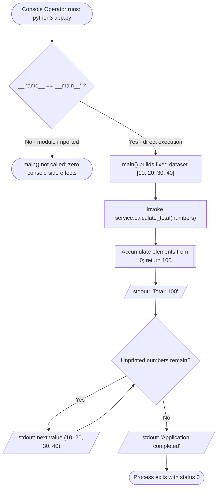
```mermaid
flowchart TD
    Start(["Console Operator runs: python3 app.py"]) --> Guard{"__name__ == '__main__' ?"}
    Guard -->|"No - module imported"| NoRun(["main() not called; zero console side effects"])
    Guard -->|"Yes - direct execution"| Build["main() builds fixed dataset [10, 20, 30, 40]"]
    Build --> Call["Invoke service.calculate_total(numbers)"]
    Call --> Sum[["Accumulate elements from 0; return 100"]]
    Sum --> PrintTotal[/"stdout: 'Total: 100'"/]
    PrintTotal --> Loop{"Unprinted numbers remain?"}
    Loop -->|"Yes"| PrintNum[/"stdout: next value (10, 20, 30, 40)"/]
    PrintNum --> Loop
    Loop -->|"No"| Done[/"stdout: 'Application completed'"/]
    Done --> Exit(["Process exits with status 0"])
```

**Swim-lane view (actors and system boundaries).** The same workflow, organized into swim lanes for each actor/module, shows the single user touchpoint (standard output) and the one in-process boundary crossing between the orchestration layer and the computation layer:

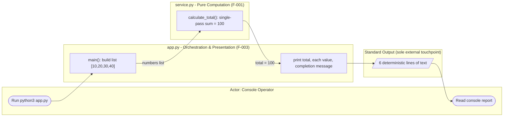
```mermaid
flowchart LR
    subgraph Operator["Actor: Console Operator"]
        OpRun(["Run python3 app.py"])
        OpObserve(["Read console report"])
    end
    subgraph App["app.py - Orchestration & Presentation (F-003)"]
        AppMain["main(): build list [10,20,30,40]"]
        AppPrint["print total, each value, completion message"]
    end
    subgraph Svc["service.py - Pure Computation (F-001)"]
        SvcTotal["calculate_total(): single-pass sum = 100"]
    end
    subgraph Out["Standard Output (sole external touchpoint)"]
        StdoutSink[/"6 deterministic lines of text"/]
    end
    OpRun --> AppMain
    AppMain -->|"numbers list"| SvcTotal
    SvcTotal -->|"total = 100"| AppPrint
    AppPrint --> StdoutSink
    StdoutSink --> OpObserve
```

**Decision points.** The entire codebase contains only three control-flow decisions, all documented below. There are no data-driven branches on user input because the input is fixed in code.

| Decision Point | Location | Branches | Effect |
|----------------|----------|----------|--------|
| `__name__ == "__main__"` execution guard | `app.py` | Direct run vs. imported module | Runs `main()` only on direct execution; keeps the module import side-effect-free (F-003-RQ-003) |
| Print loop continuation (`for number in numbers`) | `app.py` | More values vs. done | Emits each list element, then proceeds to the completion message |
| Accumulation loop continuation (`for number in numbers`) | `service.py` | More elements vs. done | Adds each element to the running total, then returns it (F-001-RQ-001) |

**Error handling paths.** The core process contains **no `try`/`except` blocks and no validation branches**; with the fixed, in-code, all-integer dataset the happy path is the only path exercised at runtime. Should the dataset ever be replaced with a non-iterable or non-numeric value, a `TypeError` would propagate unhandled to the interpreter. The error semantics and (absent) recovery mechanisms are detailed in Section 4.3.2 Error Handling and Recovery.

**Timing and SLA considerations.** The repository defines **no SLAs, latency budgets, throughput targets, or KPIs** (confirmed in Sections 1.2.3 and 2.2). The observed workload is a single synchronous O(n) accumulation pass over four elements followed by six `print` calls, so end-to-end wall-clock time is dominated by interpreter startup and completes effectively instantaneously; no timing constraint is enforced or required by any code.

### 4.1.2 Integration Workflows

The application performs **no external integration of any kind**. `service.py` has no `import` statements at all, and `app.py`'s only import is the local `from service import calculate_total` (verified across the codebase). The sole "integration" is therefore an **in-process function call** — a direct, synchronous, in-memory hand-off across the single dependency edge `app.py → service.calculate_total`, with no serialization, network hop, protocol, or broker involved.

**In-process data flow.** The data that flows across the one boundary is a plain Python list passed by reference and a numeric return value:

| From | To | Payload | Mechanism | Direction |
|------|----|---------|-----------|-----------|
| `app.main` | `service.calculate_total` | `numbers` list `[10, 20, 30, 40]` | In-process Python function argument | Synchronous call |
| `service.calculate_total` | `app.main` | Aggregate total `100` | In-process return value | Synchronous return |
| `app.main` | Operating-system stdout stream | Six text lines | `print()` (buffered stdout) | Write-only |

**Absent integration categories.** Each integration-workflow category named in the section prompt is mapped below to its actual status in the repository, with the evidence that establishes its absence:

| Requested Integration Category | Status in Repository | Evidence |
|--------------------------------|----------------------|----------|
| Data flow between systems | Not present (single process only) | No network clients, no IPC, no filesystem reads/writes; `large.csv` is excluded by `.blitzyignore` and read by no code |
| API interactions (REST/RPC/etc.) | Not present | No HTTP/socket libraries imported; no web framework, client, or server code exists |
| Event processing flows | Not present | No message broker, queue, callback, or event-loop code; execution is a single linear pass |
| Batch processing sequences | Not present (no scheduled/external batch) | The only "batch" is the fixed in-memory list processed in one synchronous loop; there is no scheduler, chunking, job runner, or external batch framework |

In summary, the system's only external touchpoint is standard output; all other integration patterns commonly documented in this section are deliberately out of scope for this repository (Section 1.3.2 Out-of-Scope) and are reported here as absent rather than fabricated.

## 4.2 Detailed Process Flows and Validation Rules

This section provides a detailed process flow for each of the three implemented features (F-001, F-002, F-003) and then consolidates the validation, authorization, and compliance rules that apply across those flows. Each flowchart shows explicit start and end points, process steps, decision diamonds, the system boundary between the orchestration module (`app.py`) and the computation module (`service.py`), the single user touchpoint (standard output), and timing characteristics. Because the input is hard-coded and the code performs no validation, the "recovery paths" shown are the interpreter's default exception propagation, elaborated further in Section 4.3.2.

### 4.2.1 F-003 — Console Orchestration & Reporting Flow

Feature **F-003** (`app.main` in `app.py`) is the runnable workflow. It is the only feature that produces output and the only one that crosses the module boundary into `service.py`. The detailed flow below begins at process invocation, branches on the `__main__` guard (F-003-RQ-003), builds the fixed dataset (F-003-RQ-001), delegates summation to the service layer (F-001), then emits the deterministic six-line report and exits (F-003-RQ-002):

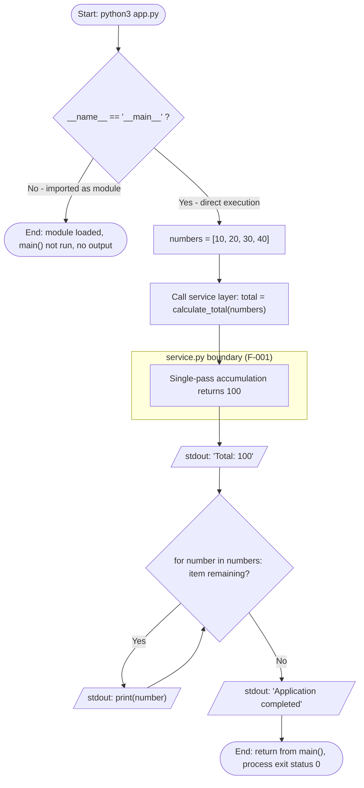
```mermaid
flowchart TD
    Start(["Start: python3 app.py"]) --> Guard{"__name__ == '__main__' ?"}
    Guard -->|"No - imported as module"| End1(["End: module loaded, main() not run, no output"])
    Guard -->|"Yes - direct execution"| Build["numbers = [10, 20, 30, 40]"]
    Build --> Delegate["Call service layer: total = calculate_total(numbers)"]
    subgraph ServiceBoundary["service.py boundary (F-001)"]
        SvcReturn["Single-pass accumulation returns 100"]
    end
    Delegate --> SvcReturn
    SvcReturn --> P1[/"stdout: 'Total: 100'"/]
    P1 --> ForCheck{"for number in numbers: item remaining?"}
    ForCheck -->|"Yes"| P2[/"stdout: print(number)"/]
    P2 --> ForCheck
    ForCheck -->|"No"| P3[/"stdout: 'Application completed'"/]
    P3 --> End2(["End: return from main(), process exit status 0"])
```

**System boundary and touchpoints.** The only boundary crossing is the synchronous in-process call to `calculate_total`; the only user touchpoint is standard output. There is no `stdin`, no CLI argument parsing, no environment-variable read, and no file access (F-003-RQ-001). **Timing:** all steps are synchronous and effectively instantaneous; no delay, timeout, or SLA is defined or enforced.

### 4.2.2 F-001 — Numeric Total (Sum) Calculation Flow

Feature **F-001** (`service.calculate_total`) is a pure, side-effect-free function invoked once per run by F-003. It initializes an accumulator to `0`, adds each element in a single pass, and returns the total; an empty or falsy iterable yields the additive identity `0` (F-001-RQ-001, F-001-RQ-002):

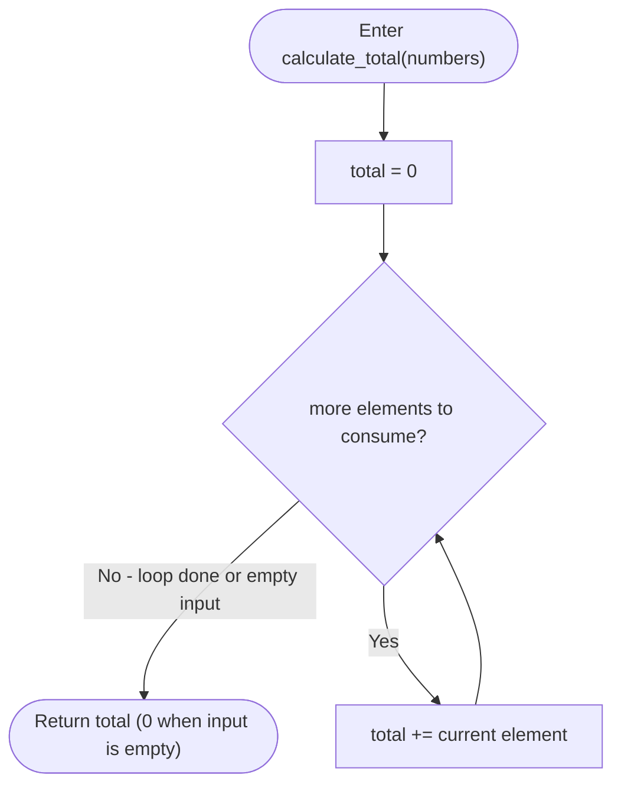
```mermaid
flowchart TD
    Start(["Enter calculate_total(numbers)"]) --> Init["total = 0"]
    Init --> Check{"more elements to consume?"}
    Check -->|"No - loop done or empty input"| Return(["Return total (0 when input is empty)"])
    Check -->|"Yes"| Add["total += current element"]
    Add --> Check
```

**Data persistence / touchpoints.** None — the function reads only its in-memory argument and returns a value; it writes nothing and holds no state between calls. **Timing:** one O(n) pass; for the application's four-element input this is negligible, and no timing target is specified.

### 4.2.3 F-002 — Numeric Average (Mean) Calculation Flow (Latent / Unused)

Feature **F-002** (`service.calculate_average`) is fully implemented but **never invoked at runtime** — `app.py` imports only `calculate_total`, so this flow is not part of any executed workflow (Sections 1.3.2 and 2.1.2). It is documented here for completeness. The flow first applies the falsy guard `if not numbers:` (F-002-RQ-002), returning `0` to prevent division by zero; otherwise it reuses F-001 for the numerator and divides by the element count (F-002-RQ-001):

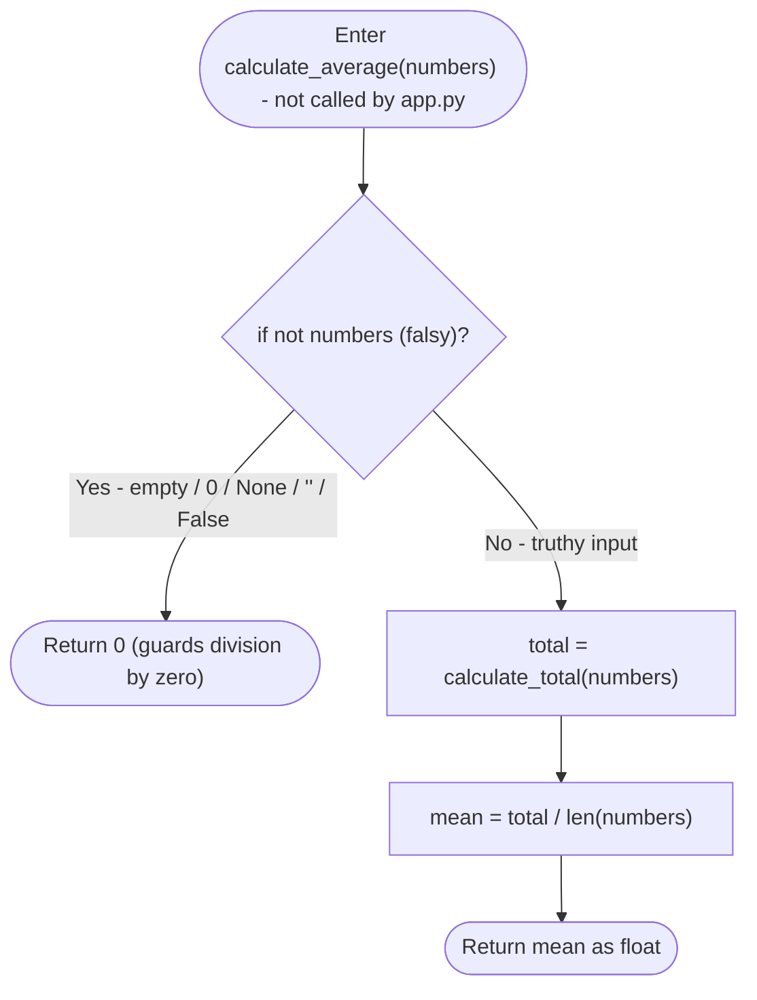
```mermaid
flowchart TD
    Start(["Enter calculate_average(numbers) - not called by app.py"]) --> Guard{"if not numbers (falsy)?"}
    Guard -->|"Yes - empty / 0 / None / '' / False"| Zero(["Return 0 (guards division by zero)"])
    Guard -->|"No - truthy input"| Sum["total = calculate_total(numbers)"]
    Sum --> Div["mean = total / len(numbers)"]
    Div --> Return(["Return mean as float"])
```

**Note on the guard.** The condition is a *falsy* check, not strictly an emptiness check: it returns `0` for an empty list/tuple, `0`, `None`, an empty string, or `False`. A truthy-but-non-numeric input (for example a non-empty string) passes the guard and then raises a `TypeError` inside `calculate_total` (verified). **Timing:** one O(n) pass plus a single division; not exercised in the delivered application.

### 4.2.4 Validation Rules, Authorization, and Compliance Checkpoints

**Business rules at each step.** The workflows enforce a small set of implicit business rules, all derived directly from the code:

| Workflow Step | Business Rule (as implemented) | Source |
|---------------|-------------------------------|--------|
| Sum initialization | Accumulator starts at `0`, so an empty iterable returns the additive identity `0` | `service.py` / F-001-RQ-002 |
| Average guard | `if not numbers: return 0` prevents a division-by-zero on falsy input | `service.py` / F-002-RQ-002 |
| Single source of truth | The reported total must be produced by the shared `calculate_total` service, not recomputed in the entry point | `app.py` / F-003 |
| Output ordering | Output must be emitted in the fixed order: total → each value → `Application completed` | `app.py` / F-003-RQ-002 |
| Import isolation | `main()` runs only under the `__main__` guard, so importing the module produces no side effects | `app.py` / F-003-RQ-003 |

**Data validation requirements.** The code performs **no explicit input validation** and defines **no type hints**; it relies entirely on Python's duck typing (confirmed in Section 2.2). The observed behavior is:

| Input Scenario | Behavior (verified) | Classification |
|----------------|---------------------|----------------|
| Iterable of numbers (list, tuple; ints/floats/bools) | Computed correctly (e.g., `[10,20,30,40] → 100`) | Valid path |
| Empty / falsy input | Returns `0` (both functions) | Guarded / defined |
| Non-iterable input (e.g., `int`) | Raises `TypeError: 'int' object is not iterable`, unhandled | No validation; exception propagates |
| Non-numeric element (e.g., `'a'`) | Raises `TypeError: unsupported operand type(s) for +=`, unhandled | No validation; exception propagates |

**Authorization checkpoints.** None exist. The application has no users, sessions, roles, credentials, tokens, or protected resources; there is no authentication or authorization code anywhere in the repository. The input is trusted because it is hard-coded in `app.py`.

**Regulatory compliance checks.** None exist and none are specified in the repository (confirmed in Sections 2.2.1–2.2.3, "Compliance Requirements: None specified"). There is no PII, no financial/health data handling, no audit logging, and no data-retention logic — the program processes a fixed in-memory list of four integers and writes text to standard output.

## 4.3 Technical Implementation: State Management and Error Handling

This section documents the state model and error-handling behavior that underpin the workflows in Sections 4.1 and 4.2. The system is stateless and persists nothing between runs; its "state" is limited to the transient in-memory execution of a single process. Its error handling is limited to Python's default exception mechanics plus one defensive guard. All statements are grounded in `app.py` and `service.py` and in verified execution.

### 4.3.1 State Management

**State transitions.** The application holds no application-level or domain state machine; the only meaningful state model is the **process lifecycle**. The diagram below models that lifecycle — from interpreter start through the `__main__` guard, computation, reporting, and exit — including the terminal fault state reached only if an invalid input ever caused an unhandled exception:

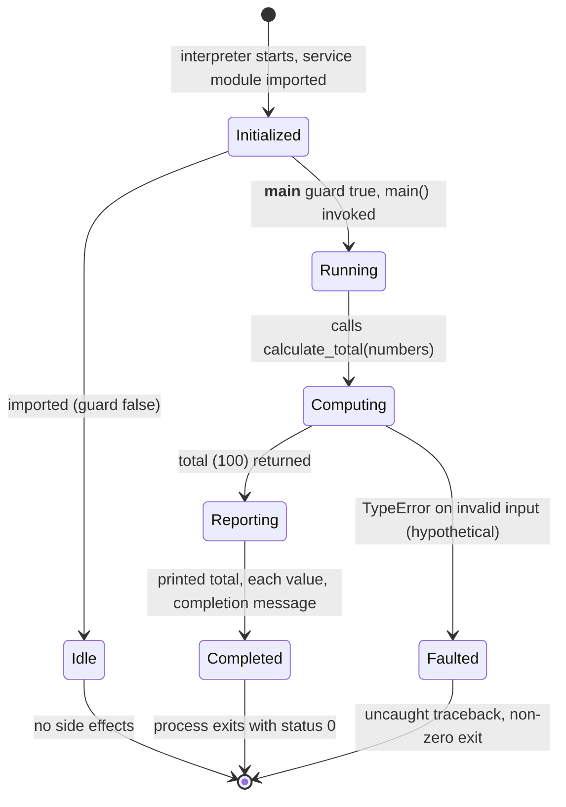
```mermaid
stateDiagram-v2
    [*] --> Initialized: interpreter starts, service module imported
    Initialized --> Idle: imported (guard false)
    Idle --> [*]: no side effects
    Initialized --> Running: __main__ guard true, main() invoked
    Running --> Computing: calls calculate_total(numbers)
    Computing --> Reporting: total (100) returned
    Reporting --> Completed: printed total, each value, completion message
    Completed --> [*]: process exits with status 0
    Computing --> Faulted: TypeError on invalid input (hypothetical)
    Faulted --> [*]: uncaught traceback, non-zero exit
```

The transient state that exists during `Running`/`Computing` is entirely local: the `numbers` list and `total` variable in `main()`, and the `total` accumulator inside `calculate_total`. None of it survives process exit.

**Data persistence points.** There are **none**. The following table enumerates every candidate persistence mechanism and its status:

| Candidate Persistence Point | Status | Evidence |
|-----------------------------|--------|----------|
| Database / ORM writes | Not present | No database client or driver is imported |
| File writes | Not present | No `open()`, no file I/O; `large.csv` is never read or written |
| In-memory variables | Transient only | `numbers`, `total` live in local scope and are discarded at exit |
| Standard output | Not persistence | Text is streamed to the console, not stored |

**Caching requirements.** There are **no caching requirements or caching code**. No memoization, no cache library, and no cached results exist; `calculate_total` recomputes on every call. Given the fixed four-element input and single invocation per run, no cache is warranted.

**Transaction boundaries.** There are **no transactions**. Because the program performs no database, file, or network mutations — its only external effect is writing text to stdout — there is nothing to commit or roll back. Each `print` is an independent, non-transactional write, and there is no atomicity, isolation, or durability requirement anywhere in the code.

### 4.3.2 Error Handling and Recovery

The repository contains **no `try`/`except` blocks, no error classes, no logging, and no alerting** (confirmed by inspection and in Section 1.3.2). Error handling therefore reduces to (a) one defensive fallback guard in `calculate_average`, and (b) Python's default behavior of propagating uncaught exceptions to the interpreter. The flowchart below shows the three possible outcomes of any runtime operation and the decision point at which an exception would be caught if a handler existed:

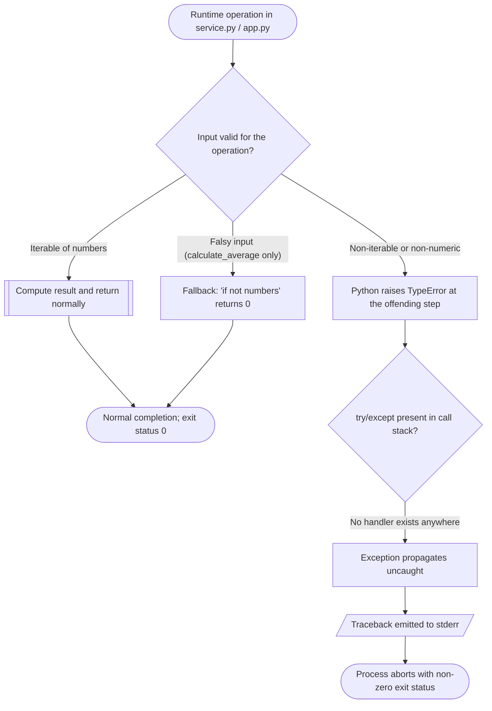
```mermaid
flowchart TD
    Start(["Runtime operation in service.py / app.py"]) --> Kind{"Input valid for the operation?"}
    Kind -->|"Iterable of numbers"| Compute[["Compute result and return normally"]]
    Compute --> Success(["Normal completion; exit status 0"])
    Kind -->|"Falsy input (calculate_average only)"| Fallback["Fallback: 'if not numbers' returns 0"]
    Fallback --> Success
    Kind -->|"Non-iterable or non-numeric"| Raise["Python raises TypeError at the offending step"]
    Raise --> Handler{"try/except present in call stack?"}
    Handler -->|"No handler exists anywhere"| Propagate["Exception propagates uncaught"]
    Propagate --> Notify[/"Traceback emitted to stderr"/]
    Notify --> Abort(["Process aborts with non-zero exit status"])
```

**Retry mechanisms.** None. There is no retry loop, backoff, timeout, or retry library; an operation is attempted exactly once. Because the input is fixed and valid, the delivered runtime never encounters a failure to retry.

**Fallback processes.** The only fallback-style logic is the guard `if not numbers: return 0` in `calculate_average` (F-002-RQ-002), which substitutes a safe default (`0`) instead of failing on falsy input. `calculate_total` has no explicit fallback, though its zero-initialized accumulator naturally returns `0` for an empty iterable (F-001-RQ-002). No other degradation, default-value, or alternate-path logic exists.

**Error notification flows.** There is **no logging, monitoring, or alerting subsystem**. The sole notification channel for a failure is Python's default uncaught-exception handler, which writes a traceback to **standard error** and terminates the process with a non-zero exit status. Successful runs write only to standard output and exit `0`.

**Recovery procedures.** There is **no automated recovery** — no checkpointing, no compensating action, and no restart supervisor. Because the program is completely **stateless and idempotent** (it persists nothing and produces the same output every run), the practical recovery procedure is manual: correct the offending input or code and re-execute `python3 app.py`. Re-running has no side effects to undo and cannot leave partial state behind.

## 4.4 Integration Sequence Diagram

This section presents the runtime interaction as a sequence diagram. As established in Section 4.1.2, the system has no external integrations, so this is an **intra-process** interaction sequence: the participants are the actor (Console Operator) and the two in-process modules (`app.py`, `service.py`), with standard output as the sole external sink. All messages are synchronous, single-threaded function calls and returns; there are no asynchronous callbacks, network round-trips, retries, or waits.

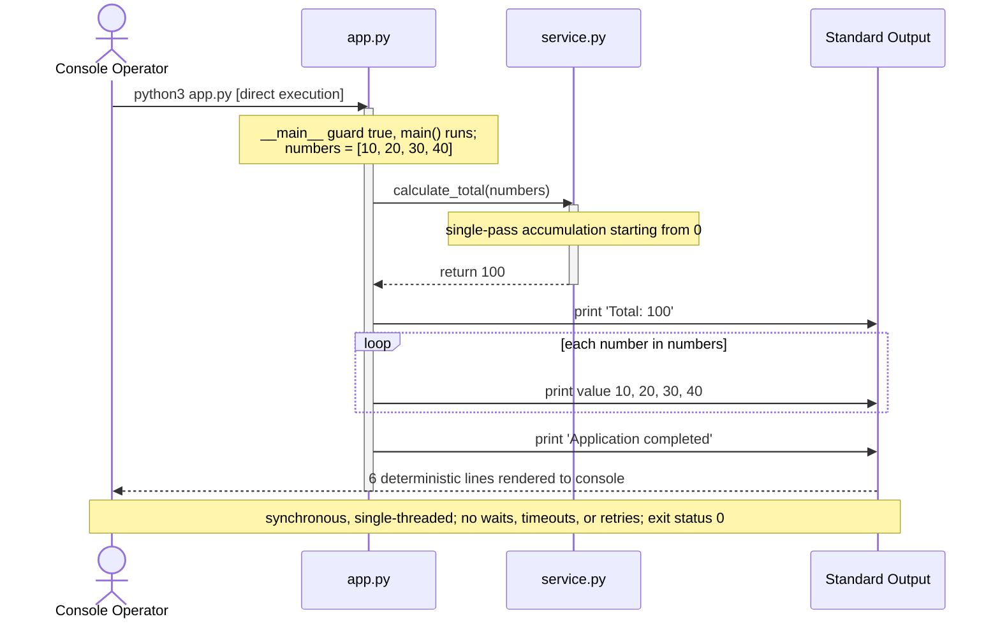
```mermaid
sequenceDiagram
    actor Operator as Console Operator
    participant App as app.py
    participant Svc as service.py
    participant Out as Standard Output
    Operator->>App: python3 app.py [direct execution]
    activate App
    Note over App: __main__ guard true, main() runs#59;<br/>numbers = [10, 20, 30, 40]
    App->>Svc: calculate_total(numbers)
    activate Svc
    Note over Svc: single-pass accumulation starting from 0
    Svc-->>App: return 100
    deactivate Svc
    App->>Out: print 'Total: 100'
    loop each number in numbers
        App->>Out: print value 10, 20, 30, 40
    end
    App->>Out: print 'Application completed'
    Out-->>Operator: 6 deterministic lines rendered to console
    deactivate App
    Note over Operator,Out: synchronous, single-threaded#59; no waits, timeouts, or retries#59; exit status 0
```

**Interaction semantics.** The sequence is strictly ordered and blocking: `main()` calls `calculate_total` and blocks until it returns `100`, then performs the six `print` operations in a fixed order (total, then each value, then the completion message). There is exactly one boundary crossing (`app.py → service.py`) and it is a normal Python call on the same call stack — no serialization, transport, or protocol is involved. Because the interaction is fully synchronous and the dataset is fixed and small, the entire sequence completes effectively instantaneously, and no ordering, concurrency, or timing controls (locks, semaphores, timeouts, SLAs) are defined or required anywhere in the code.

## 4.5 References

The following repository artifacts and Technical Specification sections were examined as evidence for the workflows, diagrams, validation rules, state model, and error-handling behavior documented in this section. All process claims were additionally confirmed by executing `python3 app.py` and by probing `service.calculate_total` / `service.calculate_average` directly.

**Repository files and folders**

- `app.py` - Entry point and orchestration (feature F-003): the `__main__` guard, `main()`, the fixed dataset `[10, 20, 30, 40]`, the `from service import calculate_total` import edge, the delegation to the service layer, and the six-line stdout report sequence. Basis for the high-level workflow, swim-lane, F-003 process flow, and sequence diagrams, and for the decision-point and business-rule tables.
- `service.py` - Computation module (features F-001 and F-002): `calculate_total` (zero-initialized single-pass accumulator; `0` for empty input) and `calculate_average` (the `if not numbers:` falsy guard, delegation to `calculate_total`, division by `len`). Basis for the F-001/F-002 process flows, the fallback description, and the validation-rules and error-handling content. Confirmed to contain no `import` statements and no `try`/`except`.
- `README.md` - One-line repository identifier (`# repo_with_600K_LOC`); confirms the absence of any documented workflows, SLAs, or process descriptions to draw from.
- `.blitzyignore` - Contains only `*.csv`; establishes that `large.csv` is excluded from analysis and, corroborated by the code, is read by no workflow (no file I/O exists).
- `` (repository root) - Confirmed the complete structure: only `app.py`, `service.py`, and `README.md` as source/docs, with no subfolders, manifests, configuration, CI, tests, schedulers, or service definitions — the basis for reporting the absence of external integrations, batch jobs, persistence, caching, transactions, authorization, and compliance controls.

**Cross-referenced Technical Specification sections**

- `1.2 System Overview` - Confirmed the single-process, dependency-free characterization, the two components and their one dependency edge, and the absence of KPIs/SLAs (Section 1.2.3).
- `1.3 Scope` - Confirmed in-scope workflow (Section 1.3.1) and the explicit out-of-scope list (Section 1.3.2): no dynamic input, no persistence, logging, error handling, validation, configuration, or external integrations.
- `2.1 Feature Catalog` - Source of the feature identifiers F-001, F-002 (latent/unused, Section 2.1.2), and F-003 used throughout this section.
- `2.2 Functional Requirements` - Source of the requirement identifiers (F-001-RQ-001/002, F-002-RQ-001/002, F-003-RQ-001/002/003) and the documented "no validation / no compliance" findings referenced in the validation-rules content.

No external or web sources were required or used; every statement in this section is grounded in the repository and its verified execution.

# 5. System Architecture

## 5.1 High-Level Architecture

This section describes the architecture of the repository as it actually exists. The system is a **standalone, single-purpose console utility / reference example** consisting of two Python modules — the console entry point `app.py` and the arithmetic utility module `service.py` — plus a one-line `README.md` identifier file. Every statement below is grounded in those files; where the section prompt anticipates an architectural element that the repository does not contain (external integrations, data stores, caches, brokers), that absence is stated plainly with its supporting evidence rather than invented.

### 5.1.1 System Overview

**Architecture style and rationale.** The system implements a **single-process, two-layer procedural/functional architecture** — an "entry-point-plus-utility-module" (driver + library) pattern. Presentation and orchestration responsibilities are isolated in `app.py`, while all numeric computation lives in the dependency-free `service.py`. There is no object orientation (no classes are defined anywhere), no framework, and no runtime beyond the CPython interpreter. This style is the natural fit for a ~30-line program: the two modules run directly under `python3 app.py` with no compilation, packaging, or wiring step, and the entire behavior is expressed with Python built-ins (`print`, `len`, f-strings) and a single local import.

**Key architectural principles and patterns (as evidenced by the code):**

- **Separation of concerns / layering** — orchestration and all side effects (input construction, console output) reside in `app.py`; pure computation resides in `service.py`.
- **Pure functions** — `calculate_total` and `calculate_average` perform no I/O and mutate no shared state; they map inputs to outputs deterministically.
- **Stable-dependency direction** — the dependency edge points one way, `app.py` → `service.calculate_total`; the computation core (`service.py`) has zero outward dependencies (no imports at all), so it is the most stable element in the design.
- **Import-safety via the `__main__` guard** — the `if __name__ == "__main__":` guard in `app.py` ensures `main()` runs only on direct execution, keeping the module side-effect-free when imported.
- **Zero-dependency, standard-library-only footprint** — no third-party packages, manifests, or lockfiles exist; the only generated artifact is CPython's local `.pyc` bytecode cache.
- **Deterministic, stateless execution** — the input is hard-coded (`[10, 20, 30, 40]`), so every run produces identical output and exit status.

**System boundaries and major interfaces.** The system boundary is a **single operating-system process** launched by the interpreter. Its interfaces are minimal and OS-provided rather than networked:

- *Inbound:* command-line invocation (`python3 app.py`). The program reads **no** command-line arguments, standard input, environment variables, or configuration files.
- *Outbound (primary):* the **standard output** stream, to which `app.py` writes the total, each input value, and a completion message.
- *Outbound (fault path only):* the **standard error** stream, used solely by Python's default uncaught-exception handler if invalid input ever reached a computation (see Section 5.4).

There are no network, database, filesystem, or message-broker boundaries. The following diagram presents the layered architecture and the runtime flow across those layers (a layer/container view, complementary to the runtime data-flow diagram in Section 1.2.2):

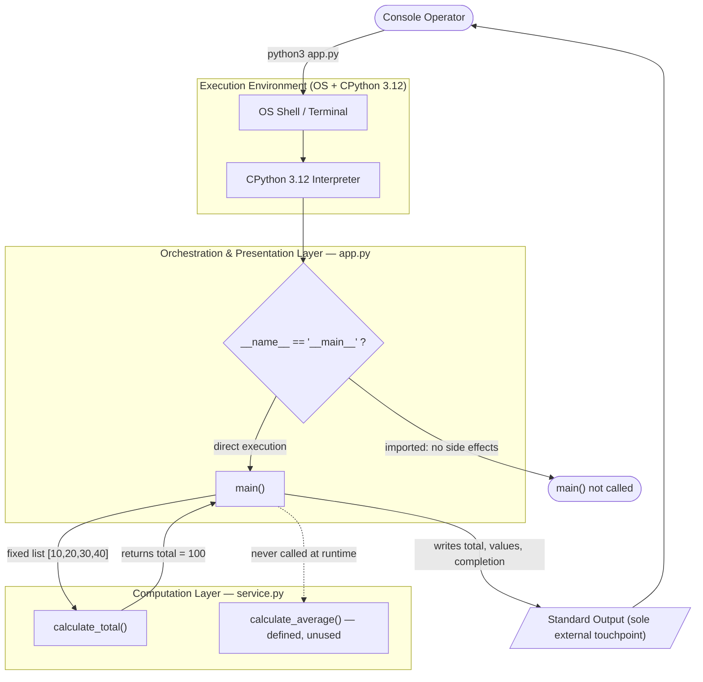
```mermaid
flowchart TD
    Operator(["Console Operator"])
    subgraph Env["Execution Environment (OS + CPython 3.12)"]
        Shell["OS Shell / Terminal"]
        Python["CPython 3.12 Interpreter"]
    end
    subgraph Presentation["Orchestration & Presentation Layer — app.py"]
        Guard{"__name__ == '__main__' ?"}
        Main["main()"]
    end
    subgraph Core["Computation Layer — service.py"]
        Total["calculate_total()"]
        Average["calculate_average() — defined, unused"]
    end
    Stdout[/"Standard Output (sole external touchpoint)"/]

    Operator -->|"python3 app.py"| Shell
    Shell --> Python
    Python --> Guard
    Guard -->|"direct execution"| Main
    Guard -->|"imported: no side effects"| Idle(["main() not called"])
    Main -->|"fixed list [10,20,30,40]"| Total
    Total -->|"returns total = 100"| Main
    Main -.->|"never called at runtime"| Average
    Main -->|"writes total, values, completion"| Stdout
    Stdout --> Operator
```

### 5.1.2 Core Components

The system comprises exactly two executable components with a single directional dependency between them. The table below (kept to four columns) captures each component's responsibility, dependencies, and integration points; the follow-up table records the critical considerations for each.

| Component | Primary Responsibility | Key Dependencies | Integration Points |
|-----------|------------------------|------------------|--------------------|
| `app.py` — Console Entry Point / Orchestrator | Build the fixed input dataset, invoke the computation, format results, and write them to stdout; gated by the `__main__` guard | Local `service` module (`calculate_total`); CPython 3.12 runtime | Inbound: OS shell invocation (`python3 app.py`); Outbound: standard output stream |
| `service.py` — Arithmetic Utility Module | Pure numeric computation: `calculate_total` (summation) and `calculate_average` (mean, currently unused) | None — no imports; uses built-in `len` only | Inbound: in-process function call from `app.py`; no external I/O |

| Component | Critical Considerations |
|-----------|-------------------------|
| `app.py` | Requires `service.py` co-located on the import path (unqualified `from service import calculate_total`); performs no input validation because the dataset is fixed in code; remains side-effect-free on import owing to the `__main__` guard |
| `service.py` | No type checks — a non-iterable or non-numeric argument raises an unhandled `TypeError`; `calculate_average` guards falsy input (`if not numbers: return 0`), avoiding division by zero; `calculate_average` is defined but not wired into the runtime path |

### 5.1.3 Data Flow Description

**Primary data flow.** A single, linear, synchronous flow constitutes the entire runtime. The Console Operator invokes `python3 app.py`; the `__main__` guard calls `main()`, which constructs the fixed list `[10, 20, 30, 40]` (`app.py` line 4). That list is passed **by reference** as an in-process function argument to `service.calculate_total` (line 6), which iterates the elements, accumulates them from a zero-initialized total, and returns the scalar `100`. `main()` then writes `Total: 100` to standard output (line 8), iterates the original list printing each value on its own line (lines 10–11), and finally prints `Application completed` (line 13) before the process exits with status `0`.

**Integration patterns and protocols.** The only cross-component hand-off is an **in-process Python function call** — a direct, in-memory, synchronous invocation across the `app.py` → `service.calculate_total` edge. There is no serialization, no network hop, no wire protocol, and no message broker; the "protocol" is simply the Python calling convention (a list argument in, a numeric value out).

**Data transformation points.** There are two transformations, both trivial and in-memory:

- *Aggregation* — `calculate_total` reduces the four-element list to a single integer via an O(n) single-pass accumulation (`service.py` lines 2–7).
- *Formatting* — `app.py` converts numeric values to console text using an f-string (`Total: {total}`) and `print()` for each element and the completion message.

**Key data stores and caches.** **None exist.** The only data that lives during a run are the transient local variables `numbers` and `total` in `main()` and the `total` accumulator inside `calculate_total`; all are discarded at process exit. There is no database, no file persistence (the `.blitzyignore`-excluded `large.csv` is never read by any code), no in-memory cache, and no memoization — `calculate_total` recomputes on every call. The system is therefore fully **stateless** between runs, as detailed in Section 5.4 and cross-referenced in Section 4.3.

### 5.1.4 External Integration Points

The application performs **no external integration of any kind**, so the five-column "external systems" table anticipated by the prompt has no rows to populate. This is a positive finding grounded in the code: `service.py` contains no `import` statements at all, and `app.py`'s only import is the local `from service import calculate_total`. The sole genuine boundary interfaces are OS-level streams, documented below:

| Boundary Interface | Direction | Mechanism | Notes |
|--------------------|-----------|-----------|-------|
| Shell / process invocation | Inbound | `python3 app.py` (no args, stdin, or env read) | Triggers the `__main__` guard → `main()` |
| Standard output (stdout) | Outbound | Buffered `print()` writes | Six deterministic text lines per run |
| Standard error (stderr) | Outbound (fault only) | Python default exception handler | Traceback emitted only on an unhandled exception |

For completeness, the integration categories commonly documented in this section are each mapped to their verified status in this repository:

| Candidate External Integration | Status | Evidence |
|--------------------------------|--------|----------|
| Networked APIs / services (REST, RPC, sockets) | Not present | No HTTP/socket libraries or client/server code imported |
| Databases / persistent storage | Not present | No database driver, ORM, or `open()`/file I/O anywhere |
| Message brokers / event streams | Not present | No queue, broker, callback, or event-loop code; execution is one linear pass |
| Authentication / third-party identity | Not present | No credentials, tokens, or auth libraries; no untrusted input surface |

Because there are no external systems, **no SLA obligations, data-exchange contracts, or protocol negotiations exist**; the only availability consideration is that a Python 3 interpreter and a co-located `service.py` are present at invocation time.


## 5.2 Component Details

This section details each of the two executable components. Because the entire system is ~30 lines of dependency-free Python 3, the "technologies and frameworks" for both components reduce to the CPython 3.12 standard runtime and Python built-ins; no third-party framework, database, or service is involved (Sections 3.1–3.5).

### 5.2.1 app.py — Console Entry Point and Orchestrator

**Purpose and responsibilities.** `app.py` is the orchestration-and-presentation layer and the program's sole entry point (feature F-003). It constructs the fixed input dataset, delegates the one computation to `service.calculate_total`, and renders all output to the console. It owns every side effect in the system.

**Technologies and frameworks.** Pure Python 3 (executed under CPython 3.12); uses only built-ins — the `print` function and an f-string literal. No classes, module-level constants, or type annotations are declared. It carries no shebang or encoding declaration, so it is launched explicitly via `python3 app.py`.

**Key interfaces and APIs.** The module exposes a single public function, `main()` (no parameters, implicit `None` return, stdout side effects). Its inbound interface is the `if __name__ == "__main__":` guard, which invokes `main()` only on direct execution; its outbound interface is the standard-output stream. It consumes one imported symbol:

```python
from service import calculate_total  # the sole cross-module dependency
```

**Data persistence requirements.** None. The `numbers` list and `total` value are transient local variables discarded at process exit; the module reads and writes no files, databases, or caches.

**Scaling considerations.** As a single-shot, synchronous CLI process with a hard-coded four-element dataset, the module has no concurrency, statefulness, or shared resource to scale. Work is O(n) in the input size for both the accumulation delegated to `service.py` and the print loop. Horizontal scaling is not applicable (each invocation is an independent, side-effect-free process); the only "scale" lever would be replacing the fixed dataset, which is a code change rather than a runtime parameter.

### 5.2.2 service.py — Arithmetic Utility Module

**Purpose and responsibilities.** `service.py` is the pure-computation layer. It provides two stateless arithmetic functions: `calculate_total` (summation, feature F-001) and `calculate_average` (arithmetic mean, feature F-002). It performs no I/O and mutates no shared state, making it safe to import and reuse.

**Technologies and frameworks.** Pure Python 3 with **no imports whatsoever**; uses the built-in `len` only (inside `calculate_average`). No classes, decorators, constants, or type annotations are present.

**Key interfaces and APIs.** The module exposes two public functions:

- `calculate_total(numbers)` — initializes an accumulator to `0`, iterates the supplied iterable adding each value, and returns the sum (returns `0` for an empty iterable). Used at runtime by `app.py`.
- `calculate_average(numbers)` — returns `0` for falsy input (the `if not numbers:` guard), otherwise returns `calculate_total(numbers) / len(numbers)`. Defined but **not** invoked anywhere at runtime (a latent capability). It depends internally on `calculate_total`.

**Data persistence requirements.** None. Both functions are pure: their only state is a local accumulator that does not survive the call. No persistence, caching, or memoization is present, so results are recomputed on every invocation.

**Scaling considerations.** Both functions are O(n) single-pass computations over the input iterable and hold no shared state, so they are inherently thread-safe and trivially reusable. There is no batching, streaming, or parallelism; scale is bounded only by the size of the iterable passed in-process and by Python's native numeric handling (integer results for `calculate_total`, float quotient for `calculate_average`). Neither function validates input, so scaling the input to non-iterable or non-numeric values would raise an unhandled `TypeError` (Section 5.4).

### 5.2.3 Component Interaction Diagram

The following diagram shows the module-level structure — the public function surface of each module and the call/import relationships between them, including the internal `calculate_average → calculate_total` edge and the fact that `main()` neither imports nor calls `calculate_average`:

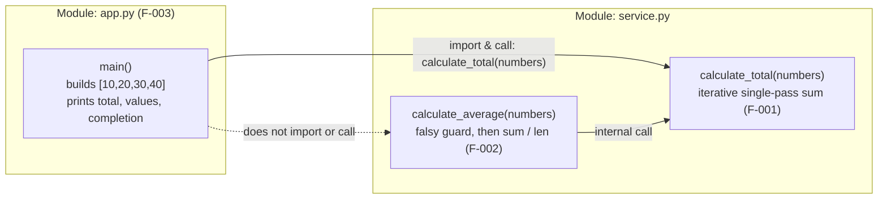
```mermaid
flowchart LR
    subgraph AppModule["Module: app.py (F-003)"]
        MainFn["main()<br/>builds [10,20,30,40]<br/>prints total, values, completion"]
    end
    subgraph ServiceModule["Module: service.py"]
        TotalFn["calculate_total(numbers)<br/>iterative single-pass sum (F-001)"]
        AvgFn["calculate_average(numbers)<br/>falsy guard, then sum / len (F-002)"]
    end
    MainFn -->|"import &amp; call: calculate_total(numbers)"| TotalFn
    AvgFn -->|"internal call"| TotalFn
    MainFn -. "does not import or call" .-> AvgFn
```

### 5.2.4 Sequence Diagram — main() Runtime Flow

This sequence diagram captures the key end-to-end flow across the runtime participants — the Console Operator, `app.py`'s `main()`, `service.calculate_total`, and the standard-output stream — including the two iterative loops (accumulation and printing):

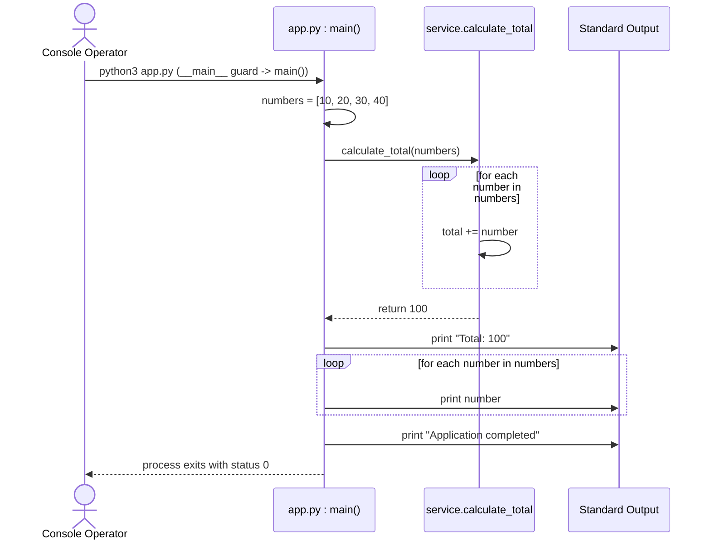
```mermaid
sequenceDiagram
    actor Operator as Console Operator
    participant App as app.py : main()
    participant Svc as service.calculate_total
    participant Out as Standard Output

    Operator->>App: python3 app.py (__main__ guard -> main())
    App->>App: numbers = [10, 20, 30, 40]
    App->>Svc: calculate_total(numbers)
    loop for each number in numbers
        Svc->>Svc: total += number
    end
    Svc-->>App: return 100
    App->>Out: print "Total: 100"
    loop for each number in numbers
        App->>Out: print number
    end
    App->>Out: print "Application completed"
    App-->>Operator: process exits with status 0
```

### 5.2.5 State Transition Diagram — calculate_total Accumulator

The only component-level state model that is not already covered by the process-lifecycle diagram in Section 4.3.1 is the internal accumulator of `calculate_total`. The diagram below models its transitions from a zero-initialized accumulator through iterative accumulation to the returned result, including the empty-iterable path where the loop body is skipped and `0` is returned:

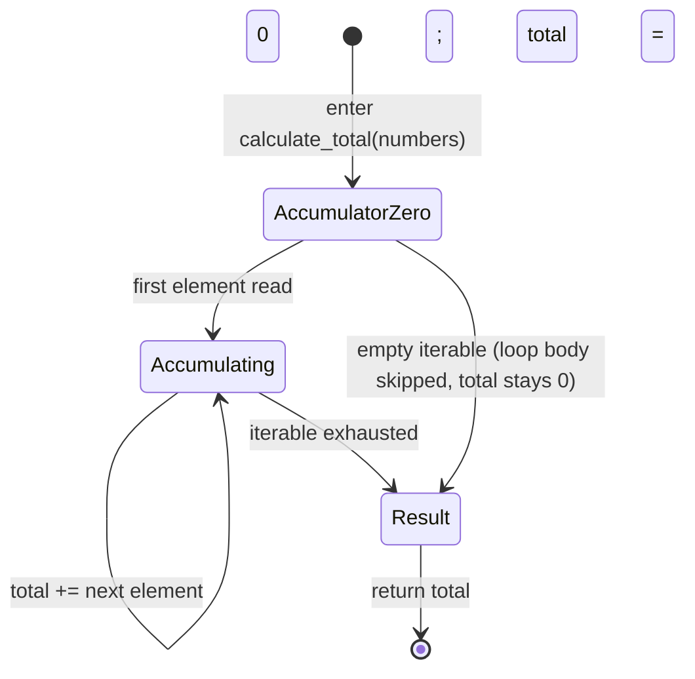
```mermaid
stateDiagram-v2
    [*] --> AccumulatorZero: enter calculate_total(numbers); total = 0
    AccumulatorZero --> Accumulating: first element read
    Accumulating --> Accumulating: total += next element
    Accumulating --> Result: iterable exhausted
    AccumulatorZero --> Result: empty iterable (loop body skipped, total stays 0)
    Result --> [*]: return total
```


## 5.3 Technical Decisions

This section records the architectural decisions that are observable in the repository and the tradeoffs each implies. The repository contains no design notes or ADR files, so the *decisions* are inferred from the code's structure while the *rationale* is limited to what the code demonstrably exhibits; where the codebase provides no documented justification for a choice, that is stated explicitly rather than assumed.

### 5.3.1 Decision Summary and Tradeoffs

The table below (four columns) summarizes the five decision areas requested by the prompt, the approach the code actually takes, the alternatives it forgoes, and the evidence-based rationale.

| Decision Area | Chosen Approach | Alternatives Not Used | Rationale (from code evidence) |
|---------------|-----------------|-----------------------|--------------------------------|
| Architecture style | Single-process, two-module (driver + pure-library) procedural design | Single monolithic file; class-based OOP; service-oriented/microservice | ~30 LOC scope; separation of concerns is fully served by two modules; no distribution requirement exists |
| Communication pattern | In-process synchronous function call | IPC, REST/RPC, sockets, message queue | Everything runs in one process; the only edge is `app.py` → `service.calculate_total`; no imports of network/IPC libraries |
| Data storage | In-memory, hard-coded list | Relational/NoSQL database; file or config-driven input | Fixed demonstration dataset `[10,20,30,40]`; no persistence need; `large.csv` is intentionally never read |
| Caching strategy | None — recompute on every call | Memoization; result cache | One invocation performing a single O(n) pass; caching would add complexity with no benefit |
| Security mechanism | None beyond the runtime's own memory safety | Input validation; authN/authZ; sandboxing | No untrusted input, no I/O, no secrets, no network — there is no attack surface to defend |

**Architecture style and tradeoffs.** The code separates orchestration/presentation (`app.py`) from pure computation (`service.py`). The tradeoff is deliberately weighted toward **simplicity and reusability over generality**: the pure functions in `service.py` are independently importable and testable, and the `__main__` guard keeps import side-effect-free, but there is no abstraction (no interfaces, no dependency injection, no configuration) because the scope does not warrant it. One notable implementation choice is that `calculate_total` sums via an explicit `for`-loop accumulator rather than Python's built-in `sum()`; the repository documents no reason for this, but it is consistent with the code's explicit, framework-free style.

**Communication pattern.** With a single process and a single dependency edge, the communication mechanism is an ordinary Python function call passing a list by reference and returning a scalar. This avoids all serialization, transport, and failure-handling complexity that networked or inter-process patterns would introduce; the tradeoff is that the two modules are co-located and cannot be independently deployed (a non-issue for a CLI utility).

**Data storage and caching.** The program neither persists nor caches anything: the dataset is fixed in code and every value is a transient local variable. This yields a fully stateless, idempotent program (re-running produces identical output with nothing to clean up) at the cost of not being data-driven — changing the input requires editing `app.py` rather than supplying external data.

**Security mechanism selection.** No authentication, authorization, input validation, or sandboxing exists, which is appropriate given the verified absence of any external or untrusted input surface. The security posture is inherited from the platform: an interpreted, memory-managed language with no native extensions, no foreign-function interface, and no third-party binaries (Section 3.1). The one residual risk is that if the fixed dataset were ever replaced with non-iterable or non-numeric data, an unhandled `TypeError` would terminate the process (Section 5.4).

### 5.3.2 Architecture Decision Records (ADRs)

The following ADRs formalize the decisions above. All are marked *Accepted* because they reflect the code as it currently exists; none is documented in the repository, so each Context/Consequences entry is derived from observed evidence.

**ADR-001 — Separate the console entry point from the computation logic.**
- *Status:* Accepted (reflected in current code).
- *Context:* The program must build input, compute an aggregate, and report results.
- *Decision:* Place orchestration/presentation and all side effects in `app.py`, and keep pure arithmetic in a dependency-free `service.py` imported by `app.py`.
- *Consequences:* `service.py` is reusable and side-effect-free; `app.py` is import-safe via the `__main__` guard; the two modules must remain co-located on the import path.

**ADR-002 — Depend on the Python standard runtime only (zero third-party dependencies).**
- *Status:* Accepted.
- *Context:* The whole program is expressible with Python built-ins (`print`, `len`, f-strings).
- *Decision:* Use no external packages, manifests, or lockfiles.
- *Consequences:* The only prerequisite to run is a Python 3 interpreter; there is no dependency management, supply-chain, or version-pinning burden, but also no framework support for future growth.

**ADR-003 — Use an in-process synchronous function call for component communication.**
- *Status:* Accepted.
- *Context:* Orchestration must hand data to computation.
- *Decision:* Invoke `service.calculate_total(numbers)` directly in-process.
- *Consequences:* No serialization/transport/error semantics to manage; the components cannot be independently deployed or scaled.

**ADR-004 — Keep data in memory with a hard-coded dataset (no persistence, no configuration).**
- *Status:* Accepted.
- *Context:* The utility demonstrates a fixed computation.
- *Decision:* Define `numbers = [10, 20, 30, 40]` in code; read no files, databases, arguments, or environment variables.
- *Consequences:* The program is deterministic, stateless, and idempotent; it is not data-driven and cannot be reconfigured without a code change.

**ADR-005 — Report exclusively through standard output; do not add logging or error handling.**
- *Status:* Accepted.
- *Context:* Results must reach the operator.
- *Decision:* Use `print()` to stdout for all output; rely on Python's default uncaught-exception behavior for faults, with only a `if not numbers:` fallback guard in `calculate_average`.
- *Consequences:* Minimal, human-readable output; no structured logs, log levels, retries, or alerting; failures surface as tracebacks on stderr with a non-zero exit (Section 5.4).

### 5.3.3 Architecture Decision Tree

The diagram below expresses the decision logic that leads from the workload's actual requirements to the resulting architecture — each branch is resolved by an observed property of the code (single run, fixed data, one computation pass, no external surface, separable computation):

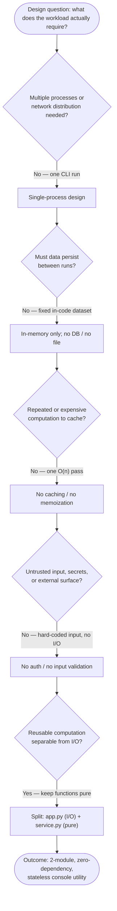
```mermaid
flowchart TD
    Start(["Design question: what does the workload actually require?"])
    Start --> Q1{"Multiple processes or<br/>network distribution needed?"}
    Q1 -->|"No — one CLI run"| Mono["Single-process design"]
    Mono --> Q2{"Must data persist<br/>between runs?"}
    Q2 -->|"No — fixed in-code dataset"| InMem["In-memory only; no DB / no file"]
    InMem --> Q3{"Repeated or expensive<br/>computation to cache?"}
    Q3 -->|"No — one O(n) pass"| NoCache["No caching / no memoization"]
    NoCache --> Q4{"Untrusted input, secrets,<br/>or external surface?"}
    Q4 -->|"No — hard-coded input, no I/O"| NoSec["No auth / no input validation"]
    NoSec --> Q5{"Reusable computation<br/>separable from I/O?"}
    Q5 -->|"Yes — keep functions pure"| Split["Split: app.py (I/O) + service.py (pure)"]
    Split --> Result(["Outcome: 2-module, zero-dependency,<br/>stateless console utility"])
```


## 5.4 Cross-Cutting Concerns

Cross-cutting concerns are, for this system, largely characterized by their **deliberate absence**: as a ~30-line, dependency-free, single-run console utility, it implements no observability stack, no security framework, and no recovery machinery. Each concern below is reported with the evidence that establishes its status; none is fabricated. The summary table orients the discussion, and the subsections elaborate on each concern and cross-reference the state/error model detailed in Section 4.3.

| Cross-Cutting Concern | Status in Repository | Evidence / Mechanism |
|-----------------------|----------------------|----------------------|
| Monitoring & observability | Not implemented | No metrics, health checks, counters, or instrumentation; the only externally visible signal is stdout and the process exit status |
| Logging & tracing | Not implemented (ad hoc stdout only) | No `logging`/tracing import; all output is via `print()` in `app.py` |
| Error handling | Minimal | One `if not numbers:` fallback guard; otherwise exceptions are unhandled |
| Authentication & authorization | Not applicable | No users, sessions, endpoints, credentials, or secrets anywhere |
| Performance & SLAs | None defined | No targets, budgets, or KPIs; workload is one O(n) pass over four elements |
| Disaster recovery | Not applicable (stateless) | Nothing persisted to back up or restore; source is preserved in Git version control |

### 5.4.1 Monitoring, Observability, Logging, and Tracing

The system has **no monitoring or observability approach and no logging or tracing strategy** in the conventional sense. There is no metrics emission, health endpoint, heartbeat, structured log, log level, correlation ID, or distributed trace — none of the relevant libraries are imported, and there is no configuration to enable them. The only observability the system offers is **implicit and human-facing**:

- **Success signal:** the deterministic six-line stdout report (`Total: 100`, the four values, `Application completed`) plus an exit status of `0`.
- **Failure signal:** a Python traceback on standard error and a non-zero exit status if an unhandled exception occurs (Section 5.4.2).

In effect, `print()` to stdout doubles as the application's only "logging," and the operating system's exit-status convention is the only machine-readable health indicator. Adding real observability would be net-new work, not an adjustment of existing instrumentation.

### 5.4.2 Error Handling Patterns

The repository contains **no `try`/`except` blocks, no custom error classes, and no alerting** (consistent with Section 4.3.2). The error-handling pattern is therefore two-fold: a single **defensive fallback** and otherwise **fail-fast propagation** to the interpreter.

- **Defensive fallback:** `calculate_average` begins with `if not numbers: return 0`, substituting a safe default for any falsy input and, in particular, preventing a division-by-zero on `len(numbers)`.
- **Natural empty-input handling:** `calculate_total` returns `0` for an empty iterable because its accumulator is zero-initialized and the loop body is simply skipped.
- **Fail-fast propagation:** neither function validates types. A non-iterable argument or a non-numeric element raises a `TypeError` at the offending step; with no handler anywhere in the call stack, the exception propagates to CPython's default handler, which prints a traceback to stderr and exits non-zero.

Because the delivered runtime uses a fixed, valid, all-integer dataset, only the success path is exercised in practice; the fault paths are latent. The diagram below models these error-handling flows across the architectural layers — computation (`service.py`), orchestration (`app.py`, which contains no handler), and the CPython runtime — and the two terminal outcomes:

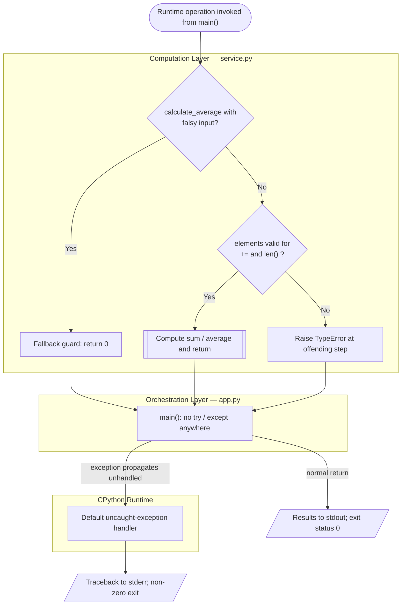
```mermaid
flowchart TD
    Start(["Runtime operation invoked from main()"])
    subgraph CoreLayer["Computation Layer — service.py"]
        Falsy{"calculate_average with<br/>falsy input?"}
        Fallback["Fallback guard: return 0"]
        ArithOK{"elements valid for<br/>+= and len() ?"}
        Compute[["Compute sum / average and return"]]
        Raise["Raise TypeError at offending step"]
    end
    subgraph AppLayer["Orchestration Layer — app.py"]
        NoHandler["main(): no try / except anywhere"]
    end
    subgraph RuntimeLayer["CPython Runtime"]
        DefaultH["Default uncaught-exception handler"]
    end
    Start --> Falsy
    Falsy -->|"Yes"| Fallback
    Falsy -->|"No"| ArithOK
    ArithOK -->|"Yes"| Compute
    ArithOK -->|"No"| Raise
    Fallback --> NoHandler
    Compute --> NoHandler
    Raise --> NoHandler
    NoHandler -->|"normal return"| OkOut[/"Results to stdout; exit status 0"/]
    NoHandler -->|"exception propagates unhandled"| DefaultH
    DefaultH --> ErrOut[/"Traceback to stderr; non-zero exit"/]
```

### 5.4.3 Authentication and Authorization

There is **no authentication or authorization framework, and none is applicable.** The system exposes no network endpoint, no user session, no role or permission model, and no protected resource; it reads no credentials, tokens, or secrets. Access control is entirely delegated to the host operating system — whoever can execute `python3 app.py` on the machine can run the program, exactly as with any local script. No identity, RBAC/ABAC, or policy layer exists to document.

### 5.4.4 Performance Requirements and SLAs

The repository defines **no performance requirements, latency budgets, throughput targets, availability SLAs, or KPIs** (confirmed in Sections 1.2.3, 4.1, and 4.3). The observable performance profile, derived from the code, is:

- **Computational complexity:** a single O(n) accumulation pass in `calculate_total` plus an O(n) print loop in `main()`, where n = 4.
- **Wall-clock behavior:** work is negligible; end-to-end time is dominated by Python interpreter startup and the program completes effectively instantaneously.
- **Resource footprint:** constant, minimal memory (a four-element list and a couple of scalar locals); single-threaded; no I/O wait.

No timing constraint is enforced or required anywhere in the code, and there is no benchmark, load test, or performance instrumentation. Any SLA would have to be introduced as a new requirement rather than documented from existing evidence.

### 5.4.5 Disaster Recovery Procedures

Formal **disaster recovery is not applicable** to this system because it is **stateless and idempotent**: it persists nothing between runs (no database, no files, no cache — Sections 4.3.1 and 5.1.3), so there is no data to back up, no state to restore, and no partial work to reconcile after a failure. The practical "recovery procedure" is simply to correct any offending input or code and re-execute `python3 app.py`; re-running has no side effects to undo and cannot leave the system in an inconsistent state. The only durability mechanism present is **source-code preservation in Git version control**, from which the two modules can be re-obtained and re-run on any host with a Python 3 interpreter. There is no runtime redundancy, failover, checkpointing, or restart supervisor, and none is warranted for a single-shot CLI utility.


## 5.5 References

The following repository artifacts and technical-specification sections were examined as evidence for this System Architecture section.

**Files inspected**

- `app.py` — Established the console entry point / orchestration layer: the `from service import calculate_total` dependency edge, `main()` building the fixed list `[10, 20, 30, 40]`, the `print()`-based stdout reporting, and the `if __name__ == "__main__":` import-safety guard.
- `service.py` — Established the pure-computation layer: `calculate_total` (iterative single-pass accumulation, returns `0` for empty input) and `calculate_average` (falsy-input fallback guard, then `calculate_total(numbers) / len(numbers)`; defined but unused at runtime), with no imports and no I/O.
- `README.md` — Confirmed the repository is a single-line identifier (`# repo_with_600K_LOC`) with no architecture, configuration, or design documentation.
- `.blitzyignore` — Established the `*.csv` exclusion, confirming `large.csv` is off-limits and (corroborated by the code) read by no module.

**Folders and artifacts inspected**

- `__pycache__/` — Contained `service.cpython-312.pyc`, the CPython 3.12 bytecode cache that provided the authoritative runtime-version signal used throughout this section.
- Git repository metadata — Confirmed the complete, byte-identical file inventory across branches `600K_01` and `main` and that no additional source has ever existed; also the sole source-preservation (durability) mechanism referenced in Section 5.4.5.

**Cross-referenced Technical Specification sections**

- `1.2 System Overview` — Aligned the system characterization ("standalone, single-purpose console utility / reference example"), the two-component model, and the runtime data-flow baseline.
- `3.1 Programming Languages` — Confirmed the single-language footprint and the Python 3 / CPython 3.12 (environment 3.12.3) version evidence and security posture.
- `4.1 System Workflows` — Aligned the single runtime workflow, the actors (Console Operator, Developer/Maintainer), and the enumerated absence of external/API/event/batch integrations.
- `4.3 Technical Implementation: State Management and Error Handling` — Aligned the stateless process-lifecycle model, the persistence/caching/transaction absences, and the error-propagation behavior underpinning Section 5.4.


# 6. SYSTEM COMPONENTS DESIGN

## 6.1 Core Services Architecture

### 6.1.1 Applicability Assessment

**Core Services Architecture is not applicable for this system.** This repository does not implement — and does not require — microservices, a distributed architecture, or any distinct, independently deployable service components. As established in Sections 1.2 and 5.1, the system is a *standalone, single-purpose console utility / reference example* whose entire behavior executes within a **single operating-system process** under the CPython interpreter.

The complete, non-ignored source consists of exactly three files — `app.py` (17 lines), `service.py` (15 lines), and a one-line `README.md`. The only relationship between the two code modules is a single, synchronous **in-process Python function call**: `app.py` statically imports and invokes `service.calculate_total` (`app.py` lines 1 and 6). There is no second runtime, no network hop, no message exchange, and no remotely reachable endpoint anywhere in the codebase.

A note on naming is warranted because it is the sole potential source of confusion: the module `service.py` is a *local arithmetic utility module* of pure functions invoked in-process. The word "service" here denotes a Python module (`calculate_total`, `calculate_average`) — **not** a networked or independently deployable service in the microservices sense.

The table below evaluates each precondition that would make a Core Services Architecture applicable against the verified state of the repository.

| Services-Architecture Precondition | Present? | Evidence in Repository |
|---|---|---|
| Multiple independently deployable services | No | One deployment unit of two co-located modules run via `python3 app.py` (Section 3.6) |
| Inter-process / network communication (HTTP, RPC, sockets, queues) | No | Sole hand-off is the in-process call `app.py → service.calculate_total`; no socket/HTTP/RPC/queue code exists (Section 5.1.3) |
| Separate service runtime boundaries (processes/containers) | No | Entire behavior runs in a single OS process; no `Dockerfile` or orchestration manifests (Sections 5.1.1, 3.6) |
| Independent per-service data stores | No | No database or persistence of any kind; only transient in-memory locals (Section 5.1.3) |
| Service registry, mesh, or orchestration platform | No | No discovery configuration, service mesh, or Kubernetes/Compose manifests (Section 3.6) |

Because none of these preconditions holds, the service-oriented concerns of discovery, load balancing, circuit breaking, and failover have nothing to act upon. The diagram below presents the actual single-process deployment and interaction topology and explicitly annotates the service-architecture elements that are absent.

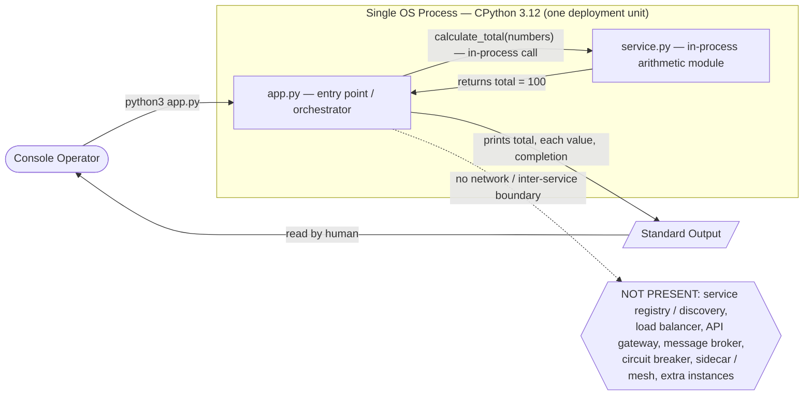
```mermaid
flowchart LR
    Operator(["Console Operator"])
    Stdout[/"Standard Output"/]
    subgraph Proc["Single OS Process — CPython 3.12 (one deployment unit)"]
        direction TB
        App["app.py — entry point / orchestrator"]
        Svc["service.py — in-process arithmetic module"]
        App -->|"calculate_total(numbers) — in-process call"| Svc
        Svc -->|"returns total = 100"| App
    end
    Absent{{"NOT PRESENT: service registry / discovery,<br/>load balancer, API gateway, message broker,<br/>circuit breaker, sidecar / mesh, extra instances"}}

    Operator -->|"python3 app.py"| App
    App -->|"prints total, each value, completion"| Stdout
    Stdout -->|"read by human"| Operator
    App -. "no network / inter-service boundary" .-> Absent
```

**Diagram 6.1.1 — Single-Process Deployment and Interaction Topology.** The entire system is one process containing both modules connected by an in-process call; the hexagon enumerates the service-architecture components that do not exist here.

For completeness — and so this section stands as a definitive reference — Sections 6.1.2 through 6.1.4 document each area required by the section prompt (Service Components, Scalability Design, and Resilience Patterns) by reporting its verified status in this repository rather than omitting it. Each area consistently resolves to "not applicable" or a trivial in-process analog, always with supporting evidence.

### 6.1.2 Service Components Analysis

Because the system runs as a single process with no networked services, the six service-component concerns enumerated by the section prompt do not apply in their conventional form. Each is reported below with its verified status. The closest in-repository analog to a "service boundary" is the **module boundary** between `app.py` (orchestration) and `service.py` (computation), which is crossed by a synchronous in-process function call rather than a service interaction (Section 5.1.2).

- **Service boundaries and responsibilities** — There are no service boundaries, only a two-module code boundary. `app.py` owns orchestration and presentation (build the fixed input, invoke the computation, write results to stdout, gate execution with the `__main__` guard); `service.py` owns pure computation (`calculate_total`, and the defined-but-unused `calculate_average`). The dependency direction is one-way, `app.py → service.py`, with the computation module having zero outward dependencies (Section 5.1.2).
- **Inter-service communication patterns** — Not applicable. The only cross-module hand-off is an in-memory Python call passing a list argument and returning a scalar (Section 5.1.3). There is no serialization, wire protocol, request/response envelope, or message; no HTTP, RPC, gRPC, socket, or queue code exists anywhere.
- **Service discovery mechanisms** — Not applicable. The dependency is resolved **statically at import time** by the interpreter via `from service import calculate_total`, which requires only that `service.py` be co-located on the module import path (Section 3.6). There is no registry, DNS-based lookup, environment-variable endpoint, or dynamic binding.
- **Load balancing strategy** — Not applicable. The program is a single instance with exactly one caller and one callee; there is no traffic, no concurrency, and therefore nothing to distribute across replicas.
- **Circuit breaker patterns** — Not applicable. Circuit breakers guard calls to fallible remote dependencies; here the only call is a local, deterministic function invocation. There is no remote dependency to trip a breaker, and a computation failure simply raises an unhandled `TypeError` (fail-fast — Section 5.4.2).
- **Retry and fallback mechanisms** — No retry logic exists (no loops, backoff, or re-invocation on failure). The only fallback in the codebase is a **value-level default guard**, `if not numbers: return 0` in `calculate_average` (`service.py` line 11), which substitutes a safe value for falsy input and prevents division by zero (Section 5.4.2). This is input-defensive behavior, not a service-level fallback path.

The single in-process boundary is illustrated by the two lines that constitute it:

```python
from service import calculate_total   # app.py:1 — static, in-process module import
total = calculate_total(numbers)      # app.py:6 — synchronous in-memory call, no network
```

The following table summarizes the status of each service-component concern.

| Service Component Concern | Status | Rationale / Evidence |
|---|---|---|
| Service boundaries & responsibilities | In-process module boundary only | `app.py` (orchestration) → `service.py` (computation); one-way dependency (Section 5.1.2) |
| Inter-service communication | Not applicable | Sole hand-off is an in-process Python call; no HTTP/RPC/socket/queue (Section 5.1.3) |
| Service discovery | Not applicable | Static `from service import calculate_total`; module co-located on import path (Section 3.6) |
| Load balancing | Not applicable | One process, one instance; no traffic to distribute |
| Circuit breaker | Not applicable | No remote/fallible dependency to guard; failures fail fast (Section 5.4.2) |
| Retry & fallback | Value-level default only | No retry; sole fallback is `if not numbers: return 0` in `calculate_average` (Section 5.4.2) |

### 6.1.3 Scalability Design Analysis

The system contains no scaling machinery, and none is warranted. The workload is fixed and negligible: a single O(n) accumulation pass over a hard-coded four-element list, followed by an O(n) print loop, with n = 4 (Section 5.4.4). The delivered unit of execution is one short-lived, single-threaded OS process. Each scalability concern from the section prompt is addressed below.

- **Horizontal / vertical scaling approach** — There is no built-in scaling mechanism. *Vertical scaling* (granting the host more CPU or memory) is irrelevant at this workload size. The only *horizontal* option is the trivial operating-system capability to launch multiple **fully independent, share-nothing** invocations of `python3 app.py`; each is a complete, isolated run with no shared state, no coordination, and no load balancer. No code exists to partition or distribute work across instances.
- **Auto-scaling triggers and rules** — Not applicable. There are no metrics, no autoscaler, and no thresholds; the system emits no counters, health checks, or telemetry on which a scaling decision could be based (Section 5.4.1).
- **Resource allocation strategy** — None is defined in code. The process receives whatever the operating system grants it and uses a constant, minimal footprint (a four-element list plus a few scalar locals), single-threaded, with no I/O wait (Section 5.4.4). There is no thread/process pool, worker configuration, connection pool, or container/cgroup resource limit (Section 3.6).
- **Performance optimization techniques** — None are implemented and none are needed. The algorithm is already a single-pass O(n) accumulation; there is no caching or memoization (`calculate_total` recomputes on every call — Section 5.1.3), and end-to-end wall-clock time is dominated by interpreter startup rather than the computation (Section 5.4.4).
- **Capacity planning guidelines** — No formal guidelines are defined. Because the input dataset is fixed at `[10, 20, 30, 40]` in code, per-run capacity is constant and fully known, and the delivered program has no growth dimension. Should the fixed list ever be enlarged, cost would grow **linearly (O(n))** in both time and memory — but that is a hypothetical characterization of the algorithm, not current behavior.

The diagram below contrasts the delivered single-process execution model with the only available "horizontal" option — independent, share-nothing re-invocation.

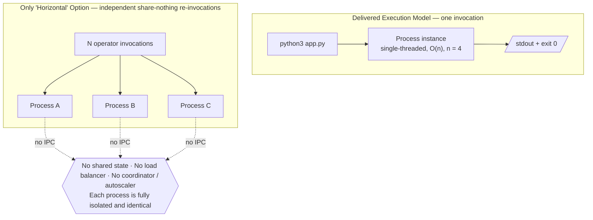
```mermaid
flowchart TB
    subgraph Single["Delivered Execution Model — one invocation"]
        direction LR
        Inv1["python3 app.py"] --> P1["Process instance<br/>single-threaded, O(n), n = 4"] --> Exit1[/"stdout + exit 0"/]
    end
    subgraph Horiz["Only 'Horizontal' Option — independent share-nothing re-invocations"]
        direction LR
        InvN["N operator invocations"] --> PA["Process A"]
        InvN --> PB["Process B"]
        InvN --> PC["Process C"]
    end
    NoShare{{"No shared state · No load balancer · No coordinator / autoscaler<br/>Each process is fully isolated and identical"}}
    PA -. "no IPC" .-> NoShare
    PB -. "no IPC" .-> NoShare
    PC -. "no IPC" .-> NoShare
```

**Diagram 6.1.3 — Scalability Model: Single-Process Execution and Share-Nothing Independent Re-Invocation.** The system scales only by running more identical, isolated processes; no coordination, load balancing, or auto-scaling layer exists.

The following table summarizes the status of each scalability concern.

| Scalability Concern | Status | Basis / Evidence |
|---|---|---|
| Vertical scaling | Not required | O(n) work with n = 4; single-threaded; negligible footprint (Section 5.4.4) |
| Horizontal scaling | Trivial share-nothing only | Independent `python3 app.py` invocations; no shared state or coordinator (Section 5.4.5) |
| Auto-scaling triggers & rules | Not applicable | No metrics, autoscaler, or thresholds (Section 5.4.1) |
| Resource allocation | None (OS default) | No pool, worker, connection, or container/cgroup limits (Section 3.6) |
| Performance optimization | Not applicable | Single-pass O(n); no cache/memoization (Section 5.1.3) |
| Capacity planning | Fixed & known | Hard-coded 4-element dataset; linear growth only hypothetically (Section 5.4.4) |

### 6.1.4 Resilience Patterns Analysis

The system implements no resilience machinery. Its operational posture is **fail-fast execution with manual, idempotent recovery**, consistent with the error and state model documented in Sections 4.3, 5.4.2, and 5.4.5. Each resilience concern from the section prompt is addressed below.

- **Fault tolerance mechanisms** — There is no fault-tolerance layer: no `try`/`except`, no supervisor, and no automatic restart. A non-iterable argument or a non-numeric element raises an unhandled `TypeError` that terminates the process with a traceback on standard error (Section 5.4.2). The only defensive measure is the `if not numbers: return 0` guard in `calculate_average` (`service.py` line 11). Because the delivered dataset is fixed and valid, only the success path is exercised in practice.
- **Disaster recovery procedures** — Not applicable. The system is **stateless and idempotent**: it persists nothing between runs (no database, files, or cache — Section 5.1.3), so there is no data to back up or restore and no partial work to reconcile. Recovery reduces to correcting any offending input or code and re-running `python3 app.py`; re-execution has no side effects to undo (Section 5.4.5). The only durability mechanism is preservation of the source in Git version control.
- **Data redundancy approach** — Not applicable at runtime. There is no data store, replication, or backup; the only live data are transient in-memory locals (`numbers`, `total`) discarded at process exit (Section 5.1.3). The sole redundancy that exists is **source-code redundancy** via the Git remote on GitHub (Section 3.6).
- **Failover configurations** — Not applicable. The program runs as a single instance with no standby, no health probe, and no failover target; there is no second node or process to fail over to (Section 5.4.5).
- **Service degradation policies** — Not applicable. There is no load shedding, graceful-degradation tier, or feature flag. The single value-level default (`return 0` for falsy input) is a correctness guard rather than a degradation policy, and there is no load or availability condition under which behavior would be degraded.

The diagram below models the resilience and recovery loop: a single process reaches one of two terminal states, and recovery is an operator-driven, side-effect-free re-run.

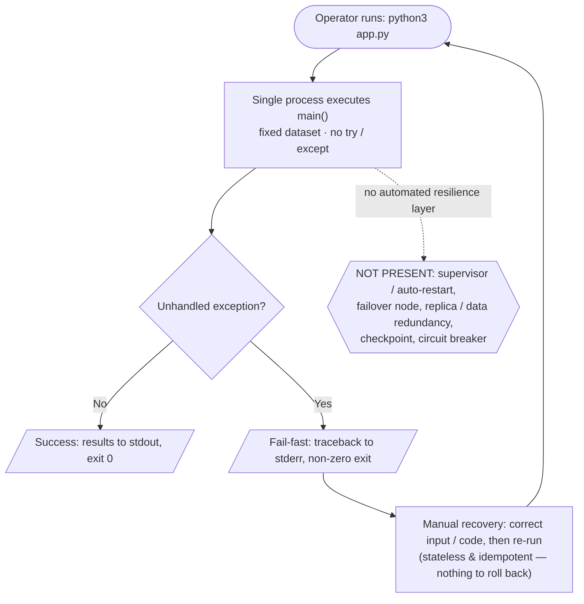
```mermaid
flowchart TD
    Start(["Operator runs: python3 app.py"])
    Run["Single process executes main()<br/>fixed dataset · no try / except"]
    Outcome{"Unhandled exception?"}
    Ok[/"Success: results to stdout, exit 0"/]
    Fail[/"Fail-fast: traceback to stderr, non-zero exit"/]
    Recover["Manual recovery: correct input / code, then re-run<br/>(stateless & idempotent — nothing to roll back)"]
    Absent{{"NOT PRESENT: supervisor / auto-restart,<br/>failover node, replica / data redundancy,<br/>checkpoint, circuit breaker"}}

    Start --> Run --> Outcome
    Outcome -->|"No"| Ok
    Outcome -->|"Yes"| Fail
    Fail --> Recover
    Recover --> Start
    Run -. "no automated resilience layer" .-> Absent
```

**Diagram 6.1.4 — Resilience and Recovery Model: Fail-Fast Execution with Manual, Idempotent Re-Run.** The only recovery path is human re-invocation; no automated tolerance, failover, redundancy, or degradation layer exists.

The following table summarizes the status of each resilience concern.

| Resilience Concern | Status | Mechanism / Evidence |
|---|---|---|
| Fault tolerance | Fail-fast (no tolerance) | No `try`/`except`; unhandled `TypeError` terminates process; only guard `if not numbers: return 0` (Section 5.4.2) |
| Disaster recovery | Not applicable (stateless) | Nothing persisted; recovery = re-run; source preserved in Git (Section 5.4.5) |
| Data redundancy | Not applicable | No store/replication; transient in-memory locals only; source redundancy via Git remote (Sections 5.1.3, 3.6) |
| Failover | Not applicable | Single instance; no standby, health probe, or failover target (Section 5.4.5) |
| Service degradation | Not applicable | No load shedding or feature flags; sole default is value-level `return 0` guard (Section 5.4.2) |

### 6.1.5 References

The following repository artifacts were inspected as direct evidence for this section:

- `app.py` — Console entry point / orchestrator; established the single-process execution model, the sole in-process import and call to `service.calculate_total` (lines 1 and 6), the `__main__` guard, and the absence of any network/service/retry code.
- `service.py` — In-process arithmetic module (`calculate_total`, `calculate_average`); established the pure-function computation, the only value-level fallback guard `if not numbers: return 0` (line 11), and the fail-fast (unhandled-exception) behavior.
- `README.md` — One-line identifier (`# repo_with_600K_LOC`); confirmed the absence of any architecture, service, or deployment documentation.
- `.blitzyignore` — Contains the single pattern `*.csv`; confirmed that `large.csv` is excluded data (never inspected, used, or documented) rather than source, so it introduces no service or scaling behavior.
- `/tmp/blitzy/repo_with_600K_LOC/600K_01_dc3c53/` (repository root) — Full inventory confirming there are no additional services, distributed components, containers, orchestration manifests, or configuration files.

The following Technical Specification sections were cross-referenced for terminology alignment and to support the status determinations above:

- Section 1.2 System Overview — System characterization as a standalone, single-purpose console utility with a single directional module dependency.
- Section 3.6 Development & Deployment — Deployment model (place two co-located files on a Python 3 host and run `python3 app.py`); confirmed absence of build system, containerization, orchestration, and CI/CD.
- Section 4.3 Technical Implementation: State Management and Error Handling — Fail-fast, stateless control-flow and error model.
- Section 5.1 High-Level Architecture — Single-process, two-layer architecture (5.1.1), component boundaries and responsibilities (5.1.2), in-process data flow with no data stores (5.1.3), and no external integration (5.1.4).
- Section 5.4 Cross-Cutting Concerns — Absence of monitoring/observability (5.4.1), minimal error handling (5.4.2), no performance requirements or SLAs (5.4.4), and disaster recovery not applicable due to stateless/idempotent design (5.4.5).

No external or web sources were required or used for this section; all determinations are grounded in the repository's own contents.

## 6.2 Database Design

### 6.2.1 Applicability Assessment

**Database Design is not applicable to this system.**

This system employs no database and no persistent storage of any kind. There is no relational database, no NoSQL/document store, no key-value or caching store, no object/blob storage, no embedded/file-backed database, and no on-disk data files that participate in the application's logic. The application is a minimal, single-process Python console utility whose entire data model is a single hard-coded, in-memory list constructed at runtime and discarded when the process exits.

This determination is consistent with the sibling section **3.5 Databases & Storage**, which records that the system "uses no database and no persistent storage of any kind," and with **1.2 System Overview**, which confirms there are no network calls, database clients, message brokers, filesystem reads/writes, environment-variable lookups, or third-party SDKs. Because there is no datastore, the schema-design, data-management, compliance, and performance-optimization concerns enumerated by this section's prompt have no corresponding implementation to document. Sub-section 6.2.2 records the assessment of each of those areas, 6.2.3 addresses the required diagrams, and 6.2.4 outlines the conditions under which a future revision would populate this section.

#### 6.2.1.1 Evidentiary Basis

The following evidence, gathered directly from the repository, establishes the absence of any persistence layer. The complete tracked source is `app.py` (16 lines) and `service.py` (14 lines), plus a one-line `README.md`.

| Evidence Category | Observation | Persistence Implication |
|-------------------|-------------|-------------------------|
| Dependency manifests | No `requirements.txt`, `pyproject.toml`, `setup.py`, `Pipfile`, or lockfile exists | No database driver, ORM, or cache client is declared or installed |
| Infrastructure files | No `Dockerfile`, `docker-compose`, Kubernetes, or Terraform manifests exist | No provisioned database, cache, or storage service |
| Schema / migration artifacts | No `.sql` files and no `migrations/`, `models/`, or `db/` folders exist | No schema, entities, indexes, or migration history |
| Source imports | The only import in the codebase is `from service import calculate_total` (`app.py` line 1) | No `sqlite3`, `psycopg2`, `sqlalchemy`, `redis`, `pymongo`, or file-I/O modules |
| Runtime data model | `app.py` builds the literal list `[10, 20, 30, 40]` and passes it to `service.calculate_total` | Data is transient, in-memory, and process-scoped only |
| Output channel | Results are emitted solely via `print()` to standard output | No data is written to any durable medium |

A keyword scan of all Python source for persistence and caching indicators — `sqlite`, `postgres`, `mysql`, `mongo`, `redis`, `sqlalchemy`, `.connect(`, `cursor`, `CREATE TABLE`, `SELECT`, `INSERT`, `migrat`, `schema`, `session`, `engine`, `open(`, and `read_csv` — returned no matches. The only directories present are `.git/` (version-control metadata) and `__pycache__/` (interpreter bytecode cache); neither is an application datastore.

#### 6.2.1.2 Note on the `large.csv` Artifact

The repository root contains a data file, `large.csv`. It is **not part of the storage architecture** for two independent reasons:

1. **Excluded from scope.** The repository's `.blitzyignore` file contains the single pattern `*.csv`, which formally excludes `large.csv` from analysis and documentation.
2. **Never read by any code.** More fundamentally, no code path in `app.py` or `service.py` opens, reads, parses, or otherwise references this file. There is no file-I/O call and no CSV-parsing logic anywhere in the codebase. The file is inert with respect to the running application.

Consequently, `large.csv` imposes no database, storage, connection, or parsing dependency on the system, and it establishes no schema, index, or retrieval mechanism. The application's behavior is identical whether or not the file is present on disk.

### 6.2.2 Assessment by Database Design Area

Each database-design area requested by this section's prompt was assessed against the repository. Every area is **Not applicable** because no datastore exists; the tables below record the specific finding and its basis so that the assessment is explicit and complete rather than merely asserted.

#### 6.2.2.1 Schema Design

There is no schema. The application's only data structure is the in-memory Python list `[10, 20, 30, 40]` built in `app.py`; it is not modeled, declared, or persisted. There are **zero tables, zero entities, zero relationships, zero indexes, and zero constraints** to document.

| Schema Concern | Status | Basis in Repository |
|----------------|--------|---------------------|
| Entity relationships | Not applicable | No entities; a single transient list, no relational model |
| Data models and structures | Not applicable | In-memory `list` of integers only; no persisted model or type declarations |
| Indexing strategy | Not applicable | No datastore, therefore no indexes (count: 0) |
| Constraints (keys, uniqueness, checks) | Not applicable | No schema, therefore no constraints (count: 0) |
| Partitioning approach | Not applicable | No tables or datasets to partition |
| Replication configuration | Not applicable | No datastore and single process; nothing to replicate |
| Backup architecture | Not applicable | No data-at-rest; only source durability is Git version control |

#### 6.2.2.2 Data Management

No data is stored, so there is nothing to migrate, version, archive, or retrieve from a durable medium. The data lifecycle is fully described by: construct the literal list → sum it via `service.calculate_total` → print the result → exit (memory reclaimed).

| Data-Management Concern | Status | Basis in Repository |
|-------------------------|--------|---------------------|
| Migration procedures | Not applicable | No schema exists; no migration tool or `migrations/` folder |
| Versioning strategy (data/schema) | Not applicable | No schema to version; only source is versioned, via Git |
| Archival policies | Not applicable | No stored data to archive; data is discarded at process exit |
| Data storage and retrieval mechanisms | Not applicable | Data is an in-process literal; no read/write against any store |
| Caching policies | Not applicable | No cache client or in-process cache structure is present |

#### 6.2.2.3 Compliance Considerations

The application handles no persisted, user-supplied, or personally identifiable data. Its only input is a trusted, in-code integer literal, and its only output is standard output. There is therefore no data-at-rest, no query surface, and no credential store to govern.

| Compliance Concern | Status | Basis in Repository |
|--------------------|--------|---------------------|
| Data retention rules | Not applicable | Nothing is retained; data lives only for the process lifetime |
| Backup and fault-tolerance policies | Not applicable | No data-at-rest to back up; no runtime redundancy or failover |
| Privacy controls | Not applicable | No PII or user data processed; input is a hard-coded literal |
| Audit mechanisms | Not applicable | No datastore, no logging, and no audit trail in the code |
| Access controls | Not applicable | No datastore credentials, roles, or grants; no authentication layer |

#### 6.2.2.4 Performance Optimization

Database-oriented performance techniques presuppose a datastore, queries, and connections — none of which exist. The workload is a single summation over four integers executed once per invocation; its computational complexity is linear in the input size, which is fixed at four.

| Performance Concern | Status | Basis in Repository |
|---------------------|--------|---------------------|
| Query optimization patterns | Not applicable | No queries; the only computation is an in-memory summation loop |
| Caching strategy | Not applicable | No cache; the result is recomputed each run and printed |
| Connection pooling | Not applicable | No database connections to pool |
| Read/write splitting | Not applicable | No datastore reads or writes; no primary/replica topology |
| Batch processing approach | Not applicable | No batch/ETL jobs; a single synchronous invocation per run |

### 6.2.3 Required Diagrams

This section's prompt requests three diagram types. Two of them — database schema (ERD) diagrams and a replication architecture diagram — depict constructs that do not exist in this system and are therefore reported as not applicable rather than fabricated. The third, a data-flow diagram, is provided below because a factual, evidence-grounded flow can be drawn: it illustrates the transient, in-memory data lifecycle and makes explicit that no persistence boundary is ever crossed.

| Required Diagram | Applicability | Reason |
|------------------|---------------|--------|
| Database schema / ERD | Not applicable | No entities, tables, columns, or relationships exist to model |
| Replication architecture | Not applicable | No datastore and a single process; no primary/replica topology |
| Data flow | Provided (below) | The actual runtime flow is in-memory only and can be shown factually |

#### 6.2.3.1 Data Flow Diagram — Actual Runtime (No Persistence)

The diagram below traces the system's real data path from invocation to process exit, alongside the persistence mechanisms that are deliberately shown as **absent**. Solid arrows are the actual, observed flow; dotted arrows indicate connections that do **not** exist in the codebase.

```mermaid
flowchart TD
    Operator(["Console Operator"]) -->|runs python3 app.py| Main["main in app.py"]
    Main -->|constructs literal list of four integers| Mem["In-memory list value 10 20 30 40"]
    Mem -->|passed by reference| Calc["service.calculate_total"]
    Calc -->|returns 100| Main
    Main -->|prints Total then each value then completion| Stdout[/"Standard Output"/]
    Stdout -->|process exits with status 0| Discard["Memory reclaimed - data discarded"]

    subgraph Absent["Absent Persistence Mechanisms - not present in codebase"]
        DBNode[("Relational or NoSQL Database")]
        CacheNode[("Cache Store")]
        FileNode["Filesystem or Object Storage"]
    end

    Main -.->|no DB client or connection| DBNode
    Main -.->|no cache client| CacheNode
    Calc -.->|no file read or write| FileNode
    CSVNode["large.csv - excluded by .blitzyignore and never read"] -.->|no file access in any module| FileNode
```

**Figure 6.2.3.1 — Runtime data flow.** All data originates from a hard-coded literal, is transformed only in memory, is reported to standard output, and is discarded when the process exits. No relational or NoSQL database, cache store, or filesystem/object storage participates in the flow, and the on-disk `large.csv` artifact is never accessed. This confirms there is no persisted state and therefore no schema, replication, or backup topology to diagram.

#### 6.2.3.2 Schema (ERD) and Replication Diagrams

Entity-relationship and replication diagrams are intentionally omitted. An ERD requires at least one entity with attributes and, typically, relationships and keys; the system defines none. A replication diagram requires a datastore with at least one primary and one replica (or an equivalent redundancy topology); the system has no datastore and runs as a single, share-nothing process. Producing either diagram would require inventing constructs that are not present in the repository, which this document does not do.

### 6.2.4 Conditions That Would Introduce Database Design

The following is forward-looking guidance, not a description of current behavior. **No persistence exists in the repository today**; this sub-section records the conditions that would make Database Design applicable in a future revision so that this section can be expanded appropriately if the system evolves. Each entry below is hypothetical and would need to be introduced as a new requirement, accompanied by supporting code and configuration, before it could be documented as fact.

| Triggering Requirement (Hypothetical) | Database-Design Areas It Would Activate |
|---------------------------------------|-----------------------------------------|
| Persisting inputs or computed results across runs | Schema design, data models, storage/retrieval mechanisms, backup architecture |
| Accepting external or user-supplied datasets (e.g., reading a real CSV/file input) | Data storage/retrieval, ingestion/migration procedures, privacy and access controls |
| Serving concurrent clients or a multi-instance deployment | Connection pooling, read/write splitting, replication configuration, indexing strategy |
| Handling regulated or personal data | Data retention rules, audit mechanisms, privacy controls, encryption at rest |
| Introducing a cache to avoid recomputation | Caching strategy and caching policies, cache invalidation |

Until such a requirement is added — with the corresponding datastore, driver/ORM, connection configuration, and schema or migration artifacts committed to the repository — Database Design remains **not applicable**, and the assessments in 6.2.1 through 6.2.3 stand as the authoritative record.

### 6.2.5 References

**Repository files examined for this section:**

- `app.py` — Console entry point. Established the sole data model (the in-memory literal list `[10, 20, 30, 40]`), the single local import `from service import calculate_total`, and that all output goes to standard output via `print()`. No database, file, or network access.
- `service.py` — Arithmetic utility module. Established that `calculate_total` and `calculate_average` are pure functions with no imports, no I/O, and no persistent state.
- `README.md` — One-line title file (`# repo_with_600K_LOC`); confirmed the absence of any architecture, schema, or persistence documentation.
- `.blitzyignore` — Contains the single pattern `*.csv`; established that `large.csv` is formally excluded from analysis and documentation.

**Repository directories examined:**

- `.git/` — Version-control metadata; the only durability mechanism in the repository (for source code), and not an application datastore.
- `__pycache__/` — CPython bytecode cache; not an application datastore.

**Absence-of-evidence checks (no matching files found):** dependency manifests (`requirements.txt`, `pyproject.toml`, `setup.py`, `Pipfile`), infrastructure/orchestration files (`Dockerfile`, `docker-compose`, Kubernetes, Terraform), schema/migration artifacts (`.sql` files, `migrations/`, `models/`, `db/` folders), and any database/cache/file-I/O imports in the Python source.

**Cross-referenced Technical Specification sections:**

- **3.5 Databases & Storage** — Corroborates that the system uses no database and no persistent storage of any kind, and that `large.csv` is not part of the storage architecture.
- **1.2 System Overview** — Corroborates that the system performs no external integration and no filesystem reads/writes, operating on transient in-memory data only.

## 6.3 Integration Architecture

### 6.3.1 Applicability Assessment

**Integration Architecture is not applicable for this system.** This repository neither implements nor requires integration with any external system, service, API, or messaging infrastructure. As established in Sections 1.2, 5.1, and 6.1, the system is a *standalone, single-purpose console utility / reference example* that executes entirely within a **single operating-system process** under the CPython interpreter, and whose only runtime touchpoint is the local **standard output** stream.

The complete, non-ignored source consists of exactly three files — `app.py` (16 lines), `service.py` (14 lines), and a one-line `README.md`. The sole cross-component hand-off anywhere in the codebase is a single synchronous **in-process Python function call**: `app.py` statically imports and invokes `service.calculate_total` (`app.py` lines 1 and 6). There is no network socket, HTTP endpoint, message broker, remote procedure call, third-party SDK, or externally reachable interface anywhere in the code. Consequently, the API-design, message-processing, and external-system concerns enumerated by this section's prompt have no corresponding implementation to document.

For completeness — so this section stands as a definitive reference rather than a bare assertion — Sections 6.3.2 through 6.3.4 report the verified status of each required area (API Design, Message Processing, External Systems), Section 6.3.5 records the conditions under which a future revision would make this section applicable, and Section 6.3.6 lists the evidence examined. Each area consistently resolves to "not applicable," always with supporting evidence drawn directly from the repository.

#### 6.3.1.1 Evidentiary Basis

The following evidence, gathered directly from the repository, establishes the absence of any integration surface. A keyword scan of all Python source for integration indicators — including `flask`, `django`, `fastapi`, `requests`, `http`, `socket`, `grpc`, `graphql`, `api`, `route`, `endpoint`, `auth`, `token`, `queue`, `kafka`, `rabbit`, `celery`, `redis`, `webhook`, `oauth`, `jwt`, `swagger`, `openapi`, `cors`, and `middleware` — returned **no matches**, as did a separate scan for URL, host, and port literals.

| Integration Precondition | Present? | Evidence in Repository |
|---|---|---|
| Networked API surface (REST/gRPC/GraphQL/WebSocket/socket) | No | No web, socket, or RPC library; no server or client code; keyword scan of all `*.py` returned zero matches |
| Inbound integration (webhook / callback / listener) | No | No server, port bind, or event listener; the sole entry is the CLI invocation `python3 app.py` (Section 5.1.1) |
| Message broker / queue / event stream | No | No broker or queue client (Kafka/RabbitMQ/SQS); execution is one linear synchronous pass (Section 4.4) |
| Third-party service SDK / external API client | No | The only import in the codebase is the local `from service import calculate_total` (`app.py` line 1); no SDKs (Sections 1.2.1, 3.4) |
| API gateway / reverse proxy | No | No gateway or proxy configuration; no web server; no `Dockerfile` or orchestration manifests (Section 3.6) |
| External data exchange / file ingestion | No | No file I/O anywhere; `large.csv` is `.blitzyignore`-excluded and never read (Sections 1.2.1, 6.2) |

Because none of these preconditions holds, there is no integration boundary on which the concerns of protocol negotiation, authentication, rate limiting, versioning, message routing, or external-service contracts could act.

#### 6.3.1.2 Integration Flow Diagram — Actual System Boundary (No External Integration)

The diagram below presents the system's real boundary and interaction topology. Solid arrows are the actual, observed flow; the dotted edges lead to callout nodes that enumerate the inbound and outbound integration mechanisms that are **absent** from the codebase. The entire system is one process whose only external contact is writing text to standard output.

```mermaid
flowchart LR
    Operator(["Console Operator"])
    Stdout[/"Standard Output (sole outbound touchpoint)"/]
    subgraph Trust["System Trust Boundary — single OS process (CPython 3.12)"]
        direction TB
        App["app.py — orchestrator / entry point"]
        Svc["service.py — in-process arithmetic module"]
        App -->|"calculate_total(numbers) — in-process call"| Svc
        Svc -->|"returns total = 100"| App
    end
    AbsentIn{{"NO INBOUND INTEGRATION:<br/>no HTTP/REST/gRPC server, no webhook<br/>listener, no message consumer, no API gateway"}}
    AbsentOut{{"NO OUTBOUND INTEGRATION:<br/>no HTTP client / SDK, no DB driver,<br/>no message producer, no external service call"}}

    Operator -->|"python3 app.py (CLI, no args / stdin / env)"| App
    App -->|"print(): total, each value, completion"| Stdout
    Stdout -->|"rendered to human operator"| Operator
    App -. "no external integration edge exists" .-> AbsentIn
    App -. "no external integration edge exists" .-> AbsentOut
```

**Diagram 6.3.1 — Actual Integration Boundary.** The only boundary crossings are the inbound CLI invocation and the outbound `print()` writes to standard output, both local operating-system facilities. The two hexagonal callouts enumerate the inbound and outbound integration components that do not exist anywhere in the code, confirming that there is no external integration surface to architect.

#### 6.3.1.3 Note on Development-Time and Data Artifacts

Three artifacts present in or around the repository could superficially be mistaken for integration points. None is an integration of the running application:

- **GitHub source-control remote.** The repository has an `origin` remote hosted on GitHub (Sections 3.4, 3.6). This is a **development-time source-control and collaboration touchpoint** used to store and share source code; it is not contacted by the application at runtime and imposes no runtime integration dependency. No credentials or endpoints are stored in the tracked application source (`app.py`, `service.py`, `README.md`).
- **`large.csv` data file.** A `large.csv` file exists at the repository root but is formally excluded from scope by the `.blitzyignore` pattern `*.csv`, and — more fundamentally — no code path in `app.py` or `service.py` opens, reads, or parses it. It is therefore not a data-integration input; the application's behavior is identical whether or not the file is present (consistent with Section 6.2).
- **CPython interpreter.** The CPython 3.12 runtime (Section 3.6) is the execution *platform*, not an integrated external service; the program invokes only Python built-ins (`print`, `len`, f-strings) and one local module import.

### 6.3.2 API Design Assessment

No application programming interface is exposed to any external consumer. There is **no network-accessible API of any kind** — no REST, gRPC, GraphQL, WebSocket, or socket server. The only "interface" that exists anywhere in the codebase is the **in-process Python function-call contract** between `app.py` and `service.py`: a language-level calling convention resolved statically at import time, not a published, versioned, or networked API (Sections 5.1.3, 4.4). Each API-design area required by this section's prompt is reported below with its verified status.

#### 6.3.2.1 The Only Interface — In-Process Function-Call Contract

The closest analog to an "API" in this repository is the callable surface of `service.py`, invoked in-memory by `app.py`. It has no wire format, transport, or request/response envelope; arguments and return values are ordinary Python objects passed on the same call stack.

| Callable | Signature (Input → Output) | Invocation | Notes |
|---|---|---|---|
| `calculate_total(numbers)` | Iterable of numbers → numeric sum (`0` for an empty iterable) | Synchronous in-process call from `app.py` line 6 | No serialization or transport; passes the list by reference (Section 5.1.3) |
| `calculate_average(numbers)` | Iterable → arithmetic mean (`0` for falsy input) | Defined in `service.py` but **not invoked** at runtime | Value guard `if not numbers: return 0` (`service.py` line 11); latent, unused surface |

This contract is enforced only by Python's runtime duck typing — there is no schema, no interface definition language, and no input validation; a non-iterable or non-numeric argument raises an unhandled `TypeError` (Section 5.4.2).

#### 6.3.2.2 API Design Areas Assessment

Every API-design concern from the prompt presupposes a network-exposed API, which does not exist here. Each is therefore **Not applicable**, with its specific basis recorded below.

| API Design Area | Status | Basis in Repository |
|---|---|---|
| Protocol specifications | Not applicable | No wire protocol; the only "protocol" is the Python calling convention (list in, scalar out); no HTTP/gRPC/WebSocket (Section 5.1.3) |
| Authentication methods | Not applicable | No users, credentials, tokens, or sessions; no identity or auth library (Section 3.4) |
| Authorization framework | Not applicable | No protected resources, roles, permissions, scopes, or ACLs anywhere in the code |
| Rate limiting strategy | Not applicable | No request surface to throttle; exactly one synchronous invocation per run (Section 4.4) |
| Versioning approach | Not applicable | No API to version; no version metadata, URI prefix, or content negotiation (Section 1.2.1) |
| Documentation standards | Not applicable | No OpenAPI/Swagger spec or API reference; `README.md` is a one-line title only (Section 1.2.1) |

#### 6.3.2.3 API Architecture Diagram

The diagram contrasts the single in-process function-call contract that actually exists (solid edges) with the layered networked API stack that is **absent** from the codebase (dotted edges into the callout subgraph). It makes explicit that no gateway, endpoint layer, authentication, rate limiting, version routing, or API documentation participates in the system.

```mermaid
flowchart TB
    Caller["app.py — in-process caller / orchestrator"]
    subgraph Contract["Only 'API' Present — In-Process Function-Call Contract (service.py)"]
        direction TB
        F1["calculate_total(numbers) → total"]
        F2["calculate_average(numbers) → mean (defined, unused)"]
    end
    Caller -->|"synchronous Python call · list in, scalar out · no serialization"| F1
    Caller -. "not invoked at runtime" .-> F2

    subgraph Absent["Absent Networked API Layers — not present in codebase"]
        direction TB
        GW["API Gateway / Reverse Proxy"]
        EP["REST / gRPC / GraphQL Endpoints"]
        AuthLayer["Authentication & Authorization Middleware"]
        RL["Rate Limiter / Quota Enforcement"]
        Ver["Version Router (URI / header negotiation)"]
        Doc["OpenAPI / Swagger Documentation"]
        GW --> EP
        EP --> AuthLayer
        AuthLayer --> RL
        RL --> Ver
        Ver --> Doc
    end
    Caller -. "no networked API stack exists" .-> GW
```

**Diagram 6.3.2 — API Architecture: In-Process Contract vs. Absent Networked API Stack.** The system's entire "API surface" is a single in-process function call to `service.calculate_total`. The dotted callout enumerates the conventional networked API layers (gateway, endpoints, auth, rate limiting, versioning, documentation) that would be designed if a real API existed — none of which is present in this repository.

### 6.3.3 Message Processing Assessment

No message-processing subsystem exists. Execution is a **single linear, synchronous pass** with no messages, events, queues, streams, or batch jobs (Sections 4.4, 5.1.3). The nearest analog to a "message" is the in-memory movement of the list value into `service.calculate_total` and the scalar result back out to standard output — an ordinary function call and return on one call stack, not a routed or brokered message. Each message-processing area from the prompt is reported below.

#### 6.3.3.1 Message Processing Areas Assessment

| Message-Processing Area | Status | Basis in Repository |
|---|---|---|
| Event processing patterns | Not applicable | No events, handlers, listeners, or event loop; `main()` is straight-line procedural code (Section 5.1.3) |
| Message queue architecture | Not applicable | No broker or queue client (Kafka/RabbitMQ/SQS); integration keyword scan returned zero matches |
| Stream processing design | Not applicable | No streaming framework and no continuous input; the input is a fixed four-element list built in code |
| Batch processing flows | Not applicable | No batch/ETL scheduler or job; exactly one synchronous invocation per run (Section 4.4) |
| Error handling strategy | Fail-fast (no message-level handling) | No `try`/`except`; an unhandled `TypeError` terminates the process; the sole guard is `if not numbers: return 0` (Sections 5.4.2, 4.3) |

The single error-handling behavior that does exist is not message-oriented: it is a value-level default guard in `calculate_average` plus fail-fast propagation of any unhandled exception to the interpreter, which writes a traceback to standard error and exits non-zero (Section 5.4.2). There is no dead-letter queue, no retry/backoff, and no error notification channel.

#### 6.3.3.2 Message Flow Diagram

The diagram traces the actual data path from invocation to process exit (solid edges) alongside the messaging infrastructure that is **absent** (dotted edges into the callout subgraph). The only "flow" is in-memory movement of a list and a scalar; nothing is enqueued, published, streamed, or scheduled.

```mermaid
flowchart LR
    Start(["python3 app.py"]) --> Build["main(): build fixed list of four integers"]
    Build -->|"in-memory value, passed by reference"| Sum["service.calculate_total: single-pass accumulation"]
    Sum -->|"returns scalar total = 100"| Emit["main(): format via f-string"]
    Emit -->|"print() writes six lines"| Out[/"Standard Output"/]
    Out --> Done(["process exits, status 0"])

    subgraph AbsentMsg["Absent Messaging Infrastructure — not present in codebase"]
        direction TB
        Q["Message Queue / Broker such as Kafka, RabbitMQ, SQS"]
        EV["Event Bus / Publish-Subscribe"]
        ST["Stream Processor for continuous input"]
        BATCH["Batch / ETL Scheduler"]
    end
    Build -. "no enqueue / publish" .-> Q
    Sum -. "no event emitted" .-> EV
    Build -. "no stream ingested" .-> ST
    Start -. "no scheduled batch job" .-> BATCH
```

**Diagram 6.3.3 — Message Flow: Linear In-Process Data Movement (No Messaging Infrastructure).** The complete "message flow" is a synchronous list-in / scalar-out function call followed by local `print()` writes. The callout enumerates the queue, event-bus, stream, and batch mechanisms that do not exist anywhere in the code.

#### 6.3.3.3 Key-Flow Sequence Diagram

The sequence below documents the key runtime flow from an integration standpoint, emphasizing that there are **zero external message round-trips**. It complements the fuller intra-process sequence in Section 4.4; here the focus is on boundary crossings and the absence of any remote or asynchronous participant.

```mermaid
sequenceDiagram
    actor Operator as Console Operator
    participant App as app.py
    participant Svc as service.py
    participant Out as Standard Output
    Note over Operator,Out: No broker, remote service, or network participant exists
    Operator->>App: python3 app.py (local CLI invocation)
    activate App
    App->>Svc: calculate_total(numbers) [in-process call, boundary crossing 1 of 1]
    activate Svc
    Svc-->>App: return 100 (in-memory, synchronous)
    deactivate Svc
    App->>Out: print total, each value, completion (local stdout)
    Out-->>Operator: six deterministic lines
    deactivate App
    Note over Operator,Out: 0 network round-trips · 0 async messages · 0 retries or timeouts
```

**Diagram 6.3.4 — Key-Flow Sequence: Zero External Message Round-Trips.** The only boundary crossing is the in-process call `app.py → service.calculate_total`; every other interaction is a local `print()` to standard output. No asynchronous message, remote call, retry, or timeout occurs (consistent with Section 4.4).

### 6.3.4 External Systems Assessment

No external systems participate at runtime. The application opens no outbound connections, contacts no remote endpoint, and depends on no third-party service; it therefore presents no outbound attack surface and holds no service credentials in its tracked source (Sections 1.2.1, 3.4, 5.1.4). Each external-system area from the prompt is reported below, followed by a complete inventory of every external touchpoint associated with the system.

#### 6.3.4.1 External Systems Areas Assessment

| External-System Area | Status | Basis in Repository |
|---|---|---|
| Third-party integration patterns | Not applicable | No SDKs or HTTP clients; the only import is the local `from service import calculate_total` (`app.py` line 1) (Sections 1.2.1, 3.4) |
| Legacy system interfaces | Not applicable | No legacy modules, adapters, wrappers, or migration scripts; git history consists only of commits that add the current files, with no documented predecessor (Section 1.2.1) |
| API gateway configuration | Not applicable | No gateway, reverse proxy, or web server; no gateway config, `Dockerfile`, or orchestration manifest (Section 3.6) |
| External service contracts | Not applicable | No SLAs, data-exchange contracts, or protocol negotiation; there is no remote counterparty to contract with (Section 5.1.4) |

#### 6.3.4.2 External Dependencies Inventory

The application has **no runtime external dependencies**. For completeness, the table below documents every external touchpoint associated with the system and classifies each as an application dependency, an execution platform, a local operating-system facility, or a development-time tool. None is a networked integration of the running program.

| Dependency / Touchpoint | Category | Runtime vs. Dev-Time | Evidence / Notes |
|---|---|---|---|
| Third-party / open-source libraries | Application dependency | None (zero) | No dependency manifest; `service.py` has no imports; `app.py` imports only the local `service` module (Sections 1.2.1, 5.1.4) |
| CPython 3.12 interpreter | Execution platform | Runtime platform (not an integration) | Bytecode tag `cpython-312` in `__pycache__`; program uses only Python built-ins (Section 3.6) |
| Standard output stream | Operating-system facility | Runtime, local (not networked) | Buffered `print()` writes; the sole outbound touchpoint (Section 5.1.4) |
| Git + GitHub `origin` remote | Source control / collaboration | Development-time only | `.git/` present; `origin` hosted on GitHub; no secrets stored in tracked application source (Sections 3.4, 3.6) |

Because the only runtime touchpoints are the local CPython interpreter and the standard output stream, there are no external availability, latency, throughput, or contract obligations for this system to satisfy or monitor (Section 5.1.4).

### 6.3.5 Conditions That Would Introduce Integration Architecture

The following is **forward-looking guidance, not a description of current behavior**. No integration exists in the repository today; this sub-section records the conditions under which Integration Architecture would become applicable in a future revision, so the section can be expanded appropriately if the system evolves. Each entry is hypothetical and would need to be introduced as a new requirement — accompanied by supporting code and configuration — before it could be documented as fact (consistent with the forward-looking treatment in Section 6.2.4).

| Triggering Requirement (Hypothetical) | Integration Areas It Would Activate |
|---|---|
| Exposing the computation over a network API (REST/gRPC/GraphQL) | Protocol specifications, authentication methods, authorization framework, rate limiting, versioning, API documentation, API gateway configuration |
| Consuming or producing messages via a broker or stream | Event processing patterns, message queue architecture, stream processing design, message-level error and retry handling |
| Integrating a third-party service or external API | Third-party integration patterns, external service contracts, external dependency management and secrets handling |
| Ingesting external or user-supplied datasets (e.g., reading a real file or CSV) | Batch processing flows, external data exchange, input validation and error handling |
| Interfacing with an upstream or legacy system | Legacy system interfaces, protocol adapters, contract and version negotiation |

Until such a requirement is added — with the corresponding client or server code, endpoint or broker definitions, and connection/configuration artifacts committed to the repository — Integration Architecture remains **not applicable**, and the assessments in Sections 6.3.1 through 6.3.4 stand as the authoritative record.

### 6.3.6 References

**Repository files examined as direct evidence:**

- `app.py` — Console entry point / orchestrator. Established the single-process execution model, the sole import `from service import calculate_total` (line 1), the single in-process call to `service.calculate_total` (line 6), the fixed in-code dataset, and that all output is via `print()` to standard output. Confirmed the absence of any network, API, messaging, or external-integration code.
- `service.py` — In-process arithmetic module. Established that `calculate_total` and `calculate_average` are pure functions with no imports and no I/O, and that the only error-handling construct is the value guard `if not numbers: return 0` (line 11).
- `README.md` — One-line title file (`# repo_with_600K_LOC`); confirmed the absence of any integration, API, or interface documentation.
- `.blitzyignore` — Contains the single pattern `*.csv`; established that `large.csv` is formally excluded from analysis and is not an integration input.

**Repository directories and artifacts examined:**

- `.git/` — Version-control metadata; source of the `origin` remote hosted on GitHub, a development-time touchpoint only (no token or credential reproduced or stored in tracked source).
- `__pycache__/` — CPython bytecode cache (`service.cpython-312.pyc`); confirmed the CPython 3.12 execution platform; not an application datastore or integration endpoint.
- `large.csv` — Present at the repository root but excluded by `.blitzyignore` and never read by any code; imposes no integration, parsing, or connection dependency.

**Absence-of-evidence checks (no matching files or code found):**

- No dependency manifests (`requirements.txt`, `pyproject.toml`, `setup.py`, `Pipfile`) and no third-party packages.
- No infrastructure or deployment artifacts (`Dockerfile`, `docker-compose`, Kubernetes manifests, gateway/reverse-proxy configuration).
- No API, framework, or messaging code: a keyword scan (including `flask`, `django`, `fastapi`, `requests`, `http`, `socket`, `grpc`, `graphql`, `api`, `route`, `endpoint`, `auth`, `token`, `queue`, `kafka`, `rabbit`, `celery`, `redis`, `webhook`, `oauth`, `jwt`, `swagger`, `openapi`, `cors`, `middleware`) and a URL/host/port literal scan both returned no matches; the only import anywhere in the codebase is the local `from service import calculate_total`.

**Cross-referenced Technical Specification sections:**

- Section 1.2 System Overview — Corroborates that the system performs no external integration, that its only interface is standard output, and that there is no documented legacy predecessor.
- Section 3.4 Third-Party Services — Corroborates that no third-party services are used at runtime and that GitHub is a development-only touchpoint with no outbound attack surface.
- Section 3.6 Development & Deployment — Corroborates the absence of a build system, containerization, and CI/CD; the `python3 app.py` execution model; and the CPython 3.12.3 / Git / GitHub tooling.
- Section 4.4 Integration Sequence Diagram — Corroborates the synchronous intra-process interaction with a single boundary crossing and no network round-trips, retries, or timeouts.
- Section 5.1 High-Level Architecture — Corroborates the single-process architecture, the in-process function call as the only cross-component hand-off (5.1.3), and that external integration points are not present (5.1.4).
- Section 5.4 Cross-Cutting Concerns — Corroborates the fail-fast error model, the sole value-level guard, and the absence of SLAs.
- Sections 6.1 Core Services Architecture and 6.2 Database Design — Corroborate, respectively, that the system is a single process with no distributed services and that it has no persistence layer.

No external or web sources were required or used for this section; all determinations are grounded in the repository's own contents.

## 6.4 Security Architecture

### 6.4.1 Applicability Assessment

**Detailed Security Architecture is not applicable for this system.** This repository implements no authentication, no authorization, and no data-protection machinery, and — as a dependency-free, single-process console utility with no network surface, no persistence, and no sensitive data — it requires none beyond the standard, largely platform-inherited practices catalogued in Section 6.4.1.3. As established in Sections 1.2, 5.4, 6.1, and 6.3, the system is a *standalone, single-purpose console utility / reference example* that executes entirely within one CPython 3.12 operating-system process and whose only runtime touchpoint is the local standard-output stream. Section 5.4.3 (Authentication and Authorization) already records that there is "no authentication or authorization framework, and none is applicable"; this section confirms that finding first-hand and extends it across every area enumerated by the prompt.

The complete, non-ignored source consists of exactly three files — `app.py` (17 lines), `service.py` (15 lines), and a one-line `README.md`. The only import anywhere in the codebase is the local `from service import calculate_total` (`app.py` line 1); there is no security library, no network or cryptographic module, and no secret material of any kind. A first-hand, case-insensitive scan of all Python source for security indicators — including `auth`, `login`, `password`, `credential`, `secret`, `token`, `session`, `cookie`, `jwt`, `oauth`, `saml`, `ldap`, `rbac`, `role`, `permission`, `acl`, `encrypt`, `crypto`, `hashlib`, `bcrypt`, `ssl`, `tls`, `https`, `certificate`, `keystore`, `vault`, `kms`, `mask`, `pii`, `gdpr`, `hipaa`, `pci`, `csrf`, and `cors` — returned no matches.

Because no security-relevant subsystem exists, the identity-management, multi-factor, session, token, password, RBAC, permission, resource-authorization, policy-enforcement, audit-logging, encryption, key-management, data-masking, secure-communication, and compliance-control concerns enumerated by this section's prompt have no corresponding implementation to document. In keeping with the treatment of Sections 6.1, 6.2, and 6.3, and so this section stands as a definitive reference rather than a bare assertion, the remaining sub-sections report the verified status of each required area with supporting evidence (6.4.2–6.4.4), provide the three required diagrams framed around the system's actual, platform-delegated posture, consolidate a security control matrix (6.4.5), and record the conditions under which a future revision would make this section applicable (6.4.6).

#### 6.4.1.1 Evidentiary Basis

The following evidence, gathered directly from the repository, establishes the absence of any security subsystem. The tables in this section are limited to a maximum of four columns as required by the section's output format.

| Evidence Category | Observation | Security Implication |
|---|---|---|
| Dependency manifests | No `requirements.txt`, `pyproject.toml`, `setup.py`, or `Pipfile` exists (Section 6.2.1.1) | No authentication, session, cryptographic, or secrets library is declared or installed |
| Source imports | The only import anywhere is `from service import calculate_total` (`app.py` line 1) | No `hashlib`, `ssl`, `secrets`, `jwt`, `os`, or network/crypto module is used |
| Security keyword scan | Case-insensitive scan of all `*.py` for auth/token/password/crypto/tls/rbac/pii indicators returned zero matches | No identity, access-control, encryption, or masking logic exists in code |
| Network surface | No socket, HTTP server/client, or port bind; no URL/host/port literals (Section 6.3.1.1) | No remote attack surface and no transport channel to protect |
| Persistence surface | No database, file writes, or cache; data is a transient in-memory literal (Section 6.2.1) | No data-at-rest to encrypt, mask, or govern |
| Input surface | `main()` builds the fixed literal `[10, 20, 30, 40]`; no args, stdin, env vars, or file reads | Input is trusted and in-code; there is no untrusted/injection surface |
| Secrets and credentials | No `.env`, key, certificate, or credential file; source files are mode 0644 with no secrets in tracked source (Section 6.3.4) | Nothing secret exists to store, rotate, or leak |
| Output surface | All output is `print()` to standard output (Sections 1.2, 6.3) | No sensitive data is emitted, and no data crosses a network boundary |

#### 6.4.1.2 Attack Surface Analysis

Because the program has no network listener, no external input, no persistence, and no secrets, its runtime attack surface is effectively limited to local operating-system access to the host itself. Each conventional attack vector is assessed below against the verified state of the repository.

| Potential Attack Vector | Present? | Basis in Repository |
|---|---|---|
| Remote exploitation (RCE, API injection, SSRF) | No | No network listener, server, or client; no socket/HTTP code anywhere (Section 6.3.1) |
| Authentication bypass / credential theft | No | No authentication and no credentials or secrets exist to bypass or steal |
| Privilege / authorization escalation | No | No roles, permissions, or policy layer; execution is governed solely by the host OS (Section 5.4.3) |
| Injection (SQL, command, deserialization) | No | No database, no shell/`eval` execution, no deserialization, and no external input; the dataset is an in-code literal |
| Sensitive-data exposure | No | No PII, secrets, or persisted data; the only output is a computed integer written to the local terminal |
| Supply-chain compromise | Minimal | Zero third-party dependencies; only the local `service` module and CPython built-ins are used |
| Local privilege escalation | No | Source files are mode 0644 with no setuid/setgid bit; the program runs as an ordinary unprivileged user process |
| Denial of service | Negligible | Fixed O(n) workload with n = 4; one short-lived process with a constant, minimal footprint (Section 5.4.4) |

#### 6.4.1.3 Standard Security Practices in Effect

Per the section prompt, where detailed security architecture is not applicable the standard security practices followed instead are documented explicitly. For this system those practices are largely **platform-inherited and design-intrinsic** rather than implemented in application code: they arise from the operating system, the CPython runtime, Git version control, and the deliberate minimalism of the program. None is fabricated; each maps to observed repository evidence.

| Standard Practice | Realization in This System (Evidence) |
|---|---|
| Minimal attack surface / least functionality | No network, no persistence, no secrets, and only `print()` output; the program does exactly one arithmetic task (Sections 1.2, 6.3) |
| OS-enforced process isolation | The application runs inside a single, ordinary CPython 3.12 OS process with the memory and privilege isolation the host kernel provides (Section 6.1) |
| Least privilege | Source files are mode 0644 with no setuid/setgid; the program requires and requests no elevated privileges |
| Host-delegated access control | The host OS login and filesystem permissions determine who may read and execute `app.py`/`service.py` (Section 5.4.3) |
| Zero-dependency (hardened) supply chain | No third-party packages are declared or installed, eliminating transitive dependency and CVE exposure (Section 3.3, Section 6.2.1.1) |
| Trusted, deterministic input | The sole input is a hardcoded in-code literal; no untrusted or externally supplied data is parsed |
| Source integrity and change traceability | Source is preserved and version-controlled in Git with an `origin` remote on GitHub, a development-time control only (Sections 3.6, 6.3.1.3) |
| Fail-fast without networked disclosure | Unhandled exceptions terminate the local process with a stderr traceback; no error detail is exposed across any network boundary (Section 5.4.2) |

These practices constitute the complete, evidence-based security posture of the delivered system. Should the system evolve to acquire an attack surface (for example, a network API, persistence, or external input), the dedicated authentication, authorization, and data-protection controls catalogued in Section 6.4.6 would become necessary.

#### 6.4.1.4 Security Zone Architecture

The prompt requires a security-zone diagram. The diagram below depicts the system's real trust topology. There is a **single meaningful trust boundary — the host operating-system user account and process boundary**; there is no network-facing zone, no DMZ, no perimeter, and no inter-service boundary, because the program neither listens on nor connects to any network. Solid arrows show the actual runtime flow; the dotted edge from the external zone confirms that no ingress path into the process exists.

```mermaid
flowchart TB
    Operator(["Human Operator"])
    subgraph ExternalZone["Untrusted / External Zone (no presence)"]
        NoNet{{"No network listener · no open port<br/>no inbound socket · no remote endpoint"}}
    end
    subgraph HostZone["Host Trust Zone — OS user account"]
        Shell["OS login session<br/>identity established by host OS"]
        FS["Local filesystem<br/>app.py, service.py — mode 0644"]
    end
    subgraph ProcZone["Application Execution Zone — single CPython 3.12 process"]
        App["app.py — orchestrator"]
        Svc["service.py — arithmetic module"]
        Data["In-memory literal 10,20,30,40<br/>trusted, in-code, transient"]
    end
    Stdout[/"Standard Output — local terminal"/]

    Operator -->|"OS authentication (login / PAM)"| Shell
    Shell -->|"python3 app.py"| App
    FS -.->|"read + execute permission check"| App
    App -->|"in-process call"| Svc
    Svc -->|"returns total = 100"| App
    App -->|"references"| Data
    App -->|"print()"| Stdout
    Stdout -->|"rendered to"| Operator
    NoNet -. "no ingress path into the process" .-> App
```

**Diagram 6.4.1 — Security Zone Topology.** The only trust boundary that governs the system is the host OS user account and process boundary (the Host Trust Zone enclosing the single-process Application Execution Zone). The External Zone is empty because the program exposes no network endpoint; the only crossings are the local CLI invocation (gated by OS authentication and filesystem permissions) and the outbound `print()` to the local terminal. No firewall, load balancer, API gateway, or network segmentation participates, consistent with the single-process topology documented in Sections 6.1 and 6.3.

### 6.4.2 Authentication Framework

No authentication framework exists in this system, and none is required. The application defines **no users, no identities, no login flow, no credentials, and no sessions or tokens**. It is invoked directly from the command line as `python3 app.py`, runs its fixed computation, and exits; at no point does it prompt for, receive, or verify any authentication material. This confirms first-hand the finding already recorded in Section 5.4.3 that the system has no authentication layer.

The only identity control that governs whether the program can run at all is **external to the application**: the host operating system authenticates the operator (for example, via OS login/PAM) before that operator can obtain a shell and execute the script. That control is a property of the host environment, not of the codebase, and it is documented here to make the boundary explicit rather than to claim an application feature. Each authentication area required by the prompt is assessed below with its verified status.

| Authentication Area | Status | Basis in Repository |
|---|---|---|
| Identity management | Not applicable | No user accounts, identity store, directory, or profile; the code has no concept of a "user" (Section 5.4.3) |
| Multi-factor authentication | Not applicable | No primary authentication exists to augment; no OTP/TOTP/WebAuthn/push code or library is present |
| Session management | Not applicable | Each run is a single stateless process that exits; no session, cookie, timeout, or session store exists (Sections 5.4.5, 6.1) |
| Token handling | Not applicable | No token is issued, stored, refreshed, or validated; no JWT/OAuth/API-key code (keyword scan returned zero matches) |
| Password policies | Not applicable | No password is collected, stored, or verified; no hashing primitive (`bcrypt`/`argon2`/`pbkdf2`/`hashlib`) is imported |

Because the delivered program performs no authentication decision of its own, an "authentication flow" for this system is entirely the host operating system's login sequence followed by unconditional program execution. The required authentication flow diagram below makes this explicit: the solid path is the actual flow (OS authenticates the user, then the program runs with no further check), while the dotted callout enumerates the application-level authentication steps that are **absent** from the codebase.

```mermaid
flowchart TD
    Start(["Operator intends to run the program"])
    OSAuth{{"Host OS authenticates the user<br/>login / PAM — outside application scope"}}
    Denied[/"OS denies session — program never starts"/]
    Shell["Authenticated OS shell session"]
    Exec["python3 app.py"]
    subgraph AppScope["Application Scope — app.py and service.py"]
        NoLogin["main() executes immediately<br/>no login prompt · no credential check"]
        Compute["Build fixed list, call calculate_total, print results"]
    end
    Out[/"Standard Output — exit status 0"/]

    Start --> OSAuth
    OSAuth -->|"failure"| Denied
    OSAuth -->|"success"| Shell
    Shell --> Exec
    Exec --> NoLogin
    NoLogin --> Compute
    Compute --> Out

    Absent{{"ABSENT application authentication:<br/>no identity store · no MFA challenge<br/>no session issuance · no token validation<br/>no password verification"}}
    NoLogin -. "no application authentication step exists" .-> Absent
```

**Diagram 6.4.2 — Authentication Flow: OS-Delegated Identity, No Application Authentication.** The only authentication is performed by the host operating system before the shell session exists; once the operator runs `python3 app.py`, `main()` executes unconditionally with no application-level identity, credential, MFA, session, or token check. The hexagonal callout enumerates the authentication mechanisms that would exist in a system that required them — none of which is present here.

### 6.4.3 Authorization System

No authorization system exists in this system, and none is required. The application defines **no roles, no permissions, no policies, no protected resources, and no enforcement points**. Once execution begins, `main()` runs unconditionally to completion; there is no guard, decorator, middleware, or interceptor that could allow or deny an operation based on identity or entitlement. This is consistent with Section 5.4.3, which records that no RBAC/ABAC or policy layer exists, and with Section 6.3.2, which found no authorization framework on any interface.

As with authentication, the only access control that applies is **delegated entirely to the host operating system**: standard filesystem permissions (the source files are mode 0644) and the OS user's rights determine who may read and execute `app.py` and `service.py`. That control operates outside the application and is administered with ordinary OS tooling, not with any code in this repository. Each authorization area required by the prompt is assessed below.

| Authorization Area | Status | Basis in Repository |
|---|---|---|
| Role-based access control | Not applicable | No roles, groups, or role-to-permission mappings, and no protected resource to gate (Section 5.4.3) |
| Permission management | Not applicable | No permission or grant model in code; the only permissions are OS filesystem bits (mode 0644) managed outside the application |
| Resource authorization | Not applicable | No protected endpoint, record, or object; the sole "resource" is a computed integer printed to the local terminal |
| Policy enforcement points | Not applicable | No middleware, guard, decorator, or interceptor; `main()` executes unconditionally (Sections 6.3.2, 5.4.3) |
| Audit logging | Not applicable | No logging framework, audit trail, or access record; the only output is the deterministic stdout report (Section 5.4.1) |

Because the program makes no authorization decision of its own, an "authorization flow" for this system reduces to the operating system's filesystem-permission check on the script files, after which the code runs with no further gating. The required authorization flow diagram below shows this: the solid path is the actual flow (OS permission check, then unconditional execution), while the dotted callout enumerates the application-level authorization mechanisms that are **absent** from the codebase.

```mermaid
flowchart TD
    User(["Authenticated OS user"])
    PermCheck{{"OS filesystem permission check<br/>read + execute on app.py / service.py (mode 0644)"}}
    Blocked[/"OS blocks access — files cannot be read or run"/]
    Load["CPython loads and executes app.py"]
    subgraph AppScope["Application Scope — no authorization logic"]
        NoGuard["main() runs unconditionally<br/>no role / permission / policy check"]
        Compute["Compute total and print results"]
    end
    Out[/"Standard Output"/]

    User --> PermCheck
    PermCheck -->|"denied"| Blocked
    PermCheck -->|"granted"| Load
    Load --> NoGuard
    NoGuard --> Compute
    Compute --> Out

    Absent{{"ABSENT application authorization:<br/>no RBAC / ABAC engine · no permission lookup<br/>no policy enforcement point · no audit log"}}
    NoGuard -. "no application authorization step exists" .-> Absent
```

**Diagram 6.4.3 — Authorization Flow: OS Filesystem-Permission Delegation, No Application Authorization.** The only authorization gate is the host OS filesystem-permission check on the script files; once granted, `main()` executes with no role, permission, policy-enforcement, or audit step of its own. The hexagonal callout enumerates the authorization mechanisms that a system requiring access control would implement — none of which exists in this repository.

### 6.4.4 Data Protection

No data-protection machinery exists in this system, and none is required, because there is **no sensitive data, no data-at-rest, no data-in-transit, and no secret material** to protect. The application's entire data model is a single hardcoded, non-sensitive integer literal `[10, 20, 30, 40]` constructed in `app.py`, summed in memory by `service.calculate_total`, printed to the local terminal, and discarded when the process exits (Sections 1.2, 6.2). There is no database or file persistence (Section 6.2), no network transmission of any kind (Section 6.3), and no credential, key, or certificate anywhere in the repository (Section 6.4.1.1). From a data-classification standpoint, the only datum the system handles is **public, non-sensitive, and ephemeral**.

#### 6.4.4.1 Data Protection Areas Assessment

Each data-protection area required by the prompt is assessed below with its verified status.

| Data Protection Area | Status | Basis in Repository |
|---|---|---|
| Encryption standards | Not applicable | No data-at-rest or in-transit and no cryptographic library imported; there is nothing to encrypt (Sections 6.2, 6.3) |
| Key management | Not applicable | No keys, certificates, keystore, KMS, or vault; no secret material exists (Section 6.4.1.1) |
| Data masking rules | Not applicable | No PII or sensitive fields; the only data is non-sensitive integers printed in full to the local terminal |
| Secure communication | Not applicable | No network communication; the sole output channel is local stdout, so there is no TLS/HTTPS to configure (Section 6.3) |
| Compliance controls | Not applicable | No regulated or personal data is processed or stored; see the compliance requirements in Section 6.4.4.2 (Section 6.2.2.3) |

#### 6.4.4.2 Compliance Requirements

The section prompt requires that compliance requirements be documented. Based solely on the repository's contents, the system **collects, processes, transmits, and stores no personal, health, financial, or otherwise regulated data**, and it operates as a local console utility rather than a hosted or multi-tenant service. Consequently, the commonly referenced regulatory and assurance frameworks below impose **no applicable controls** on the system as delivered. This determination follows from the evidence (no data collection, a hardcoded literal input, no persistence, and no network surface); it is not a legal opinion, and the applicable obligations for any future revision would be driven by the data and deployment context introduced at that time (see Section 6.4.6).

| Compliance Framework | Applicability | Rationale (Repository Evidence) |
|---|---|---|
| GDPR (EU personal data) | Not applicable | No personal data is collected, processed, or stored; input is a hardcoded integer literal |
| HIPAA (US protected health information) | Not applicable | No health information of any kind exists in the system |
| PCI-DSS (payment card data) | Not applicable | No cardholder data, payment flow, or network transmission is present (Section 6.3) |
| SOC 2 (hosted-service trust criteria) | Not applicable | Not a hosted or multi-tenant service; no customer data, network endpoint, or tenancy (Section 6.1) |
| CCPA / CPRA (California consumer data) | Not applicable | No consumer personal information is collected, shared, or sold |

Because no regulated data enters, resides in, or leaves the system, there are no encryption-at-rest, encryption-in-transit, data-retention, breach-notification, or subject-rights obligations to satisfy. The standard practices already in effect (Section 6.4.1.3) — minimal attack surface, OS process isolation, host-delegated access control, a zero-dependency supply chain, and Git-based source integrity — constitute the complete, evidence-based data-protection posture of the delivered system.

### 6.4.5 Security Control Matrix

This sub-section consolidates the section's findings into the security control matrix required by the prompt. It records, for every control domain, whether the **application** implements a control and which **layer** actually provides (or would provide) protection. The consistent finding is that the application implements no security controls of its own; the system's protection rests on **platform-inherited controls** (the host operating system and the CPython runtime) combined with the **design-intrinsic** properties of a dependency-free, network-free, stateless utility (Section 6.4.1.3).

| Security Control Domain | Application Control | Enforcing Layer / Mechanism |
|---|---|---|
| Identity & authentication | None | Host OS login/PAM authenticates the operator (Section 6.4.2) |
| Authorization & access control | None | Host OS filesystem permissions, mode 0644, gate read/execute (Section 6.4.3) |
| Encryption at rest | None (not required) | No data-at-rest exists; nothing to encrypt (Sections 6.2, 6.4.4) |
| Encryption in transit | None (not required) | No network transport; output is local stdout only (Sections 6.3, 6.4.4) |
| Secrets & key management | None (not required) | No secrets, keys, or certificates exist in the repository (Section 6.4.1.1) |
| Input validation | None | Trusted in-code literal input; bad types fail fast via unhandled `TypeError` (Section 5.4.2) |
| Audit logging & monitoring | None | Deterministic stdout report plus OS exit status only (Section 5.4.1) |
| Dependency / supply-chain security | Inherent (hardened) | Zero third-party dependencies; only the local module and CPython built-ins (Sections 3.3, 6.2.1.1) |
| Network exposure control | Inherent | No listener, socket, or open port; no remote attack surface (Section 6.3.1) |
| Process & privilege isolation | Inherent | Single unprivileged CPython 3.12 OS process; no setuid/setgid; kernel-enforced isolation (Section 6.1) |

The control-coverage summary below cross-walks the three security domains enumerated by the prompt to their verified status and the sub-section (including the required diagram) where each is documented, so the completeness of coverage is explicit.

| Prompt Security Domain | Verified Status | Documented In |
|---|---|---|
| Authentication Framework | Not applicable — OS-delegated identity only | Section 6.4.2 (+ Diagram 6.4.2) |
| Authorization System | Not applicable — OS filesystem-permission delegation only | Section 6.4.3 (+ Diagram 6.4.3) |
| Data Protection | Not applicable — no sensitive data, transport, or secrets | Section 6.4.4 |
| Security zones | Single OS trust boundary; no network zone | Section 6.4.1.4 (Diagram 6.4.1) |

In summary, there are no application-layer security controls to configure, test, or monitor. The delivered security posture is the sum of the platform-inherited and design-intrinsic controls above; introducing application-layer controls would be net-new work triggered by the conditions in Section 6.4.6.

### 6.4.6 Conditions That Would Introduce Security Architecture

The following is **forward-looking guidance, not a description of current behavior**. No security architecture exists in the repository today; this sub-section records the conditions under which authentication, authorization, and data-protection controls would become necessary in a future revision, so the section can be expanded appropriately if the system evolves. Each entry is hypothetical and would need to be introduced as a new requirement — accompanied by the corresponding code, configuration, and dependencies — before it could be documented as fact, consistent with the forward-looking treatment in Sections 6.2.4 and 6.3.5.

| Triggering Requirement (Hypothetical) | Security Areas It Would Activate |
|---|---|
| Exposing the computation over a network API (REST/gRPC/web) | Authentication (identity, MFA, sessions/tokens), authorization (RBAC, policy enforcement points), TLS/secure communication, rate limiting, input validation, audit logging |
| Persisting inputs or results, especially sensitive data | Encryption at rest, key management, access controls, data-retention rules, audit logging, backup protection |
| Accepting external or user-supplied input (files, CLI args, stdin, uploads) | Input validation and sanitization, injection defenses, error handling that avoids sensitive disclosure, data masking |
| Integrating a third-party service or external API | Secrets and key management, secure credential storage, TLS for outbound calls, dependency/supply-chain scanning |
| Serving multiple users or multi-tenant workloads | Identity management, authentication (including MFA), RBAC and permission management, session management, tenant isolation, audit logging |
| Handling regulated or personal data (PII/PHI/PCI) | Compliance controls (GDPR/HIPAA/PCI-DSS/SOC 2), encryption at rest and in transit, data masking, retention and subject-rights handling, breach notification, audit trail |

Until such a requirement is added — with the supporting authentication, authorization, cryptographic, or logging code and its configuration committed to the repository — Security Architecture remains **not applicable**, and the assessments in Sections 6.4.1 through 6.4.5 stand as the authoritative record.

### 6.4.7 References

**Repository files examined as direct evidence:**

- `app.py` — Console entry point / orchestrator. Established the trusted in-code literal input `[10, 20, 30, 40]`, the sole import `from service import calculate_total` (line 1), stdout-only output, and the complete absence of authentication, authorization, cryptographic, secrets, session/token, and network code.
- `service.py` — In-process arithmetic module. Established that `calculate_total` and `calculate_average` are pure functions with no imports, no I/O, and no security logic, and that invalid input fails fast via an unhandled `TypeError` (no sanitization layer).
- `README.md` — One-line title file (`# repo_with_600K_LOC`); confirmed the absence of any security, threat-model, or compliance documentation.
- `.blitzyignore` — Contains the single pattern `*.csv`; established that `large.csv` is formally excluded from analysis and was never viewed, used, or treated as a data-protection surface.

**Repository directories and artifacts examined:**

- `__pycache__/` — CPython bytecode cache (`service.cpython-312.pyc`); confirmed the CPython 3.12 runtime platform; not a datastore or secret store.
- `.git/` — Version-control metadata; source of the `origin` remote on GitHub, a development-time source-integrity control only (no credential or token reproduced or stored in tracked application source).
- `large.csv` — Present at the repository root but excluded by `.blitzyignore` and never read by any code; it imposes no data-protection, encryption, or masking requirement.

**First-hand checks performed (results):**

- Security-indicator keyword scan of all `*.py` (including `auth`, `login`, `password`, `credential`, `secret`, `token`, `session`, `jwt`, `oauth`, `rbac`, `permission`, `encrypt`, `crypto`, `hashlib`, `ssl`, `tls`, `https`, `certificate`, `vault`, `kms`, `mask`, `pii`, `gdpr`, `hipaa`, `pci`, `csrf`, `cors`) — returned **zero matches**.
- Dependency-manifest check — no `requirements.txt`, `pyproject.toml`, `setup.py`, or `Pipfile`; therefore no authentication, session, or cryptographic library is declared or installed.
- Secrets/permissions check — no `.env`, key, or certificate files; source files are mode 0644 with no setuid/setgid bit and no secrets in tracked source.
- Network/persistence checks — no socket/HTTP/port code and no database/file writes (corroborated by Sections 6.2 and 6.3).

**Cross-referenced Technical Specification sections:**

- Section 1.2 System Overview — Corroborates the standalone console-utility characterization, the stdout-only interface, and the absence of external integration.
- Section 3.3 Open Source Dependencies — Corroborates the zero-dependency (hardened) supply chain.
- Section 3.6 Development & Deployment — Corroborates the CPython 3.12 runtime, Git/GitHub tooling, and the absence of build/containerization/CI.
- Section 5.4 Cross-Cutting Concerns — Section 5.4.1 corroborates the absence of logging/monitoring/audit, 5.4.2 the fail-fast error model, and 5.4.3 that "there is no authentication or authorization framework, and none is applicable."
- Section 6.1 Core Services Architecture — Corroborates the single, unprivileged, stateless CPython process (process isolation).
- Section 6.2 Database Design — Corroborates the absence of persistence; Section 6.2.2.3 corroborates the absence of privacy controls, audit mechanisms, and datastore access controls.
- Section 6.3 Integration Architecture — Corroborates the absence of any networked/API/integration surface and of secrets or credentials in tracked source, and that GitHub is a development-time-only touchpoint.

No external or web sources were required or used for this section; all determinations are grounded in the repository's own contents.

## 6.5 Monitoring and Observability

### 6.5.1 Applicability Assessment and Basic Monitoring Practices

**Detailed Monitoring Architecture is not applicable for this system.** This repository is a *standalone, single-purpose console utility / reference example* (Sections 1.2 and 5.1) whose entire behavior runs to completion inside a **single, short-lived CPython process** and then exits. It exposes no network endpoint, holds no persistent state, runs no resident daemon, and imports no telemetry libraries. As established verbatim in Section 5.4.1, the system has *"no monitoring or observability approach and no logging or tracing strategy"* in the conventional sense — a monitoring stack (metrics collection, log aggregation, distributed tracing, alerting, dashboards) would be entirely net-new work rather than documentation of anything that exists.

The complete, non-ignored source is four files — `app.py` (17 lines), `service.py` (15 lines), a one-line `README.md`, and `.blitzyignore` (the single pattern `*.csv`). A whole-tree search for observability primitives (`logging`, `prometheus`, `opentelemetry`, `statsd`, `sentry`, `datadog`, health endpoints, `metrics`, `tracer`, `span`) returns **zero** matches; the only `import` anywhere is the local `from service import calculate_total` (`app.py` line 1). There is no dependency manifest, no configuration file, no `Dockerfile`, and no CI/CD pipeline (Section 3.6).

Rather than omit the areas enumerated by the section prompt, Sections 6.5.2 through 6.5.4 document each one by reporting its **verified status** in this repository and the **basic practice used instead**, always with supporting evidence. The remainder of this sub-section establishes why detailed monitoring does not apply, presents the minimal observation model that does, and defines the basic monitoring practices that are followed.

#### 6.5.1.1 Monitoring-Precondition Evaluation

Detailed monitoring becomes valuable when a system has continuous operation, remote surfaces, external dependencies, durable state, or contractual service levels to protect. The table below evaluates each such precondition against the verified state of the repository; none holds.

| Monitoring Precondition | Present? | Evidence in Repository |
|---|---|---|
| Long-running / resident process (server, daemon, worker) | No | Run-once process launched by `python3 app.py`; performs a fixed O(n) computation and exits (Sections 5.1.1, 3.6) |
| Network-exposed endpoint or listener to probe | No | No HTTP/socket/RPC server; the sole outbound interface is standard output (Section 5.1.4) |
| Telemetry instrumentation (metrics, traces, structured logs) | No | No `logging`/metrics/tracing imports; only `from service import calculate_total` (Section 5.4.1) |
| External dependency whose availability must be watched | No | Zero third-party dependencies; no database, cache, broker, or API (Section 5.1.4) |
| Persistent state requiring integrity or backup monitoring | No | Stateless and idempotent; only transient in-memory locals (`numbers`, `total`) (Section 5.4.5) |
| Defined SLA / SLO / KPI to measure against | No | No performance targets, latency budgets, availability SLAs, or KPIs anywhere (Sections 5.4.4, 1.2.3) |

Because every precondition resolves to *No*, the concerns that a monitoring architecture would address — service availability, error-rate trends, saturation, dependency health, SLA compliance — have nothing to act upon at runtime.

#### 6.5.1.2 Minimal Monitoring Architecture

The system's actual "monitoring architecture" reduces to two machine- or human-observable signals emitted by a single process: its **standard-output text** and its **process exit status** (with a Python traceback on standard error only along the fault path). The diagram below depicts this observation model and explicitly annotates the monitoring components that are absent.

```mermaid
flowchart LR
    Trigger(["Operator / CI runner"])
    subgraph Proc["Single CPython 3.12 Process — run-once"]
        direction TB
        Main["app.py · main()"]
        Svc["service.py · calculate_total()"]
        Main -->|"in-process call"| Svc
    end
    Stdout[/"stdout — six deterministic lines"/]
    Stderr[/"stderr — traceback (fault path only)"/]
    ExitCode["Process exit status<br/>0 = success · non-zero = fault"]
    Observer(["Human / CI log inspection"])
    Absent{{"NOT PRESENT: metrics agent, log aggregator,<br/>tracing collector, dashboard, alert manager"}}

    Trigger -->|"python3 app.py"| Main
    Main -->|"print() — success path"| Stdout
    Main -.->|"unhandled exception"| Stderr
    Main -->|"process terminates"| ExitCode
    Stdout --> Observer
    Stderr --> Observer
    ExitCode --> Observer
    Main -. "no telemetry emitted" .-> Absent
```

**Diagram 6.5.1 — Minimal Observation Model.** A single run-once process emits deterministic stdout and an exit status that a human or CI runner inspects directly; the hexagon enumerates the monitoring-infrastructure components that do not exist in this repository.

#### 6.5.1.3 Basic Monitoring Practices and Observable Signals

In place of a monitoring stack, operation is verified through **direct inspection of the two signals the program produces**, exactly as documented for the success and failure paths in Section 5.4.1. These signals form the de-facto "metrics" of the system; they are enumerated in the table below (the closest analog this codebase has to a metrics definition).

| Observable Signal | Source | Healthy Value | Interpretation |
|---|---|---|---|
| Process exit status | OS process termination code | `0` | Non-zero ⇒ unhandled exception / abnormal termination (Section 5.4.2) |
| Completion sentinel line | Final stdout line, `app.py` line 13 | `Application completed` | Absence ⇒ process terminated before `main()` finished |
| Aggregate result line | First stdout line, `app.py` line 8 | `Total: 100` | Deviation ⇒ computation or output regression (Section 1.2.3) |
| Fault trace | Standard error | (empty) | A non-empty Python traceback ⇒ a fault occurred (Section 5.4.2) |

The basic monitoring practices that are followed instead of a dedicated monitoring architecture are therefore:

- **Exit-status checking** — treat a `python3 app.py` exit code of `0` as the sole machine-readable health indicator; any non-zero code signals failure (verified live: the success path returns `0`, an injected non-numeric element returns `1`).
- **Output verification against a known-good baseline** — confirm the deterministic six-line stdout report (`Total: 100`, the four input values, `Application completed`) matches the acceptance behavior in Section 1.2.3; the trailing `Application completed` line doubles as a completion heartbeat.
- **Standard-error inspection** — on any failure, read the Python traceback emitted to stderr, which names the offending module, line, and exception type (Section 5.4.2).
- **Source-level change tracking** — rely on Git version control (GitHub `origin` remote, Section 3.6) as the record of what changed, since there is no runtime telemetry to correlate against.

These practices require no additional tooling: they use only the process exit convention and console output the program already produces.

### 6.5.2 Monitoring Infrastructure

The five monitoring-infrastructure capabilities enumerated by the section prompt — metrics collection, log aggregation, distributed tracing, alert management, and dashboard design — are **each absent from this repository**. No metrics client, log framework, tracing SDK, alert notifier, or dashboard configuration is imported or committed anywhere (Sections 5.4.1, 3.6). The table below reports the verified status of each capability and the basic practice that stands in for it; the sub-sections then detail alert management and dashboard design because the prompt requires an alert threshold matrix and a dashboard layout.

| Infrastructure Capability | Status | Basic Practice / Evidence |
|---|---|---|
| Metrics collection | Not implemented | No counters/gauges/histograms or metrics client; process exit status and stdout are the only observed signals (Section 5.4.1) |
| Log aggregation | Not implemented | No `logging` module or log sink; `print()` to stdout is the only "log," captured only if the shell/CI records the console (Section 5.4.1) |
| Distributed tracing | Not applicable | One in-process call `app.py → service.calculate_total`; no process or network boundary to span (Sections 5.1.3, 6.1.2) |
| Alert management | Not implemented | No alerting rules or notifier; failure surfaces as a non-zero exit and stderr traceback observed manually (Section 5.4.2) |
| Dashboard design | Not implemented | No visualization layer; the terminal / CI console log is the sole observation surface |

#### 6.5.2.1 Metrics Collection, Log Aggregation, and Distributed Tracing

**Metrics collection.** The program emits no numeric telemetry. There is no metrics registry, no counter/gauge/histogram, and no push or scrape endpoint; the value `100` printed as `Total: 100` is a *functional result*, not a collected metric. The de-facto substitute is the observable-signals set defined in Section 6.5.1.3 (exit status, completion sentinel, result line), inspected per run rather than aggregated over time.

**Log aggregation.** As documented in Section 5.4.1, *"`print()` to stdout doubles as the application's only 'logging.'"* There is no structured logging, no log level, no timestamp, no correlation identifier, and no log-rotation or shipping configuration. Consequently there is nothing to aggregate at the application layer: the six deterministic stdout lines are "collected" only incidentally, when the invoking shell redirects them to a file or a CI runner records the job's console output. Log retention is therefore whatever the surrounding execution environment provides, not a property of this codebase.

**Distributed tracing.** Distributed tracing is not applicable because the system has no distribution to trace. The entire runtime is a single CPython process whose only cross-component hand-off is the synchronous in-memory call `app.py → service.calculate_total` (`app.py` lines 1 and 6); there is no second service, network hop, or asynchronous boundary across which a trace context could propagate (Sections 5.1.3 and 6.1.2). A conventional call stack visible in the stderr traceback fully describes the one execution path when a fault occurs.

#### 6.5.2.2 Alert Management

**No automated alert management exists** — there is no rules engine, no `try`/`except` that raises an alert, and no notifier (email, chat, pager) anywhere in the code (Section 5.4.2). "Alerting" is therefore a **manual or CI-applied inspection** of the same signals the program already produces: a run is treated as failed when its exit status is non-zero, its stderr is non-empty, or its stdout deviates from the known-good baseline.

The matrix below expresses those failure-detection conditions as an alert threshold matrix. The thresholds are grounded in the verified success/failure signals (Section 5.4.1, live-verified: success ⇒ exit `0`; injected non-numeric element ⇒ exit `1` with a `TypeError` traceback) and the acceptance behavior in Section 1.2.3. They define what a human operator or a CI assertion would treat as alert-worthy; they are **not** thresholds evaluated by any monitoring system present in the repository.

| Detection Condition (Signal) | Alert Threshold | Severity | Response |
|---|---|---|---|
| Process exit status | Not equal to `0` | Critical | Inspect stderr traceback; apply the runbook (Section 6.5.4) |
| Completion sentinel (`Application completed`) | Missing from stdout | Critical | Process ended early; read stderr, correct cause, re-run |
| stderr content | Non-empty (traceback present) | Critical | Identify exception type, module, and line; fix input or code |
| Aggregate result line | Not equal to `Total: 100` | High | Output / computation regression versus baseline (Section 1.2.3) |

#### 6.5.2.3 Dashboard Design

**No dashboard is designed or shipped.** There is no Grafana/Kibana definition, no metrics UI, and no visualization config. The only surface on which the system's state is "displayed" is the **terminal or CI console log** that receives the program's standard output (and, on failure, standard error). The diagram below documents the layout of that de-facto dashboard — the panels an operator actually reads, in top-to-bottom scan order — rather than a fabricated visualization tool.

```mermaid
flowchart TB
    subgraph Console["De-facto Dashboard — Terminal / CI Console Log"]
        direction TB
        P1["Result Panel<br/>Total: 100"]
        P2["Inputs Echo Panel<br/>10 · 20 · 30 · 40"]
        P3["Completion / Health Panel<br/>Application completed"]
        Ex["Status Indicator<br/>process exit code (0 = healthy)"]
        Tb["Fault Panel — stderr (failure only)<br/>traceback: exception, module, line"]
        P1 --> P2 --> P3 --> Ex
    end
```

**Diagram 6.5.2 — Console Observation Surface ("Dashboard") Layout.** On the success path the operator scans three stdout panels (result, echoed inputs, completion sentinel) and the exit-status indicator; the fault panel is populated on stderr only when a failure occurs. This is the complete observation surface — no graphical dashboard exists.

### 6.5.3 Observability Patterns

The five observability patterns named by the section prompt — health checks, performance metrics, business metrics, SLA monitoring, and capacity tracking — are reported below with their verified status. Only two have a concrete (if minimal) in-repository analog: **health checks**, satisfied by the exit status and completion sentinel, and the **performance profile**, which can be characterized from the code even though it is not instrumented. The remaining three do not apply to a fixed-workload, run-once arithmetic utility.

| Observability Pattern | Status | Basis / Evidence |
|---|---|---|
| Health checks | Exit status + completion sentinel | No health endpoint; liveness = exit `0` and the `Application completed` line (Sections 5.4.1, 1.2.3) |
| Performance metrics | Not instrumented | O(n) accumulation + O(n) print loop, n = 4; time dominated by interpreter startup; no timers/counters (Section 5.4.4) |
| Business metrics | Not tracked | Sole domain output is `Total: 100`, printed as a result rather than emitted as a KPI (Section 1.2.2) |
| SLA monitoring | Not applicable | No SLA / SLO / KPI is defined anywhere to monitor (Sections 5.4.4, 1.2.3) |
| Capacity tracking | Not applicable | Fixed four-element dataset; constant minimal footprint; no capacity metric (Sections 5.4.4, 6.1.3) |

#### 6.5.3.1 Health Checks and Performance Metrics

**Health checks.** The system has no HTTP `/healthz`, readiness, or liveness endpoint because it runs no server (Section 5.1.4). The equivalent *post-run* health check is a two-part assertion on the signals the program emits: the process exited with status `0`, and its final stdout line is `Application completed`. As Section 5.4.1 states, the operating system's exit-status convention *"is the only machine-readable health indicator,"* and the completion sentinel confirms `main()` ran end-to-end rather than terminating early. A health check thus reduces to running `python3 app.py`, then verifying `$? == 0` and the presence of the sentinel line — no probe, heartbeat, or watchdog is present or required.

**Performance metrics.** No performance instrumentation exists — there is no timer, latency histogram, profiler hook, benchmark, or load test (Section 5.4.4). The performance profile is nonetheless fully characterizable from the code because the workload is fixed:

- **Computational cost** — a single O(n) accumulation pass in `calculate_total` plus an O(n) print loop in `main()`, with n = 4 (Section 5.4.4).
- **Wall-clock behavior** — negligible computation; end-to-end time is dominated by CPython interpreter startup, and the program completes effectively instantaneously.
- **Resource footprint** — constant and minimal (a four-element list and a few scalar locals), single-threaded, with no I/O wait.

Because these characteristics are deterministic and constant across runs, there is no time-series worth collecting; the "performance metric" is simply that every run does the same negligible work.

#### 6.5.3.2 Business Metrics and Capacity Tracking

**Business metrics.** The repository provides no business context (Section 1.2.1) and tracks no business KPI. Its only domain output is the arithmetic aggregate `Total: 100` (and the defined-but-unused `calculate_average`, Section 1.2.2); these are *functional results written to the console*, not conversion, usage, revenue, or throughput metrics captured for analysis. There is no event emission, counter, or analytics sink through which a business metric could be recorded, so this pattern has no applicable content beyond noting its deliberate absence.

**Capacity tracking.** Capacity tracking is not applicable because the workload has no growth dimension at runtime: the input is the hard-coded list `[10, 20, 30, 40]` (`app.py` line 4), so per-run capacity is constant and fully known in advance, consistent with the "fixed & known" capacity determination in Section 6.1.3. There is no saturation metric (CPU, memory, queue depth, connection count), no autoscaling trigger, and no capacity threshold — none can exist without a resident process or a variable workload. Were the fixed dataset ever enlarged, cost would grow linearly (O(n)) in both time and memory, but that is a hypothetical property of the algorithm, not a tracked runtime dimension.

#### 6.5.3.3 SLA Monitoring and Documented SLA Requirements

**No service-level agreements, objectives, or indicators are defined in the repository**, so there is nothing to monitor for SLA compliance. This is stated authoritatively in Section 5.4.4 (*"no performance requirements, latency budgets, throughput targets, availability SLAs, or KPIs"*) and Section 1.2.3 (*"Key performance indicators are not defined anywhere in the repository"*). Any SLA would have to be introduced as a new requirement rather than documented from existing evidence.

To satisfy the prompt's requirement to *document SLA requirements*, the table below records each conventional SLA dimension, confirms that no formal target exists for it, and gives the only observable basis the repository provides. The final row is deliberately labeled as a **de-facto correctness criterion, not an SLA** — it is a verifiable acceptance behavior (Section 1.2.3), not an availability or performance guarantee.

| SLA Dimension | Formal Target Defined? | Observable Basis in Repository |
|---|---|---|
| Availability / uptime | No | Run-once CLI with no resident service; "uptime" is not a meaningful dimension (Section 6.1.1) |
| Latency / response time | No | No latency budget; runtime dominated by interpreter startup for an O(n=4) computation (Section 5.4.4) |
| Throughput | No | No throughput target; exactly one fixed dataset is processed per invocation (Section 5.4.4) |
| Error rate | No | No error-budget target; fail-fast on invalid input, exit `0` on the fixed valid dataset (Section 5.4.2) |
| Correctness (de-facto acceptance, not an SLA) | Not an SLA — a verifiable criterion | `python3 app.py` ⇒ exit `0` and the exact six-line output; `calculate_total([10,20,30,40]) == 100` (Section 1.2.3) |

### 6.5.4 Incident Response

There is **no automated incident-response machinery** in the repository — no alert router, no on-call/escalation configuration, no committed runbook document, and no post-mortem or issue-tracking artifact (Sections 5.4.2, 5.4.5, 3.6). Incident response is correspondingly lightweight and human-driven, and it is made tractable by the system being **stateless, idempotent, and fully deterministic**: any failure is reproduced simply by re-running, and recovery has no state to roll back. The table below summarizes each incident-response concern; the sub-sections then provide the alert flow, the operational runbook, and the post-incident practices.

| Incident-Response Concern | Status | Practice / Evidence |
|---|---|---|
| Alert routing | Manual (no automated routing) | Failure surfaces via non-zero exit + stderr traceback, observed by operator/CI (Section 5.4.2) |
| Escalation procedures | Not defined | No severity tiers or on-call rotation; single-operator local execution model (Section 5.4.3) |
| Runbooks | Implicit recovery procedure | Correct offending input/code, then re-run `python3 app.py` — stateless/idempotent (Section 5.4.5) |
| Post-mortem processes | Not formalized | No incident log; Git commit history is the only change record (Sections 1.2.1, 3.6) |
| Improvement tracking | Git / GitHub version control only | Changes are tracked through commits on the GitHub `origin` remote (Section 3.6) |

#### 6.5.4.1 Alert Routing and Escalation

**Alert routing.** No signal is routed anywhere automatically; a fault is *pulled* by whoever inspects the run rather than *pushed* by a notifier. The routing path is therefore: the process fails (non-zero exit and/or a traceback on stderr), a human operator or a CI runner observes that outcome on the console, and they begin triage using the runbook in Section 6.5.4.2. The diagram below models this detection-to-recovery flow.

```mermaid
flowchart TD
    Run(["Run completes: python3 app.py"])
    CheckExit{"Exit status == 0 ?"}
    CheckOut{"stdout ends with<br/>'Application completed' ?"}
    Healthy[/"Healthy — no action"/]
    Fault["Fault detected:<br/>non-zero exit and/or stderr traceback"]
    Notify["Manual notification:<br/>operator / CI console inspection"]
    Triage["Triage using runbook (Section 6.5.4.2)"]
    Recover["Correct input / code, then re-run (stateless)"]

    Run --> CheckExit
    CheckExit -->|"Yes"| CheckOut
    CheckExit -->|"No"| Fault
    CheckOut -->|"Yes"| Healthy
    CheckOut -->|"No"| Fault
    Fault --> Notify
    Notify --> Triage
    Triage --> Recover
    Recover --> Run
```

**Diagram 6.5.3 — Alert (Failure-Detection) Flow.** Detection is a manual/CI check of exit status and the completion sentinel; a detected fault is routed to a human for triage and an idempotent re-run. No automated notification hop exists.

**Escalation procedures.** No escalation tiers, severity levels, or on-call rotation are defined. Access is delegated entirely to the host operating system — *"whoever can execute `python3 app.py` on the machine can run the program"* (Section 5.4.3) — so the operational model is a single actor. The only "escalation" that exists in practice is informal: if re-running does not resolve a failure (for example, a genuine code defect rather than a bad input), the matter passes to the developer/maintainer, who edits the source and commits a fix through Git (Section 3.6).

#### 6.5.4.2 Runbooks

No runbook file is committed to the repository, but the operational procedure is fully determined by the code and the state/error model in Sections 5.4.2 and 5.4.5. The runbook below captures normal execution, verification, diagnosis, and recovery.

| Step | Action | Expected / Success Signal |
|---|---|---|
| 1 · Execute | Run `python3 app.py` from the directory containing both `app.py` and `service.py` | Six-line stdout report; process exit status `0` |
| 2 · Verify | Confirm exit `0`, first line `Total: 100`, and final line `Application completed` | Output matches the baseline in Section 1.2.3 |
| 3 · Diagnose (on failure) | Read the Python traceback on stderr: exception type, module, and line number | Root cause identified (e.g., `TypeError` on non-numeric input) (Section 5.4.2) |
| 4 · Recover | Correct the offending input or code; re-run from Step 1 — there is no partial state to reconcile | Successful re-run; stateless & idempotent (Section 5.4.5) |

The two failure modes that this runbook realistically addresses are both grounded in the code: a **`ModuleNotFoundError`** if `service.py` is not co-located on the import path (the unqualified `from service import calculate_total` must resolve — Section 5.1.2), and an unhandled **`TypeError`** if a non-iterable or non-numeric value ever reaches `calculate_total` (Section 5.4.2). Because the delivered dataset is fixed and valid, neither fault occurs on the standard success path; both are latent and are resolved by the same correct-and-re-run loop.

#### 6.5.4.3 Post-Mortem Processes and Improvement Tracking

**Post-mortem processes.** No formal post-mortem process, incident log, or blameless-review template exists in the repository. Two properties of the system make heavyweight post-mortems unnecessary for its current form: execution is **fully deterministic** (identical input yields identical output and exit status every run), so any incident is trivially reproducible, and the system is **stateless**, so a failure cannot leave residual corruption to investigate (Sections 5.4.5, 1.2.3). Root-cause analysis therefore reduces to reading the stderr traceback and re-running. The only durable record of what changed over time is the **Git commit history** — the five-commit history noted in Section 1.2.1 (`Initial commit`, `Add files via upload`, and the `Create app.py` / `Create service.py` / `Create .blitzyignore` commits).

**Improvement tracking.** Improvements are tracked solely through **version control** on the GitHub `origin` remote (Section 3.6); the repository contains no issue tracker, backlog, `CHANGELOG`, or roadmap document. One concrete, code-visible improvement opportunity is already latent in the source: `calculate_average` is defined in `service.py` but never invoked by `app.py` (Sections 1.2.2, 6.1.2), so wiring it into the runtime would be tracked as a future commit. Absent a dedicated tracking tool, the commit log is both the change record and the improvement backlog for this system.

### 6.5.5 References

The following repository artifacts were inspected as direct evidence for this section:

- `app.py` — Console entry point / orchestrator; established that output is exclusively `print()` to standard output, the deterministic six-line report and its `Application completed` completion sentinel (line 13) and `Total: 100` result line (line 8), the sole `from service import calculate_total` import (line 1), the `__main__` guard, and the success-path exit status `0`.
- `service.py` — Arithmetic utility module (`calculate_total`, `calculate_average`); established the absence of any logging/metrics/tracing imports, the pure-function computation with no telemetry, the fail-fast `TypeError` fault path, and the latent (defined-but-unused) `calculate_average` improvement opportunity.
- `README.md` — One-line identifier (`# repo_with_600K_LOC`); confirmed there is no monitoring, operations, or runbook documentation.
- `.blitzyignore` — Contains the single pattern `*.csv`; confirmed `large.csv` is excluded data (never inspected or documented) and introduces no monitoring surface.
- `__pycache__/service.cpython-312.pyc` — Generated CPython 3.12 bytecode; corroborated the CPython 3.12 runtime referenced in the diagrams.
- `/tmp/blitzy/repo_with_600K_LOC/600K_01_dc3c53/` (repository root) — Full inventory confirming there are no dependency manifests, configuration files, dashboards, alerting rules, CI/CD pipelines, or any other observability tooling.

Live verification performed during investigation: `python3 app.py` produced the exact six-line output and exit status `0`; injecting a non-numeric element into `calculate_total` produced a `TypeError` traceback on standard error and a non-zero exit status (`1`), grounding the alert-threshold and health-check determinations.

The following Technical Specification sections were cross-referenced for terminology alignment and to support the status determinations above:

- Section 1.2 System Overview — System characterization as a standalone, single-purpose console utility (1.2.1); primary capabilities and the `Total`/`calculate_average` outputs (1.2.2); de-facto success criteria and the explicit absence of KPIs (1.2.3).
- Section 3.6 Development & Deployment — Execution model (`python3 app.py`, exit `0`); confirmed absence of build system, containerization, and CI/CD; CPython 3.12.3 runtime and Git/GitHub `origin` remote as the only change-tracking mechanism.
- Section 5.1 High-Level Architecture — Single-process model (5.1.1), module co-location requirement (5.1.2), stateless in-process data flow (5.1.3), and standard output as the sole external interface (5.1.4).
- Section 5.4 Cross-Cutting Concerns — Explicit absence of monitoring/observability/logging/tracing (5.4.1), fail-fast error handling (5.4.2), OS-delegated access with no auth model (5.4.3), absence of performance requirements and SLAs (5.4.4), and stateless/idempotent recovery (5.4.5).
- Section 6.1 Core Services Architecture — Single-process applicability pattern (6.1.1), absence of inter-service communication to trace (6.1.2), and the "fixed & known" capacity determination (6.1.3).

No external or web sources were required or used for this section; all determinations are grounded in the repository's own contents and the cross-referenced Technical Specification sections.

## 6.6 Testing Strategy

### 6.6.1 Testing Approach

The testing strategy for this repository is presented in four parts. An applicability assessment (6.6.1.1) establishes what class of testing the system actually warrants; the single tier that genuinely applies — unit testing of the arithmetic functions in `service.py`, plus a golden-output check of `app.main()` — is then documented as the prescribed basic approach (6.6.1.2); and integration testing (6.6.1.3) and end-to-end testing (6.6.1.4) are reported with their verified status.

Because the repository currently contains no test suite — Section 2.4 records verbatim that *"No automated tests or CI exist"* — the unit-testing content below is a **prescribed approach** (the *"basic unit testing that will be used"*), grounded in the technology choices of Sections 3.1 and 3.2 and validated live during investigation, rather than documentation of an existing suite. Where a pattern was executed and confirmed during investigation, it is explicitly noted as verified.

#### 6.6.1.1 Applicability Assessment

**Detailed Testing Strategy is not applicable for this system.** This repository is a *standalone, single-purpose console utility / reference example* (Sections 1.2 and 5.1) whose entire behavior is two pure arithmetic functions — `calculate_total` and `calculate_average` in `service.py` — and a thin console orchestrator, `main()` in `app.py`. The complete, non-ignored source is three files: `app.py` (16 lines), `service.py` (14 lines), and a one-line `README.md`. The system has **zero external dependencies**, no services, no database, no network or HTTP surface, no user interface, and no persistent state (Sections 3.2, 5.1.3, 6.1.1).

A comprehensive, multi-tier testing strategy — integration harnesses, contract tests, browser-driven end-to-end suites, load/performance testing, and dependency/security scanning — becomes valuable when a system has multiple services, network or API boundaries, a database, a UI, external dependencies, durable state, or contractual service levels. **None of those preconditions holds here**, so the concerns those test tiers address have nothing to act upon. The table below evaluates each precondition against the verified state of the repository.

| Testing-Scope Precondition | Present? | Evidence in Repository |
|---|---|---|
| Multiple services / network or API surface to integrate | No | Single process; sole hand-off is the in-process call `app.py → service.calculate_total`; no HTTP/RPC/socket/queue (Sections 6.1.1, 6.1.2) |
| Database or persistent state to verify | No | Stateless and idempotent; only transient in-memory locals; no datastore (Sections 5.1.3, 5.4.5) |
| External / third-party dependency to mock or contract-test | No | Zero external dependencies; the only import anywhere is `from service import calculate_total` (Section 3.2) |
| User interface / browser to automate | No | Sole output channel is standard output via `print()`; no GUI or web front-end (Section 5.1.4) |
| Defined SLA / performance budget to load-test | No | No performance targets, latency budgets, throughput targets, or KPIs (Sections 5.4.4, 1.2.3) |
| Existing automated test suite / CI to document | No | *"No automated tests or CI exist"* (Section 2.4); no `tests/` directory, no `.github/workflows`, no `pytest.ini`/`tox.ini`/`.coveragerc` |

**What does apply — and the basic approach that will be used.** The one testing tier warranted is **unit testing** of the two pure functions in `service.py`, complemented by a single golden-output assertion for `app.main()`. This basic approach (detailed in 6.6.1.2) is deliberately minimal and consistent with the system's technology choices:

- **Framework:** Python's standard-library `unittest` module, which ships with CPython 3.12 and therefore requires **no installation** — preserving the deliberate *"zero external dependencies"* posture recorded in Section 3.2.
- **Scope:** exercise `calculate_total` and `calculate_average` across their success and edge/fault paths, plus one characterization test asserting the deterministic six-line console report of `app.main()`.
- **Determinism:** the functions are pure and the application dataset is fixed (`[10, 20, 30, 40]`, `app.py` line 4), so tests are fully deterministic and need no fixtures, no external-system mocks, and no environment setup.
- **Resource requirements:** the only prerequisite is a **CPython 3.12 interpreter** (Section 3.1). Tests run in-memory, single-threaded, and complete in well under one second; no database, container, network, or additional infrastructure is required.

The diagram below documents the resulting minimal **test environment architecture** and annotates the test infrastructure that is deliberately absent.

```mermaid
flowchart TB
    Dev(["Developer / CI runner"])
    subgraph Env["Test Environment — single CPython 3.12 process, no external infra"]
        direction TB
        Runner["unittest runner (stdlib)<br/>python3 -m unittest"]
        Tests["Test modules<br/>test_service.py / test_app.py"]
        subgraph SUT["System Under Test — imported in-process"]
            direction TB
            Svc["service.py<br/>calculate_total, calculate_average"]
            App["app.py<br/>main() writes to stdout"]
        end
        Assert{"Assertions vs<br/>expected constants"}
        Report[/"Report: OK / FAILED<br/>+ process exit code"/]
        Runner --> Tests
        Tests --> Svc
        Tests --> App
        Svc --> Assert
        App --> Assert
        Assert --> Report
    end
    Absent{{"NOT REQUIRED: database, network/API mocks,<br/>containers, browser grid, external test services"}}
    Dev -->|"python3 -m unittest"| Runner
    Report -->|"result + exit code"| Dev
    Tests -. "no external test infrastructure" .-> Absent
```

**Diagram 6.6.1 — Test Environment Architecture.** A single CPython 3.12 process runs the stdlib `unittest` runner, which imports `service.py` and `app.py` in-process and asserts against expected constants; the hexagon enumerates the test infrastructure that does not exist and is not required for this system.

#### 6.6.1.2 Unit Testing

Unit testing is the only tier that meaningfully applies. The units under test are the two pure functions in `service.py` (`calculate_total`, `calculate_average`) and the console orchestrator `app.main()`.

**Testing frameworks and tools.** The prescribed framework is the Python **standard-library `unittest`** module. It is bundled with the CPython 3.12 runtime (Section 3.1), so adopting it adds **no third-party dependency** and keeps the repository's zero-dependency profile intact (Section 3.2). `pytest` is a widely used alternative that offers terser assertion syntax, but it introduces a development-time third-party dependency and is therefore **not recommended unless the zero-dependency constraint is deliberately relaxed** (`pytest` exists in some developer environments but is not part of this repository). Coverage measurement, if desired, can use the third-party `coverage.py` or the stdlib `trace` module; neither is present in the repository today.

| Tool / Facility | Type | Role in the Test Suite |
|---|---|---|
| `unittest` | Python standard library | `TestCase` classes, `assertEqual`/`assertRaises`, and the `python3 -m unittest` runner |
| `unittest.mock` | Python standard library | `patch`/`Mock` for output interception or monkeypatching, if ever needed |
| `io.StringIO` + `contextlib.redirect_stdout` | Python standard library | Capture `app.main()` console output for assertion |
| `coverage.py` *(optional, dev-only)* | Third-party (not in repo) | Line/branch coverage measurement — only if a coverage gate is introduced |

**Test organization structure.** Given the flat, package-less layout (Section 3.1 notes there is no `__init__.py` and modules are imported by bare name), the prescribed structure keeps tests co-located with the code so the unqualified imports resolve without packaging:

- A `test_service.py` (and optionally `test_app.py`) placed in the **repository root**, alongside `service.py`/`app.py`, or under a `tests/` directory run via `python3 -m unittest discover`.
- One `TestCase` class per unit: `TestCalculateTotal` and `TestCalculateAverage` for `service.py`, and `TestMainOutput` for `app.py`.
- Because the total surface is two functions plus one orchestrator, a **single test module** is sufficient; no suite hierarchy, shared base classes, or test packages are warranted.

**Mocking strategy.** Mocking is **minimal to none**. The functions are pure — no I/O, network, filesystem, clock, or randomness — so there is nothing external to stub; tests pass real inputs and assert on real return values. The only test double required is **stdout interception** for `app.main()`, achieved with the stdlib `io.StringIO` via `contextlib.redirect_stdout` (or `unittest.mock.patch` on `builtins.print`); this is output capture, not dependency mocking. There are no external services, databases, or APIs to virtualize (Sections 3.2, 6.1.2), so no mocking library beyond the standard library is needed.

**Code coverage requirements.** No coverage tool or threshold is configured in the repository today. Because `service.py` is roughly 14 lines and every branch is reachable, a prescribed target of **100% statement and branch coverage of `service.py`** is realistic and inexpensive: covering `calculate_total` on a non-empty list and an empty list, and covering **both** branches of the `if not numbers:` guard in `calculate_average`, exercises every line. `app.main()` is fully covered by the single golden-output test. Consolidated coverage targets are recorded in Section 6.6.3.

**Test naming conventions.** Follow `unittest`'s default discovery conventions: test modules named `test_*.py`; `TestCase` subclasses named `Test<Unit>` (e.g., `TestCalculateTotal`); and test methods named `test_<behavior>_<condition>` (e.g., `test_returns_sum_of_known_list`, `test_empty_list_returns_zero`, `test_falsy_input_returns_zero`). These patterns make intent explicit and allow zero-configuration discovery by the runner.

**Test data management.** Test inputs are small **in-code literals**, mirroring the style the application already uses (`app.py` line 4 hard-codes `[10, 20, 30, 40]`). No external fixtures, seed files, factories, or databases are needed, and the `*.csv`-ignored `large.csv` is never involved. Expected values are literal constants derived from the deterministic behavior verified live during investigation — for example `calculate_total([10, 20, 30, 40]) == 100`, `calculate_total([]) == 0`, and `calculate_average([10, 20, 30, 40]) == 25.0`. Because inputs are immutable literals and the functions are side-effect-free, **no teardown or state reset is required** between tests.

**Test strategy matrix.** The following matrix maps each feature (using the IDs from Section 2.1) to representative test cases and priority.

| Feature / Unit | Representative Test Cases | Priority |
|---|---|---|
| F-001 `calculate_total` (`service.py`) | Sum of `[10,20,30,40]` → `100`; empty list → `0`; float list → float sum; non-numeric element → `TypeError` | Critical |
| F-002 `calculate_average` (`service.py`) | Mean of `[10,20,30,40]` → `25.0`; falsy input (`[]`/`0`/`None`) → `0` (guards division-by-zero) | Low |
| F-003 `app.main` (`app.py`) | Golden stdout: six lines, first `Total: 100`, last `Application completed`; process exit `0` | Critical |

**Example test patterns.** The following stdlib-`unittest` patterns were **executed live against the repository modules during investigation and passed** (a five-test suite reported `OK`). Success-path and edge assertions:

```python
self.assertEqual(calculate_total([10, 20, 30, 40]), 100)    # F-001: sum
self.assertEqual(calculate_average([10, 20, 30, 40]), 25.0) # F-002: mean
self.assertEqual(calculate_total([]), 0)                    # F-001: empty -> 0
```

Fault-path (fail-fast) assertion using `assertRaises`:

```python
with self.assertRaises(TypeError):   # non-numeric element fails fast
    calculate_total([1, "x"])
```

Golden-output assertion for `app.main()`, capturing stdout with stdlib tools:

```python
with contextlib.redirect_stdout(io.StringIO()) as buf:
    app.main()
lines = buf.getvalue().splitlines()
self.assertEqual((lines[0], lines[-1]), ("Total: 100", "Application completed"))
```

**Test data flow.** The diagram below shows how in-code literal inputs flow through the imported functions and are compared against constant oracles to produce a pass/fail verdict.

```mermaid
flowchart LR
    subgraph Inputs["Test Inputs — in-code literals"]
        direction TB
        D1["[10, 20, 30, 40]"]
        D2["[] / 0 / None (falsy)"]
        D3["[1, 'x'] (malformed)"]
    end
    subgraph Exec["Execution — modules imported in-process"]
        direction TB
        F1["calculate_total()"]
        F2["calculate_average()"]
        M["app.main() to captured stdout"]
    end
    subgraph Oracle["Expected Oracles — constants"]
        direction TB
        E1["100 and 25.0"]
        E2["0 (falsy guard)"]
        E3["raises TypeError"]
        E4["6-line report"]
    end
    V{"assertEqual /<br/>assertRaises"}
    R[/"OK (exit 0) or FAILED (exit 1)"/]
    D1 --> F1
    D1 --> F2
    D1 --> M
    D2 --> F2
    D3 --> F1
    F1 --> V
    F2 --> V
    M --> V
    E1 --> V
    E2 --> V
    E3 --> V
    E4 --> V
    V --> R
```

**Diagram 6.6.2 — Unit Test Data Flow.** Immutable literal inputs drive the in-process functions; their results (and raised exceptions) are compared to constant oracles by `assertEqual`/`assertRaises`, yielding an overall `OK`/`FAILED` verdict and process exit code.

#### 6.6.1.3 Integration Testing

Integration testing has almost nothing to act upon in this system, because the only "integration" is a single in-process function call. Each concern from the section prompt is reported below with its verified status.

- **Service integration test approach** — The sole integration point is the in-process call `app.py → service.calculate_total` (Section 6.1.2); there are no independently deployable services and no network boundary. This one linkage is exercised end-to-end by the `app.main()` golden-output test (6.6.1.2 and 6.6.1.4), which runs the **real** `service.py` through the **real** orchestrator. A separate service-integration harness is therefore unnecessary.
- **API testing strategy** — Not applicable. There is no HTTP/REST/gRPC/GraphQL API and no network endpoint (Sections 5.1.4, 6.1.2). The only "API" is the in-process Python module API (`calculate_total`, `calculate_average`), which is fully covered by the unit tests in 6.6.1.2.
- **Database integration testing** — Not applicable. There is no database, ORM, or persistence layer; the system holds only transient in-memory locals (Section 5.1.3), so there is no schema, migration, or query behavior to verify.
- **External service mocking** — Not applicable. The system has **zero third-party or external dependencies** to stub or virtualize (Section 3.2); no wire mocks, service virtualization, or contract tests are needed.
- **Test environment management** — Reduces to **module co-location**: a single CPython 3.12 interpreter with `service.py` and `app.py` on the same import path (Section 3.1). There are no containers, test databases, service stubs, environment variables, or configuration files to provision (Section 3.6).

| Integration Concern | Status | Basis / Evidence |
|---|---|---|
| Service integration | In-process call only | `app.py → service.calculate_total`; covered by the `main()` output test (Section 6.1.2) |
| API testing | Not applicable | No HTTP/RPC/GraphQL API or network endpoint (Sections 5.1.4, 6.1.2) |
| Database integration | Not applicable | No database/ORM/persistence; transient in-memory state only (Section 5.1.3) |
| External service mocking | Not applicable | Zero external/third-party dependencies to stub (Section 3.2) |
| Test environment management | Module co-location only | One CPython 3.12 process; no containers/test DBs/config (Sections 3.1, 3.6) |

#### 6.6.1.4 End-to-End Testing

The system exposes exactly one end-to-end behavior — a console run — so end-to-end testing collapses to a single characterization ("golden output") test. Each prompt concern is reported below.

- **E2E test scenarios** — The one meaningful scenario is the full console run: an operator or CI runner executes `python3 app.py`, and the program must emit the exact six-line report (`Total: 100`, then `10`, `20`, `30`, `40`, then `Application completed`) and exit with status `0` (Section 1.2.3). This behavior was **verified live** during investigation. It is best implemented as a subprocess test that asserts on captured stdout and the return code.
- **UI automation approach** — Not applicable. There is no GUI or web UI; the sole interface is standard output (Section 5.1.4). No Selenium/Cypress/Playwright driver applies.
- **Test data setup/teardown** — None required. The input is hard-coded (`app.py` line 4), and the program is **stateless and idempotent** (Section 5.4.5), so there is nothing to seed before a run and nothing to clean up after; re-runs are side-effect-free.
- **Performance testing requirements** — Not applicable. No performance targets, latency budgets, throughput targets, or SLAs are defined (Sections 5.4.4, 1.2.3), and the workload is a fixed O(n = 4) computation dominated by interpreter startup. No load, stress, or soak testing is warranted.
- **Cross-browser testing strategy** — Not applicable. There is no browser or web front-end, so cross-browser compatibility has no meaning for this system.

An illustrative end-to-end pattern (subprocess execution asserting the observable contract — exit code and completion sentinel — both **verified live**):

```python
r = subprocess.run([sys.executable, "app.py"], capture_output=True, text=True)
self.assertEqual(r.returncode, 0)
self.assertEqual(r.stdout.splitlines()[-1], "Application completed")
```

| E2E Concern | Status | Basis / Evidence |
|---|---|---|
| End-to-end scenario | One CLI golden-output test | `python3 app.py` ⇒ six deterministic lines + exit `0` (Section 1.2.3) |
| UI automation | Not applicable | No GUI/web UI; stdout is the only interface (Section 5.1.4) |
| Test data setup/teardown | Not required | Hard-coded input; stateless & idempotent (Section 5.4.5) |
| Performance testing | Not applicable | No SLAs/latency/throughput; fixed O(n = 4) workload (Sections 5.4.4, 1.2.3) |
| Cross-browser testing | Not applicable | No browser or web front-end exists |

### 6.6.2 Test Automation

**No test automation exists in the repository today.** There is no CI/CD pipeline, no automated trigger, and no test runner configuration: Section 3.6 confirms there is *no `.github/workflows/` directory and no other pipeline configuration*, and Section 2.4 records that *"No automated tests or CI exist."* The content below therefore documents the **verified current status** of each automation concern alongside the **minimal automation that would be used** if the basic unit suite from Section 6.6.1.2 were adopted — grounded in the technology already in place (a CPython 3.12 interpreter and a GitHub `origin` remote, Section 3.6).

- **CI/CD integration** — None present. Because the `origin` remote is hosted on GitHub (Section 3.6), the natural minimal integration is a single **GitHub Actions** workflow that runs the stdlib `unittest` suite on the repository. It requires no build, packaging, container, or dependency-install step (Section 3.2), only a Python 3.12 interpreter.
- **Automated test triggers** — None present. The recommended triggers are `push` and `pull_request` events on GitHub, so every commit and proposed change runs the suite automatically. Today, tests would run only on **manual** invocation of `python3 -m unittest`.
- **Parallel test execution** — Not warranted. The suite is a handful of near-instantaneous, independent tests; `unittest` executes them **sequentially** in well under one second, so no parallel runner, sharding, or worker pool is needed (consistent with the fixed, negligible workload noted in Section 6.1.3).
- **Test reporting requirements** — The stdlib `unittest` **text runner** is sufficient: it prints per-test status and a final `OK` / `FAILED (failures=N, errors=M)` summary, and sets the process exit code accordingly. If a CI system later needs machine-readable results, a third-party JUnit-XML reporter could be added, but none is present in the repository.
- **Failed test handling** — A failing assertion or an uncaught error makes the `unittest` runner **exit non-zero**. That exit code is the single, machine-readable signal a CI job (or a human) uses to fail the build and prompt a fix — the same exit-status convention that already governs the application itself (Sections 5.4.2, 6.5).
- **Flaky test management** — **Not applicable.** The system is fully deterministic: identical inputs yield identical outputs and exit status on every run (Sections 1.2.3, 5.4.5), and there is no time dependence, randomness, network I/O, concurrency, or shared mutable state that could make a test intermittently fail. With no source of nondeterminism, no retry, quarantine, or flaky-test-tracking mechanism is required.

| Test Automation Concern | Status | Basis / Practice |
|---|---|---|
| CI/CD integration | None present (recommended: GitHub Actions) | No `.github/workflows` or pipeline config (Sections 3.6, 2.4); GitHub `origin` could run `python3 -m unittest` |
| Automated test triggers | None present | No pipeline to trigger; recommended = `push` / `pull_request` on GitHub (Section 3.6) |
| Parallel test execution | Not warranted | Few near-instant independent tests; `unittest` runs sequentially (Section 6.1.3) |
| Test reporting | `unittest` console output + exit code | Per-test status + final `OK`/`FAILED` summary; optional JUnit-XML reporter (not in repo) |
| Failed test handling | Non-zero exit code | Any failure/error exits non-zero → fail build / prompt fix (Sections 5.4.2, 6.5) |
| Flaky test management | Not applicable | Deterministic; no time/randomness/network/concurrency/shared state (Sections 1.2.3, 5.4.5) |

The diagram below models the **test execution flow** for both the manual invocation used today and the recommended CI trigger.

```mermaid
flowchart TD
    Trigger(["Trigger: python3 -m unittest<br/>manual today; recommended on push / pull_request"])
    Discover["unittest discovers test_*.py<br/>sequential execution"]
    Run["Run each TestCase<br/>assertEqual / assertRaises"]
    Result{"All tests passed?"}
    Pass[/"Report OK, exit 0<br/>quality gate open"/]
    Fail[/"Report FAILED/ERROR, exit non-zero<br/>quality gate closed"/]
    Fix["Developer reads failure output,<br/>corrects code or test"]
    Trigger --> Discover --> Run --> Result
    Result -->|"Yes"| Pass
    Result -->|"No"| Fail
    Fail --> Fix
    Fix --> Trigger
```

**Diagram 6.6.3 — Test Execution Flow.** The `unittest` runner discovers and runs the tests sequentially; all-pass yields exit `0` (gate open), while any failure yields a non-zero exit (gate closed) that routes the developer to a fix-and-re-run loop. This mirrors the fail-fast, exit-code-driven model used elsewhere in the system (Sections 5.4.2, 6.5).

A compact, illustrative GitHub Actions workflow is shown below. It is a **recommendation and is not present in the repository today**; a full version would additionally check out the repository (`actions/checkout`) and select Python 3.12 (`actions/setup-python`) before the single run step:

```yaml
on: [push, pull_request]            # recommended trigger (not present today)
run: python -m unittest discover -v  # single build step; no install required
```

### 6.6.3 Quality Metrics

**No formal quality metrics, coverage thresholds, or quality gates are defined in the repository** — consistent with the absence of KPIs and performance targets recorded in Sections 1.2.3 and 5.4.4. The metrics below are the **prescribed targets for the basic unit suite** of Section 6.6.1.2, chosen to be both meaningful and trivially attainable given a codebase of roughly 30 lines across two modules whose behavior is fully deterministic.

| Quality Metric | Target / Requirement | Basis |
|---|---|---|
| Code coverage | 100% of `service.py` (statement & branch) | ~14 fully reachable lines; two functions (Section 6.6.1.2) |
| Test success rate | 100% pass (0 failures, 0 errors) | Deterministic output every run; no failure tolerance (Sections 1.2.3, 5.4.5) |
| Performance thresholds | None defined — not applicable | No SLAs, latency budgets, throughput targets, or KPIs (Sections 5.4.4, 1.2.3) |
| Documentation | Self-describing tests + baseline output oracle | Descriptive test names; six-line baseline (Section 1.2.3) |

**Code coverage targets.** The prescribed target is **100% statement and branch coverage of `service.py`**, achievable with roughly four assertions: `calculate_total` on a non-empty and an empty list, and `calculate_average` exercising **both** branches of its `if not numbers:` guard (the falsy-input path returning `0`, and the truthy-input path computing the mean). `app.py` (`main`) reaches 100% statement coverage through the single golden-output test. Coverage measurement is optional — via the third-party `coverage.py` or the stdlib `trace` module — and is not configured or enforced today.

**Test success rate requirements.** Because the system is fully deterministic and stateless (identical inputs always produce identical outputs and exit status — Sections 1.2.3, 5.4.5), the required pass rate is **100%**: there is no acceptable failure tolerance and no flakiness budget, so **any** failing test represents a genuine regression rather than noise. This is enforced mechanically by the `unittest` runner's non-zero exit on any failure or error (Section 6.6.2).

**Performance test thresholds.** **Not applicable.** No performance requirements, latency budgets, throughput targets, or availability SLAs exist anywhere in the repository (Sections 5.4.4, 1.2.3), so there is no threshold to assert against. The suite's own runtime is negligible (sub-second, in-memory), but this is an observation, not an enforced budget. **Resource requirements** for test execution are correspondingly minimal: a single **CPython 3.12 interpreter** (Section 3.1), single-threaded, with no database, container, network, or other infrastructure.

**Quality gates.** No automated gate exists in the repository today. The prescribed gate — enforceable through the `unittest` exit code in a CI job (Section 6.6.2) — combines a green test run, full coverage of `service.py`, and a byte-exact match of the deterministic console baseline. The matrix below defines each gate and how it is enforced.

| Quality Gate | Threshold / Criterion | Enforcement |
|---|---|---|
| All tests pass | 100% pass (0 failures, 0 errors) | `unittest` non-zero exit on any failure (Section 6.6.2) |
| Coverage | 100% of `service.py` (statement & branch) | Optional `coverage.py` / `trace`; not enforced today |
| Golden output | Exact six-line report + process exit `0` | `app.main()` / subprocess assertion vs baseline (Section 1.2.3) |
| Security robustness | Malformed input fails fast (`TypeError`); no silent wrong result | `assertRaises(TypeError)` negative test (Sections 2.4, 5.4.2) |

**Documentation requirements.** The tests are the primary documentation of expected behavior: descriptive method names (Section 6.6.1.2) and constant oracles make each test self-explanatory, and the deterministic six-line output in Section 1.2.3 serves as the acceptance baseline. Today the repository's only prose documentation is the one-line `README.md` (`# repo_with_600K_LOC`), which contains no test or usage instructions; the recommended documentation addition is a short note on how to run the suite (`python3 -m unittest`) and the expected `OK` result.

**Security testing requirements.** Security testing is **minimal by necessity because the attack surface is essentially nil** (see Section 6.4 Security Architecture; Section 2.4 records the per-feature security implications as *"pure function, no I/O, no untrusted input, no secrets"*). Concretely:

- **Static/dynamic scanning and dependency (SCA) auditing have no targets** — there are **zero third-party dependencies** to audit (Section 3.2), no network surface for dynamic (DAST) probing (Section 5.1.4), and no credential or secret handling in the source (Section 3.6).
- The one security-relevant behavior worth asserting is **input robustness / fail-fast**: a malformed input (a non-numeric element) must raise an unhandled `TypeError` and terminate, rather than silently returning an incorrect aggregate (Sections 2.4, 5.4.2). This is the negative test already listed in the quality-gate matrix and verified live in Section 6.6.1.2.

Should the program ever be extended to accept untrusted external input (files, network, CLI arguments), input-validation and injection-oriented security tests would need to be introduced; no such surface exists in the current codebase.

### 6.6.4 References

The following repository artifacts were inspected as direct evidence for this section:

- `app.py` — Console entry point / orchestrator; established the unit under test F-003 (`main`), its sole import `from service import calculate_total`, the deterministic six-line stdout report (`Total: 100` … `Application completed`), the success exit status `0`, and the absence of any test, logging, or assertion code.
- `service.py` — Arithmetic utility module; established the two pure functions under test — `calculate_total` and `calculate_average` (defined-but-unused) — their success, empty/falsy-guard, and fail-fast `TypeError` behaviors, the lack of any imports, and the 100%-coverage feasibility of the prescribed unit tests.
- `README.md` — One-line identifier (`# repo_with_600K_LOC`); confirmed there is no test, usage, or quality documentation committed.
- `.blitzyignore` — Contains the single pattern `*.csv`; confirmed `large.csv` is excluded data (never inspected, used, or documented) and is not a test fixture.
- `__pycache__/service.cpython-312.pyc` — Generated CPython 3.12 bytecode; corroborated the CPython 3.12 runtime that is the sole resource requirement for test execution.
- `/tmp/blitzy/repo_with_600K_LOC/600K_01_dc3c53/` (repository root) — Full inventory confirming there is no `tests/` directory, no `test_*.py`, no `pytest.ini`/`tox.ini`/`.coveragerc`, no dependency manifest, no `.github/workflows` or other CI/CD configuration, and no `Dockerfile`/`Makefile`.

Live verification performed during investigation (grounding the example patterns, metrics, and status determinations):

- `python3 app.py` produced the exact six-line output and exit status `0`; a non-numeric element injected into `calculate_total` raised a `TypeError` and exited non-zero (`1`).
- Confirmed values: `calculate_total([10,20,30,40]) == 100`, `calculate_total([]) == 0`, `calculate_average([10,20,30,40]) == 25.0`, `calculate_average([])`/`calculate_average(None) == 0`.
- A five-test stdlib `unittest` suite (classes `TestCalculateTotal`, `TestCalculateAverage`, `TestMainOutput`) was executed from a temporary location against the repository modules and reported `OK`; `app.main()` output was asserted via `io.StringIO` + `contextlib.redirect_stdout`. The demonstration file was kept outside the repository and removed; **no test file was added to the repository**.
- Verified `unittest` is importable from the CPython 3.12 standard library (no installation required), and that the only import statement anywhere in the source is `from service import calculate_total`.

The following Technical Specification sections were cross-referenced for terminology alignment and to support the status determinations above:

- Section 1.2 System Overview — Characterization as a standalone single-purpose console utility (1.2.1); the deterministic six-line success baseline and the explicit absence of KPIs (1.2.3).
- Section 2.1 Feature Catalog — Feature identifiers and priorities used in the test strategy matrix: F-001 `calculate_total`, F-002 `calculate_average`, F-003 console orchestration.
- Section 2.4 Implementation Considerations — Records verbatim that *"No automated tests or CI exist"* and the per-feature security implications (pure function, no I/O, no untrusted input, no secrets).
- Section 3.1 Programming Languages — Python 3 / CPython 3.12(.3) runtime and the module co-location requirement that shapes test placement.
- Section 3.2 Frameworks & Libraries — No test framework present; zero external dependencies; standard-library-only posture that motivates choosing stdlib `unittest`.
- Section 3.6 Development & Deployment — Confirmed absence of CI/CD, build system, and containerization; GitHub `origin` remote and the `python3 app.py` (exit `0`) execution model.
- Section 5.1 High-Level Architecture — Single-process model and standard output as the sole external interface, with no data stores.
- Section 5.4 Cross-Cutting Concerns — Fail-fast error handling (5.4.2), absence of performance requirements/SLAs (5.4.4), and the stateless/idempotent property (5.4.5) that eliminates flakiness and teardown.
- Section 6.1 Core Services Architecture — Single-process applicability pattern and the in-process `app.py → service.calculate_total` call that constitutes the only "integration."
- Section 6.4 Security Architecture — Minimal attack surface underpinning the minimal security-testing requirements.
- Section 6.5 Monitoring and Observability — Exit-status and deterministic-stdout signals reused as the test pass/fail oracle.

No external or web sources were required or used for this section; all determinations are grounded in the repository's own contents and the cross-referenced Technical Specification sections.

# 7. User Interface Design

## 7.1 User Interface Assessment

**No user interface required.**

This repository does not define, implement, or depend on any user interface. It is a headless, non-interactive Python 3 console application whose only channel for communicating with a user is plain text written to standard output (stdout) through `print()`. No graphical (GUI), web, mobile, desktop, or terminal (TUI) user interface exists anywhere in the codebase.

The application logic in `app.py` emits output exclusively through `print()` calls, and the computation module `service.py` performs pure arithmetic with no input or output. The program accepts no interactive input: its dataset is the hard-coded list `[10, 20, 30, 40]` defined inline in `main()`. The complete, fixed extent of the program's user-facing output is the following console text:

```text
Total: 100
10
20
30
40
Application completed
```

**Basis for the determination.** A systematic review of the repository's complete tracked contents found no artifact associated with any interface technology:

- No frontend framework or library (no React, Vue, Angular, or Svelte) and no `package.json` or JavaScript/TypeScript sources.
- No web framework capable of serving pages (no Flask, Django, or FastAPI) and no HTTP server, route handlers, or `render_template` usage.
- No markup, styling, or template files (no `.html`, `.css`, `.scss`, `.js`, `.jsx`, `.tsx`, `.vue`, `.svelte`, `.jinja`/`.j2`, `.hbs`, or `.ejs`).
- No desktop or terminal GUI/TUI toolkit (no Tkinter, PyQt, PySide, Kivy, wxPython, `curses`, `rich`, `textual`, or `blessed`).
- No image, icon, or static-asset files (no `.png`, `.svg`, or `.ico`) and no assets directory.

The entire set of version-controlled files is `.blitzyignore`, `README.md`, `app.py`, `service.py`, and a `large.csv` data file. The CSV is excluded from analysis by `.blitzyignore` and is never read by the application code, so it contributes no interface. `README.md` contains only the repository name (`# repo_with_600K_LOC`) and documents no interface. This assessment is consistent with the broader specification, whose System Overview establishes that the system's only "interface" is standard output.

**Applicability of standard User Interface Design topics.** Because no interface exists, the topics this section would otherwise document are not applicable. Each is addressed below for completeness:

| UI Design Topic | Applicability | Rationale (from repository evidence) |
|-----------------|---------------|--------------------------------------|
| Core UI technologies | Not applicable | No UI framework, rendering engine, or markup/styling technology is present |
| UI use cases | Not applicable | No interactive user flows; execution is a single non-interactive batch run |
| UI / backend interaction boundaries | Not applicable | Single in-process program with no client/server or UI/API split; output is written only to stdout |
| UI schemas | Not applicable | No forms, view models, component props, or UI data contracts are defined |
| Screens required | Not applicable | No screens, pages, views, or windows exist in the codebase |
| User interactions | Not applicable | Input is the hard-coded list `[10, 20, 30, 40]`; the program reads no user input at runtime |
| Visual design considerations | Not applicable | No layout, theming, typography, color, iconography, or accessibility assets exist |

If a user interface is introduced in a future revision, this section should be expanded to document the adopted UI technologies, required screens, interaction flows, UI-to-backend data contracts, and the visual design system at that time.

## 7.2 References

**Files examined**

- `app.py` — Console entry point; confirmed the program's only user-facing output is plain text written to stdout via `print()`, with no UI rendering and no interactive input.
- `service.py` — Arithmetic utility module (`calculate_total`, `calculate_average`); confirmed pure computation with no I/O and no interface.
- `README.md` — Repository identifier only (`# repo_with_600K_LOC`); confirmed it contains no interface documentation.
- `.blitzyignore` — Declares `*.csv` off-limits; confirmed `large.csv` is excluded data that is not read by, or part of, any interface.

**Folders examined**

- `` (repository root) — Established the complete, minimal repository structure: only the files above plus the excluded `large.csv`; no frontend, template, asset, or component directories exist.

**Cross-referenced specification sections**

- `1.2 System Overview` — Corroborates the console-utility characterization and that the system's only "interface" is standard output.

# 8. Infrastructure

## 8.1 Infrastructure Applicability Assessment

**Detailed Infrastructure Architecture is not applicable for this system.**

The repository is a *standalone, single-purpose console utility / reference example* (Sections 1.2 and 5.1): an approximately 30-line, dependency-free Python program whose entire behavior runs to completion inside a **single, short-lived CPython process** and then exits. It is executed on demand with `python3 app.py`, exposes no network endpoint, runs no resident daemon, persists no state, and consumes no external or managed service. There is consequently **no deployment infrastructure to architect** — the repository contains no cloud configuration, container image, orchestration manifest, Infrastructure-as-Code, or CI/CD pipeline of any kind (Section 3.6, verified below).

In accordance with the documentation guidance for standalone applications, this section (1) records the applicability determination and its evidence (Section 8.1); (2) addresses each enumerated infrastructure domain — deployment environment, cloud, containerization, orchestration, CI/CD, and monitoring — by reporting its **verified status** and, where one exists, the **minimal practice used instead** (Sections 8.2, 8.3, 8.5, 8.6); and (3) documents the only substantive infrastructure the system actually has: its **minimal build and distribution requirements** (Section 8.4). No SLAs, cost centers, or operational tiers are fabricated; every determination is grounded in the repository's contents.

### 8.1.1 Evidentiary Basis

The complete non-ignored, tracked source is four files — `app.py` (entry point), `service.py` (arithmetic module), a one-line `README.md`, and `.blitzyignore` (the single pattern `*.csv`) — accompanied only by an auto-generated `__pycache__/` bytecode cache. This inventory is identical across the `600K_01`, `main`, and `origin/main` branches and across the entire commit history; no infrastructure artifact has ever been tracked. A whole-tree file-type scan and a source keyword scan confirm the absence of every conventional infrastructure element.

| Infrastructure Element | Present? | Evidence |
|---|---|---|
| Dependency manifest (`requirements.txt` / `pyproject.toml` / `Pipfile`) | No | None in tree; zero third-party imports (Sections 3.3, 3.6) |
| Container definition (`Dockerfile` / Compose / OCI image) | No | No container file in any branch (Section 3.6) |
| Orchestration manifest (Kubernetes / Helm) | No | No manifest or chart directory exists |
| Infrastructure-as-Code (Terraform / CloudFormation / Pulumi) | No | No `.tf` / `.hcl` / template files in tree |
| CI/CD pipeline (`.github/workflows` / GitLab / Jenkins) | No | No pipeline configuration of any kind (Section 3.6) |
| Cloud SDK / provider configuration | No | Keyword scan (`boto3`, `aws`, `gcp`, `azure`, `s3`) returns no matches |
| Network listener / server (socket / HTTP / port) | No | No server code; sole interface is standard output (Section 5.1.4) |
| Persistent datastore or storage service | No | Stateless; no database or file I/O (Sections 5.4.5, 6.2) |
| CPython 3.12 runtime prerequisite | Yes | `__pycache__/*.cpython-312.pyc`; environment CPython 3.12.3 (Section 3.6) |
| Version control (Git + GitHub `origin`) | Yes | `.git/` present; `origin` remote on GitHub (Section 3.6) |

Only the final two rows resolve to *Yes*, and both are development and distribution facilities rather than runtime deployment infrastructure. Every element that a deployment architecture would coordinate — servers, networks, images, clusters, pipelines, and datastores — is absent.

### 8.1.2 System Classification and Execution Model

The system is classified as a **standalone command-line application** with a two-file, driver-plus-library structure (`app.py` importing from `service.py`) executed as one operating-system process (Section 5.1.1). Its "infrastructure" is therefore nothing more than a **single general-purpose host** — a developer workstation, a build agent, or any server — that provides a CPython 3.12 interpreter; the operating system supplies process isolation, and the terminal supplies the only I/O surface. The layered diagram below depicts this complete execution stack and explicitly annotates the infrastructure tiers that are **not provisioned**.

```mermaid
flowchart TB
    Operator(["Operator / Developer"])
    subgraph Host["Execution Host - single general-purpose machine"]
        subgraph OSL["Operating System - process isolation"]
            subgraph RT["CPython 3.12 Runtime (interpreter)"]
                AppN["app.py - main() entry point"]
                SvcN["service.py - calculate_total / calculate_average"]
                PycN["__pycache__ - bytecode cache (auto-generated)"]
                AppN -->|"import + in-process call"| SvcN
                SvcN -.->|"compiled on first import"| PycN
            end
        end
        TermN[/"Terminal - stdout (results), stderr (faults)"/]
    end
    Absent{{"NOT PROVISIONED: cloud account, VPC/network, container image, orchestrator, load balancer, database, CI/CD server, monitoring stack"}}
    Operator -->|"python3 app.py"| AppN
    AppN -->|"print() output"| TermN
    Operator -. "provisions none of" .-> Absent
```

**Diagram 8.1 — Infrastructure Architecture (Local Execution Stack).** The entire runtime footprint is a single CPython process on one host; the hexagon enumerates the deployment-infrastructure tiers that do not exist in the repository. This complements the tooling/runtime flow in Section 3.6 and the observation model in Section 6.5.1.2.

### 8.1.3 Applicability of Infrastructure Domains

To keep this section complete rather than omitting the prompt's enumerated areas, the table below maps each infrastructure domain to its applicability and the sub-section that documents it.

| Infrastructure Domain | Applicable to This System? | Documented In |
|---|---|---|
| Deployment environment | Local host only (no tiers) | Section 8.2 |
| Cloud services | No | Section 8.3.1 |
| Containerization | No | Section 8.3.2 |
| Orchestration | No | Section 8.3.3 |
| CI/CD pipeline | No (Git-based manual workflow) | Section 8.5 |
| Infrastructure monitoring | No (stdout + exit status) | Section 8.6 |
| Build and distribution | Minimal (interpreter + Git) | Section 8.4 |

## 8.2 Deployment Environment

Because no deployment infrastructure exists (Section 8.1), the "deployment environment" reduces to the requirements a host must satisfy to run the program and the source-control workflow that governs changes. Both are minimal and are documented below strictly from observed evidence.

### 8.2.1 Target Environment Assessment

**Environment type.** The system targets no managed environment category (on-premises, cloud, hybrid, or multi-cloud). It runs in a **single-host local execution environment**: any one machine — a developer workstation, a build agent, or a server — that provides a CPython 3.12 interpreter and a copy of the two co-located source files (Sections 3.6, 5.1.2). No environment is provisioned, reserved, or dedicated; the program borrows whatever host invokes it and releases all resources on exit.

**Geographic distribution.** None is required. The program is a single-process, single-invocation utility with no users, replicas, or network surface (Sections 5.1.4, 6.1), so there is no multi-region, latency-driven, or data-residency distribution requirement. It executes wherever it is launched.

**Resource requirements.** The workload is a single O(n) accumulation over a four-element list plus an O(n) print loop, with n = 4 (Section 5.4.4), so runtime demand is dominated by the interpreter itself rather than by the application. The guideline sizing below is derived from direct measurement; the application's own footprint over the bare interpreter is negligible.

| Resource | Guideline Requirement | Basis / Evidence |
|---|---|---|
| Compute (CPU) | 1 core, single-threaded | Single O(n=4) pass; no concurrency (Section 5.4.4) |
| Memory | ~8–16 MB total, interpreter-dominated | Measured peak RSS ~11 MB incl. interpreter (~8 MB bare); app data negligible |
| Storage | < 5 KB (536 B source + ~1.2 KB bytecode cache) | Measured file sizes; excludes the `.blitzyignore`-excluded `*.csv` |
| Network | None | No sockets, ports, or listeners; sole interface is stdout (Section 5.1.4) |
| Runtime / OS | Any OS with CPython 3.12 (minimum Python 3.6 for f-strings) | Sections 3.1, 3.6 |

**Compliance and regulatory requirements.** None are present or applicable. The only input is the hard-coded literal list `[10, 20, 30, 40]` in `app.py`, so the system processes no personal, financial, health, or otherwise regulated data; it stores nothing and transmits nothing (Sections 6.2.2.3, 6.4). No compliance control, audit artifact, or data-residency constraint exists in the repository, and none is required for a local arithmetic utility.

### 8.2.2 Environment Management

**Infrastructure as Code (IaC).** There is no IaC because there is no infrastructure to declare. No Terraform, CloudFormation, Pulumi, Ansible, or equivalent provisioning code exists in the repository (Section 8.1.1). Preparing an environment is the manual, one-time act of installing a Python 3 interpreter on the host — a prerequisite, not a provisioned resource.

**Configuration management.** The system is configuration-free. It reads no environment variables, command-line arguments, configuration files, or feature flags; its behavior is fixed entirely in source (the hard-coded dataset and deterministic print sequence in `app.py`). There is therefore no configuration to template, manage, or promote across environments, and no secrets store to integrate (Section 3.4).

**Environment promotion strategy.** No development/staging/production tier separation exists — there is a **single logical runtime environment** (a host with CPython 3.12). The only promotion the project has is **source-code promotion through Git**: changes are committed on the feature branch `600K_01` and integrated into `main`, with the GitHub `origin` remote as the shared record (Section 3.6). Because the runtime environment definition is identical everywhere (interpreter plus two co-located files), a change that is correct on one host is correct on all. The flow below models this branch-based promotion in place of an environment pipeline.

```mermaid
flowchart LR
    Edit["Local working tree - edit app.py / service.py"]
    Commit["git commit on 600K_01 branch"]
    Push["git push to GitHub origin"]
    Merge["Integrate into main branch"]
    RunEnv["Single logical runtime environment - any host with CPython 3.12"]
    Note{{"No separate dev / staging / prod tiers - one environment definition (host + Python 3)"}}
    Edit --> Commit --> Push --> Merge
    Merge -->|"checkout + python3 app.py"| RunEnv
    RunEnv -. "identical everywhere" .-> Note
```

**Diagram 8.2 — Environment Promotion Flow (Source-Control Based).** Promotion is of source code across Git branches, not of a deployment across environment tiers; the single runtime environment definition is reproduced identically on every host.

**Backup and disaster recovery.** Formal backup and disaster recovery are **not applicable** because the system is **stateless and idempotent** (Section 5.4.5): it persists nothing between runs, so there is no runtime data, database, or file state to back up or restore, and consequently no Recovery Point Objective or Recovery Time Objective to define. The only durability mechanism is **source preservation in Git** (the GitHub `origin` remote); recovery from host or disk loss is simply to re-clone the two modules and re-run `python3 app.py`. There is no runtime redundancy, failover, checkpoint, or restart supervisor, and none is warranted for a single-shot CLI utility.

## 8.3 Cloud Services, Containerization, and Orchestration Assessment

None of the three managed-infrastructure domains — cloud services, containerization, and orchestration — applies to this system. Each is addressed below with its verified status and the condition under which it would become relevant. The determinations follow directly from the absence findings in Section 8.1.1 and the single-process architecture established in Section 6.1.

| Domain | Status | Condition That Would Introduce It |
|---|---|---|
| Cloud services | Not used | A need for managed compute/storage/database or remote availability |
| Containerization | Not used | Introduction of third-party dependencies or a reproducibility requirement |
| Orchestration | Not required | The workload becoming a long-running or multi-instance service |

### 8.3.1 Cloud Services Assessment

**Cloud services are not used by this system, and none are applicable.** No cloud provider is selected or referenced anywhere in the repository: there is no provider SDK (`boto3`, `google-cloud-*`, `azure-*`), no cloud configuration, no credentials, and no managed-service client — confirmed by the keyword scan and the empty dependency set (Sections 8.1.1, 3.4). The program runs entirely on a local interpreter and requires no compute, storage, database, messaging, or identity service from any provider.

Consequently there is **no provider-selection justification, no service inventory with versions, no high-availability design, no cloud cost model, and no cloud security or compliance posture to document** — each would be net-new work rather than documentation of anything present. The GitHub `origin` remote (Section 3.6) is a source-hosting convenience used at development time only; it is not a runtime cloud dependency, and the application never contacts it during execution.

### 8.3.2 Containerization Assessment

**Containerization is not used by this system, and none is required.** The repository contains no `Dockerfile`, no `docker-compose` file, no OCI image definition, and no `.dockerignore` (Sections 8.1.1, 3.6). There is therefore no container platform to select, no base-image strategy, no image-versioning or tagging scheme, no layer-caching or multi-stage build optimization, and no image security-scanning requirement.

Because the program has **zero third-party dependencies** and needs only a stock Python 3 interpreter, containerization would add packaging weight without solving any dependency-isolation or reproducibility problem the system actually has: the two source files are already fully portable to any host with Python 3. Should containerization ever be desired for standardized distribution, a minimal single-stage image over an official `python:3.12-slim` base copying the two files and setting `CMD ["python3", "app.py"]` would suffice — but no such artifact exists today and it is explicitly out of scope.

### 8.3.3 Orchestration Assessment

**Orchestration is not required by this system.** There is no Kubernetes manifest, Helm chart, Nomad job, or Compose service definition anywhere in the repository (Section 8.1.1). Orchestration coordinates the scheduling, scaling, networking, and lifecycle of long-running or multi-instance workloads; this program is a **single, short-lived, single-process invocation** with no service to schedule, no replicas to balance, and no inter-service networking to manage (Sections 6.1, 5.1.1).

There is thus **no orchestration platform to select, no cluster architecture, no service-deployment strategy, no auto-scaling configuration, and no resource-allocation (requests/limits) policy.** Concurrency, if ever needed, is achieved simply by launching multiple independent operating-system processes — a share-nothing model that requires no orchestrator, consistent with the scalability determination in Section 6.1.

## 8.4 Build and Distribution Requirements

This sub-section documents the only substantive infrastructure the system possesses. Consistent with the guidance for standalone applications, it covers the runtime and build requirements, the distribution model, the complete set of external dependencies, resource-sizing guidelines, and cost estimates. All figures are either measured directly or evidenced from the repository.

### 8.4.1 Runtime and Build Requirements

The system requires a **CPython 3.12 interpreter** (environment observed at 3.12.3; minimum Python 3.6 for the f-strings used in `app.py`) and nothing else. Because Python is interpreted, there is **no build system and no compilation, bundling, packaging, or dependency-resolution step** (Section 3.6). The only build-like artifact is the `__pycache__/*.cpython-312.pyc` bytecode, which CPython generates automatically when `service.py` is first imported; it is a **runtime cache, not a managed build output**, and can be deleted and regenerated freely.

| Requirement | Value / Status | Evidence |
|---|---|---|
| Language runtime | CPython 3.12 (minimum Python 3.6) | Section 3.1; `__pycache__/*.cpython-312.pyc` |
| Build / compile step | None (interpreted) | Section 3.6; no `Makefile`/build backend |
| Packaging | None (no wheel, sdist, or `setup.py`) | Section 8.1.1 |
| Dependency installation | None (zero third-party dependencies) | Sections 3.3, 8.1.1 |
| Layout constraint | `service.py` co-located with `app.py` on the import path | Section 5.1.2 |

The single layout constraint is that `service.py` must sit beside `app.py` so the unqualified `from service import calculate_total` (`app.py` line 1) resolves; otherwise startup fails fast with `ModuleNotFoundError` (Sections 5.1.2, 6.5.4.2).

### 8.4.2 Distribution Model

Distribution is **source-based**: the deliverable is the two `.py` files themselves. They are obtained either by cloning or pulling the Git repository from the GitHub `origin` remote or by copying the files directly onto a target host (Section 3.6). There is **no package-registry (PyPI) publication, no release archive, and no installer** — no such artifacts exist in the repository. Execution is the act of running `python3 app.py` from the directory that contains both files, after which the program prints its deterministic six-line report and exits with status `0` (Sections 1.2.3, 5.4.1).

### 8.4.3 External Dependencies

The complete external-dependency surface is small and entirely development- or runtime-prerequisite in nature. The application declares and imports **no third-party packages**; the Python standard library is used only implicitly through built-ins (`print`, `len`, f-strings), with no `import` statement for any standard-library module (Sections 3.2, 3.3).

| External Dependency | Role | Scope |
|---|---|---|
| CPython 3 interpreter (3.12 observed) | Executes the program | Runtime prerequisite (not bundled) |
| Git (2.43.0 observed) | Version control | Development / distribution |
| GitHub (`origin` remote) | Source hosting | Development / distribution |
| Third-party / PyPI packages | — | None (zero declared or imported) |

### 8.4.4 Resource Sizing Guidelines

The guidelines below size a **single invocation** and are derived from direct measurement. The application's own demand is negligible; totals are dominated by interpreter startup and baseline memory. Values are approximate and environment-dependent.

| Dimension | Baseline (current workload) | Scaling Note |
|---|---|---|
| CPU | 1 core, single-threaded, negligible utilization | Grows O(n) with dataset size (n = 4 today) |
| Memory | ~8–16 MB total (interpreter-dominated) | Adds O(n) for larger in-memory lists |
| Disk | < 5 KB (source + bytecode cache) | Independent of data; nothing is persisted |
| Wall-clock | ~10–15 ms end-to-end (measured ~11.7 ms) | Dominated by interpreter startup, not compute |
| Concurrency | N independent OS processes | Linear host CPU/RAM per process; no shared state (Section 6.1) |

### 8.4.5 Cost Estimates

Because the system provisions **no infrastructure**, its recurring infrastructure cost is **effectively zero**. The only implicit costs are a general-purpose host that is already available and developer time — neither of which is provisioned or metered infrastructure. The estimate below is expressed as recurring cost of dedicated infrastructure.

| Cost Category | Estimated Recurring Cost | Basis |
|---|---|---|
| Compute / hosting | $0 | Runs on an existing host on demand; no dedicated server |
| Cloud services | $0 | None used (Section 8.3.1) |
| Container registry | $0 | No images produced or stored (Section 8.3.2) |
| CI/CD compute | $0 | No pipeline configured (Section 8.5) |
| Source hosting | $0 (no paid tier evidenced) | GitHub `origin` remote (Section 3.6) |
| Monitoring / observability | $0 | No monitoring stack deployed (Section 8.6) |
| Runtime license | $0 | CPython is free and open-source software |

The total provisioned/recurring infrastructure cost is therefore **$0**. This figure excludes the developer workstation and human effort, which are general-purpose resources rather than infrastructure dedicated to this system.

## 8.5 CI/CD Pipeline

No automated CI/CD pipeline exists in the repository — there is no `.github/workflows/` directory and no configuration for GitLab CI, Jenkins, CircleCI, Travis, or any other system (Sections 3.6, 8.1.1, and 2.4, which records verbatim that *"No automated tests or CI exist"*). The de-facto pipeline is a **manual, Git-based, local build-and-run workflow**: a developer commits source to GitHub, the source is acquired on a target host, and the program is run and verified by hand. Because the system is interpreted, stateless, and dependency-free, this manual flow performs every function a pipeline would — build (none required), test (manual), and deploy (copy and run) — with no automation infrastructure. The workflow is modeled below and detailed as a build pipeline (Section 8.5.1) and a deployment pipeline (Section 8.5.2).

```mermaid
flowchart TD
    Start([Change committed to GitHub origin])
    Acquire["Acquire source: git clone / git pull (app.py + service.py)"]
    Check{"CPython 3.12 present and<br/>both files co-located?"}
    Prep["Install / verify Python 3 interpreter"]
    Run["Execute: python3 app.py"]
    Verify{"Exit status 0 and<br/>stdout matches baseline?"}
    Success[/"Healthy run - Total: 100 ... Application completed"/]
    Diagnose["Read stderr traceback; identify cause (Section 6.5.4.2)"]
    Rollback["Rollback: git checkout previous commit / git revert"]
    Start --> Acquire --> Check
    Check -->|"No"| Prep --> Run
    Check -->|"Yes"| Run
    Run --> Verify
    Verify -->|"Yes"| Success
    Verify -->|"No"| Diagnose --> Rollback --> Acquire
```

**Diagram 8.3 — Deployment Workflow (Manual, Git-Based).** Acquisition, execution, and verification are performed by hand; the only rollback mechanism is a Git checkout/revert of the source, after which the workflow repeats. No automated build, test, or deploy stage exists.

### 8.5.1 Build Pipeline

There is effectively no build pipeline because there is nothing to build. The table summarizes each build-pipeline concern; the notes follow.

| Build Stage | Status / Mechanism | Evidence |
|---|---|---|
| Source-control trigger | Manual; no webhook or Actions runner | Sections 3.6, 8.1.1 |
| Build environment | Host with CPython 3.12; no toolchain | Section 8.4.1 |
| Dependency management | None (zero third-party dependencies) | Section 3.3 |
| Artifact generation / storage | None; source is the artifact; local `.pyc` cache only | Section 8.4.2 |
| Quality gates | None automated (manual output check) | Sections 6.6, 2.4 |

- **Source control triggers.** Commits and pushes to the GitHub `origin` remote are manual and initiate no automated build; no webhook, Actions runner, or pipeline listener is configured (Section 8.1.1). The effective "trigger" is a developer choosing to run the program.
- **Build environment requirements.** The build environment is identical to the runtime environment — any host with a CPython 3.12 interpreter. No compiler, build container, or build toolchain is needed (Section 8.4.1).
- **Dependency management.** There is nothing to resolve, lock, or vendor: the application declares and imports no third-party packages (Section 3.3), so no package manager or lockfile participates in a build.
- **Artifact generation and storage.** No build artifact is produced or published. The distributable *is* the source (Section 8.4.2); the only generated file is the untracked, host-local `__pycache__/*.cpython-312.pyc` bytecode cache, which is neither versioned nor stored in a registry. Source is "stored" in Git on the GitHub `origin` remote.
- **Quality gates.** No linter, formatter, type-checker, automated test suite, or coverage gate is configured (Sections 6.6, 2.4). The only implicit gate is a developer manually confirming the deterministic output (Section 6.5.1.3).

### 8.5.2 Deployment Pipeline

Deployment reduces to placing the current source on a host and running it. The table summarizes each deployment-pipeline concern; the notes follow.

| Deployment Concern | Approach in This System | Evidence |
|---|---|---|
| Deployment strategy | Manual recreate (fresh stateless process) | Sections 5.4.5, 6.1 |
| Environment promotion | Git branch `600K_01` to `main`; identical environment | Section 8.2.2 |
| Rollback | `git checkout` / `git revert` a prior commit, then re-run | Section 5.4.5 |
| Post-deployment validation | Manual: exit `0` plus six-line stdout baseline | Section 6.5.1.3 |
| Release management | Git commit history; no tags, releases, or changelog | Sections 1.2.1, 3.6 |

- **Deployment strategy.** Blue-green, canary, and rolling strategies apply to replicated, long-running services, of which there are none here. The strategy is a manual **recreate**: each invocation is a fresh, stateless process (Sections 5.4.5, 6.1), so there is no in-place upgrade or live-traffic cutover to coordinate.
- **Environment promotion workflow.** Promotion is of source across Git branches (`600K_01` → `main`), reproduced identically on any host, as detailed in Section 8.2.2 (Diagram 8.2). There are no environment tiers to promote through.
- **Rollback procedures.** Because "deployment" is simply running a given revision of the source, rollback is a Git operation — `git checkout <previous commit>` or `git revert` to restore an earlier version of the two files, then re-run. Statelessness means rollback involves no data migration or state reconciliation (Section 5.4.5).
- **Post-deployment validation.** Validation is the manual health check defined in Section 6.5: confirm the process exit status is `0` and the stdout is the deterministic six-line report ending in `Application completed` (Sections 6.5.1.3, 6.5.4.2). No automated smoke test or health probe exists.
- **Release management.** Git commits are the release records; the observed history is five commits (`Initial commit`, `Add files via upload`, and the `Create app.py` / `Create service.py` / `Create .blitzyignore` commits — Section 1.2.1). No Git tags, GitHub Releases, semantic version numbers, or changelog are present in the repository (Section 3.6).

## 8.6 Infrastructure Monitoring

**Infrastructure monitoring is not applicable** because there is no provisioned infrastructure to monitor — no servers, containers, clusters, cloud services, or network to observe (Section 8.1). Application-level observability, itself minimal, is documented in depth in Section 6.5; the only runtime signals the program emits are its **process exit status** and its **standard output** (with a Python traceback on standard error along the fault path). This sub-section addresses each infrastructure-monitoring concern named by the prompt and the basic practice that stands in for it.

| Monitoring Concern | Status | Basic Practice / Evidence |
|---|---|---|
| Resource monitoring (CPU / memory / disk / network) | Not implemented | No agent or exporter; footprint is constant and negligible (Section 8.4.4) |
| Performance metrics collection | Not instrumented | No timers/counters; O(n=4) work, interpreter-startup-bound (Sections 5.4.4, 6.5.3.1) |
| Cost monitoring and optimization | Not applicable | $0 provisioned infrastructure; nothing metered to monitor (Section 8.4.5) |
| Security monitoring | Not implemented | No network/attack surface; OS process isolation; no secrets (Sections 6.4, 3.4) |
| Compliance auditing | Not applicable | No regulated data or controls; Git history is the only audit trail (Sections 8.2.1, 6.5.4.3) |

- **Resource monitoring approach.** No monitoring agent or exporter (for example, `node_exporter`, CloudWatch agent, or a container metrics sidecar) is present or required. If a host operator wishes to observe a run, standard operating-system facilities — the process exit code and utilities such as `/usr/bin/time` — are sufficient. The resource footprint is constant and negligible per invocation (Section 8.4.4).
- **Performance metrics collection.** There is no performance instrumentation: no timer, latency histogram, profiler hook, benchmark, or load test (Section 5.4.4). The workload is deterministic and constant, so there is no time-series worth collecting; the characterizable profile (single O(n) pass, interpreter-startup-dominated wall-clock) is documented in Section 6.5.3.1.
- **Cost monitoring and optimization.** With no cloud billing account and no metered resources, there is nothing to monitor for cost (Section 8.4.5). The primary cost optimizations are already structural and permanent: zero third-party dependencies and zero provisioned infrastructure, which hold the recurring infrastructure cost at $0.
- **Security monitoring.** There is no network listener, intrusion-detection/prevention system, web application firewall, or log-based threat detection, because there is no network or externally reachable surface (Sections 6.4, 5.1.4). Access control is delegated to the host operating system's process isolation, and the tracked source contains no secrets or credentials (Section 3.4). The relevant "security monitoring" is source-integrity tracking through Git on the GitHub `origin` remote.
- **Compliance auditing.** No regulated data is processed and no compliance controls exist (Section 8.2.1), so there is nothing to audit for compliance. The only audit trail present is the Git commit history, which records every change to the source (Section 6.5.4.3).

**Network architecture and network monitoring.** A network-architecture diagram is **not applicable**: the program performs no network I/O whatsoever — no sockets, ports, listeners, or outbound calls (Sections 5.1.4, 6.3) — so no network topology, segmentation, or traffic-monitoring surface exists to depict or observe. The infrastructure footprint is fully captured by the single-host execution stack in Diagram 8.1.

## 8.7 References

The following repository artifacts were inspected as direct evidence for this section:

- `app.py` — Console entry point / orchestrator; established the hard-coded input list `[10, 20, 30, 40]`, the exclusively `print()`-based standard-output interface, the sole `from service import calculate_total` import, the `__main__` guard, the deterministic six-line report, and the success-path exit status `0`.
- `service.py` — Arithmetic utility module (`calculate_total`, `calculate_average`); established zero imports and zero third-party dependencies, pure-function computation, and the absence of any I/O, persistence, network, or configuration surface.
- `README.md` — One-line identifier (`# repo_with_600K_LOC`); confirmed the absence of any infrastructure, deployment, operations, or runbook documentation.
- `.blitzyignore` — Contains the single pattern `*.csv`; confirmed that `large.csv` is excluded data (never inspected or documented) and introduces no infrastructure surface.
- `__pycache__/app.cpython-312.pyc`, `__pycache__/service.cpython-312.pyc` — Generated CPython 3.12 bytecode (~1.2 KB total); corroborated the CPython 3.12 runtime and that the only build-like artifact is an auto-generated, host-local, unversioned cache rather than a managed build output.
- `.git/` — Version-control metadata; established Git (client 2.43.0) and the GitHub `origin` remote as the sole durability and distribution mechanism, the five-commit history, and the identical `600K_01` / `main` branch contents.
- `/tmp/blitzy/repo_with_600K_LOC/600K_01_dc3c53/` (repository root) — Full inventory confirming the absence, across all branches and the entire commit history, of any `Dockerfile`/Compose file, CI/CD pipeline configuration, Infrastructure-as-Code, Kubernetes/Helm manifest, cloud configuration, monitoring configuration, dependency manifest, `.env` file, `Makefile`, or shell script.

Live verification performed during investigation: a whole-tree infrastructure/config file-type scan and a cloud/infra/network keyword scan both returned empty (the only match being the benign local import); measured tracked-source size (536 bytes), bytecode-cache size (~1.2 KB), end-to-end wall-clock (~11.7 ms, interpreter-startup-dominated), and peak resident memory (~11 MB including the interpreter, ~8 MB bare-interpreter baseline); and `python3 app.py` produced the exact six-line output and exit status `0`.

The following Technical Specification sections were cross-referenced for terminology alignment and to support the determinations above:

- Section 1.2 System Overview — Classification as a standalone, single-purpose console utility and the five-commit Git history.
- Section 2.4 Implementation Considerations — Records verbatim that "No automated tests or CI exist."
- Section 3.1 Programming Languages — CPython 3.12 runtime (minimum Python 3.6 for f-strings).
- Section 3.3 Open Source Dependencies — Zero third-party/open-source dependencies.
- Section 3.4 Third-Party Services — No external services; GitHub is a development-time touchpoint only; no secrets in tracked source.
- Section 3.6 Development & Deployment — No build system, containerization, or CI/CD; deployment via `python3 app.py`; CPython 3.12.3; Git 2.43.0; GitHub `origin` remote; `__pycache__` is a runtime cache.
- Section 5.1 High-Level Architecture — Single-process model, module co-location requirement, and standard output as the sole external interface.
- Section 5.4 Cross-Cutting Concerns — Absence of performance requirements/SLAs/KPIs (5.4.4) and stateless/idempotent recovery with Git as the only durability mechanism (5.4.5).
- Section 6.1 Core Services Architecture — Single-process applicability and the share-nothing, fixed-capacity concurrency model.
- Section 6.2 Database Design — No persistence or datastore of any kind.
- Section 6.3 Integration Architecture — No external integration and no network surface.
- Section 6.4 Security Architecture — No attack surface; access control delegated to OS process isolation; no secrets or credentials.
- Section 6.5 Monitoring and Observability — Observable signals (exit status, stdout, stderr), the manual health check, and the operational runbook.

No external or web sources were required or used for this section; all determinations are grounded in the repository's own contents and the cross-referenced Technical Specification sections.

# 9. Appendices

## 9.1 Additional Technical Information

This appendix consolidates supplementary technical details that are grounded in the repository and support the preceding sections but were not centralized in a single quick-reference elsewhere in this document. Every value below was verified by direct inspection of the repository; where a figure also appears in the body, the originating section is cross-referenced. No new behavior, target, or requirement is introduced. Two standing constraints are observed throughout this appendix: the `large.csv` artifact excluded by `.blitzyignore` (`*.csv`) is never inspected or documented, and no source-control credentials are reproduced (the GitHub `origin` remote is referenced only as a development-time touchpoint, consistent with Sections 3.4, 3.6, and 6.3.1.3).

### 9.1.1 Runtime Environment, Toolchain, and Version Reference

The system is single-language Python 3 with no third-party dependencies, executed under CPython and versioned with Git. The consolidated version and toolchain facts are:

| Aspect | Value / Version | Evidence |
|--------|-----------------|----------|
| Application language | Python 3 (procedural/functional; no classes) | `app.py`, `service.py` (Section 3.1) |
| Interpreter / runtime | CPython 3.12.3 | Observed interpreter; `__pycache__` `cpython-312` tag (Sections 3.1, 3.6) |
| Bytecode magic number | `cb0d0d0a` | First four bytes of both `.pyc` files; equals the interpreter's `importlib.util.MAGIC_NUMBER` (CPython 3.12) |
| Minimum language level | Python 3.6 | f-string literal `print(f"Total: {total}")` at `app.py` line 8 (Section 3.1) |
| Version-control client | Git 2.43.0 | Observed client; `.git/` present (Section 3.6) |
| Source-control remote | GitHub `origin` remote (development-time only) | `.git/` metadata; not contacted at runtime (Sections 3.4, 3.6, 6.3.1.3) |
| Build / packaging / CI | None | No manifest, build backend, `Dockerfile`, or CI configuration (Section 3.6) |
| Third-party dependencies | None (zero) | Only import anywhere is the local `from service import calculate_total` (Sections 3.3, 6.3) |

### 9.1.2 Repository File Inventory and Size Metrics

The complete tracked source is four files totaling 536 bytes; the only other on-disk artifacts are an auto-generated bytecode cache and the excluded CSV data file.

| File / Artifact | Size | Lines | Role |
|-----------------|------|-------|------|
| `.blitzyignore` | 6 B | 1 | Scope-exclusion rule (`*.csv`) |
| `README.md` | 20 B | 1 (H1 only) | Repository identifier (`# repo_with_600K_LOC`) |
| `app.py` | 273 B | 16 | Console entry point / orchestrator |
| `service.py` | 237 B | 14 | Arithmetic utility module |
| Tracked source subtotal | 536 B | ~30 | Sum of the four tracked, non-CSV files |
| `__pycache__/app.cpython-312.pyc` | 627 B | — | Auto-generated bytecode cache (untracked) |
| `__pycache__/service.cpython-312.pyc` | 549 B | — | Auto-generated bytecode cache (untracked) |
| `large.csv` | Excluded | Excluded | `.blitzyignore` `*.csv`; never read, inspected, or documented |

The two bytecode files together are approximately 1.2 KB; they are a host-local runtime cache produced automatically by CPython on first import, not a managed build output (Sections 3.6, 8.4).

### 9.1.3 Version Control Metadata

The Git history consists of exactly five commits and two branches with identical tracked contents; no source file other than those in Section 9.1.2 has ever been tracked on any branch (Sections 1.2.1, 8.7). The commit sequence (oldest to newest) is:

| Order | Commit Message |
|-------|----------------|
| 1 | Initial commit |
| 2 | Add files via upload |
| 3 | Create app.py |
| 4 | Create service.py |
| 5 | Create .blitzyignore |

The checked-out branch is `600K_01`; a `main` branch also exists with the same contents. Git version control is also the system's only durability mechanism (Section 5.4.5): the two modules can be re-obtained and re-run on any host with a Python 3 interpreter.

### 9.1.4 Module Callable Surface and Identifier Schemes

The entire callable surface of the codebase comprises three functions across two modules. The `calculate_average` function is a defined-but-unused (latent) public function — it is never invoked at runtime because `app.py` imports only `calculate_total`.

| Callable | Defined In | Behavior and Runtime Status |
|----------|-----------|------------------------------|
| `main()` | `app.py` | Builds `[10, 20, 30, 40]`, calls `calculate_total`, prints the report; runs under the `__main__` guard (Feature F-003) |
| `calculate_total(numbers)` | `service.py` | Accumulator sum; returns `0` for an empty iterable; invoked at runtime (Feature F-001) |
| `calculate_average(numbers)` | `service.py` | Returns `0` for falsy input, else `calculate_total(numbers) / len(numbers)`; defined but not invoked (Feature F-002, latent) |

The specification uses two structured identifier schemes when tracing features and requirements through Sections 2 and 4:

| Identifier | Format | Example |
|------------|--------|---------|
| Feature | `F-XXX` | `F-001` (Numeric Total / Sum) |
| Functional requirement | `F-XXX-RQ-YYY` | `F-002-RQ-002` (falsy-input guard) |

### 9.1.5 Runtime Behavior and Invocation Reference

The program is a stateless, single-run console utility with fully deterministic output. Its observable runtime characteristics are:

| Property | Observed Value / Behavior |
|----------|---------------------------|
| Invocation | `python3 app.py` — no command-line arguments, standard input, or environment variables |
| Standard output (success) | Six deterministic lines: `Total: 100`, then `10`, `20`, `30`, `40`, then `Application completed` |
| Exit status (success) | `0` |
| Failure signal | Python traceback to standard error and a non-zero exit status (observed exit `1` on an unhandled `TypeError`) |
| Computational complexity | One `O(n)` accumulation pass plus one `O(n)` print loop, with n = 4 (Section 5.4.4) |
| Wall-clock (end-to-end) | ~11.7 ms, dominated by interpreter startup (environment-dependent; Section 8) |
| Peak resident memory | ~8–11 MB including the interpreter (environment-dependent; Section 8) |

**Invocation and packaging constraints.** Neither module carries a shebang line or an encoding declaration, and there is no package structure (`__init__.py`); the modules are therefore intended to be launched explicitly through the interpreter, and `service.py` must be co-located with `app.py` on the import path so that the unqualified `from service import calculate_total` resolves (Section 3.1).

### 9.1.6 Note on Repository Naming and the Excluded Data Artifact

The repository identifier `repo_with_600K_LOC` — which is also the sole content of `README.md` — does not correspond to the size of the tracked source, which totals 536 bytes across roughly 30 lines of Python (Section 9.1.2). The "600K" label most plausibly refers to the `large.csv` data artifact present at the repository root, which is formally excluded from scope by the `.blitzyignore` pattern `*.csv` and is never opened, read, or parsed by any code path (Sections 1.2.1, 6.2, 6.3). In accordance with that exclusion rule, the file's contents were never inspected or documented anywhere in this specification; it imposes no runtime, storage, or integration dependency, and the application's behavior is identical whether or not it is present. Readers reconciling the name against the codebase should therefore treat the identifier as a label only, not as an indicator of source volume or complexity.

## 9.2 Glossary

The following terms appear across this specification and are defined here in the specific context of this system. Each definition is grounded in the repository's actual behavior and cross-references the section(s) where the term is used; none introduces functionality beyond what the code demonstrates.

| Term | Definition (in the context of this system) |
|------|---------------------------------------------|
| Accumulator | A local variable initialized to `0` that `calculate_total` increments while iterating over its input, holding the running sum until it is returned (`service.py`; Sections 4.3.1, 5.4.2). |
| Big-O notation (`O(n)`) | Asymptotic notation for how work grows with input size `n`; the system's workload is one `O(n)` summation pass plus one `O(n)` print loop, with n = 4 (Section 5.4.4). |
| Bytecode (`.pyc`) | The compiled intermediate representation CPython generates from a module on first import and caches under `__pycache__/`; a host-local runtime cache, not a managed build output (Sections 3.6, 8.4). |
| Console utility / console application | A program that interacts through text streams (standard output only, here) rather than a graphical interface; the document's classification of this system (Section 1.2.1). |
| CPython | The reference C implementation of the Python interpreter; the observed runtime is CPython 3.12.3, serving as both the development and execution platform (Sections 3.1, 3.6). |
| Deterministic | Producing identical output for identical input on every run; the six-line report and exit status `0` are deterministic (Sections 1.2.3, 5.4.1). |
| Duck typing | Python's dynamic typing model in which an operation succeeds based on an object's behavior rather than a declared type; the functions perform no type checks, so an incompatible argument raises a runtime `TypeError` (Section 6.3.2.1). |
| Entry point | The module executed to start the program; `app.py` is the entry point/orchestrator invoked via `python3 app.py` (Sections 1.2.2, 3.1). |
| Fail-fast | An error posture in which an invalid operation immediately raises an unhandled exception that propagates to the interpreter rather than being caught and recovered (Section 5.4.2). |
| Fallback guard | A defensive check that substitutes a safe default; here `if not numbers: return 0` in `calculate_average`, which also prevents division by zero (Sections 4.3.2, 5.4.2). |
| Falsy input | A value evaluating to false in a Boolean context (empty list, `0`, `None`, `""`); the fallback guard returns `0` for any falsy input (Sections 4.3.2, 5.4.2). |
| f-string | A formatted string literal (introduced in Python 3.6) used at `app.py` line 8, `f"Total: {total}"`; its presence sets the minimum language level (Section 3.1). |
| Headless | Running without any graphical or interactive interface; the application communicates solely through standard output (Section 7.1). |
| Idempotent | A property whereby re-executing the program yields the same result with no cumulative side effects, because it persists nothing between runs (Sections 4.3.2, 5.4.5). |
| In-process function call | The single synchronous, in-memory hand-off from `app.py` to `service.calculate_total`; the sole cross-component interaction, with no serialization, network, or wire protocol (Sections 5.1.3, 6.3). |
| Latent (unused) surface | Code that is defined but never invoked at runtime; `calculate_average` is a latent public function (Section 6.3.2.1). |
| `__main__` guard | The `if __name__ == "__main__":` construct in `app.py` that runs `main()` on direct execution but not on import, keeping the module import side-effect-free (Sections 1.2.2, 3.1). |
| Memoization | A caching technique that stores prior results to avoid recomputation; explicitly absent — `calculate_total` recomputes on every call (Section 4.3.1). |
| Module | A single Python source file usable as an importable namespace; the system comprises the `app` and `service` modules. |
| Orchestration | The coordination role of `app.py`: constructing the input, invoking the service, and writing results to the console (Sections 1.2.2, 6.3). |
| Pure function | A function whose result depends only on its inputs and that produces no side effects; `calculate_total` and `calculate_average` are pure (Sections 1.2.2, 6.3.2.1). |
| Reference example | A small, self-contained program that demonstrates a pattern rather than serving a market; the document's classification of this system (Section 1.2.1). |
| Shebang | A leading `#!` line naming the interpreter for direct execution; absent here, so the modules are launched explicitly through `python3` (Section 3.1). |
| Side effect | An observable effect beyond a function's return value (here, writing to standard output); confined to `app.py`, while `service.py` is side-effect-free (Section 1.2.2). |
| Standard error (`stderr`) | The operating-system text stream to which CPython writes a traceback when an uncaught exception terminates the process (Sections 4.3.2, 5.4.2). |
| Standard library | The modules bundled with Python; the program uses only built-ins (`print`, `len`, f-strings) and imports no standard-library module (Section 3.6). |
| Standard output (`stdout`) | The operating-system text stream that is the program's sole runtime interface, carrying the `print()` results (throughout). |
| Stateless | Retaining no state between runs; the process holds only transient in-memory locals that are discarded at exit (Sections 4.3.1, 5.4.5). |
| Traceback | The stack trace CPython prints to standard error when an exception is handled nowhere in the call stack (Sections 4.3.2, 5.4.2). |
| Zero-dependency | Relying on no third-party or external packages; a defining trait of this codebase (Sections 3.3, 6.4.1.3). |

## 9.3 Acronyms

The following acronyms and initialisms appear across this specification. Many are referenced within assessments that explain why a particular technology, protocol, or control is **not applicable** to this system (for example, the integration, security, and infrastructure sections); their inclusion here defines the term and does **not** imply that the system implements it. Expansions are given in the general-industry sense in which the document uses them.

| Acronym | Expanded Form |
|---------|---------------|
| ABAC | Attribute-Based Access Control |
| ACL | Access Control List |
| API | Application Programming Interface |
| CCPA | California Consumer Privacy Act |
| CI/CD | Continuous Integration / Continuous Delivery (and Deployment) |
| CLI | Command-Line Interface |
| CORS | Cross-Origin Resource Sharing |
| CPRA | California Privacy Rights Act |
| CSRF | Cross-Site Request Forgery |
| CSV | Comma-Separated Values |
| CVE | Common Vulnerabilities and Exposures |
| DMZ | Demilitarized Zone (network perimeter segment) |
| ETL | Extract, Transform, Load |
| GDPR | General Data Protection Regulation |
| gRPC | gRPC Remote Procedure Call (RPC framework) |
| HIPAA | Health Insurance Portability and Accountability Act |
| HTTP | HyperText Transfer Protocol |
| HTTPS | HyperText Transfer Protocol Secure |
| IaC | Infrastructure as Code |
| I/O | Input / Output |
| JWT | JSON Web Token |
| KMS | Key Management Service |
| KPI | Key Performance Indicator |
| LDAP | Lightweight Directory Access Protocol |
| LOC | Lines of Code |
| MFA | Multi-Factor Authentication |
| OAuth | Open Authorization |
| OCI | Open Container Initiative |
| ORM | Object-Relational Mapping |
| OS | Operating System |
| OTP | One-Time Password |
| PAM | Pluggable Authentication Modules |
| PCI-DSS | Payment Card Industry Data Security Standard (shorthand: PCI) |
| PHI | Protected Health Information |
| PII | Personally Identifiable Information |
| RBAC | Role-Based Access Control |
| RCE | Remote Code Execution |
| REST | Representational State Transfer |
| RPC | Remote Procedure Call |
| SAML | Security Assertion Markup Language |
| SDK | Software Development Kit |
| SLA | Service Level Agreement |
| SOC 2 | System and Organization Controls 2 |
| SQL | Structured Query Language |
| SQS | Simple Queue Service (Amazon SQS) |
| SSL | Secure Sockets Layer |
| SSRF | Server-Side Request Forgery |
| TLS | Transport Layer Security |
| TOTP | Time-based One-Time Password |
| TUI | Text (Terminal) User Interface |
| UI | User Interface |
| URI | Uniform Resource Identifier |
| URL | Uniform Resource Locator |

**Note on runtime and repository terms.** `CPython` (the reference C implementation of Python) and `LOC` in the repository identifier `repo_with_600K_LOC` are discussed in Sections 9.1.1 and 9.1.6; `CPython` is a proper name rather than an acronym and is defined in the Glossary (Section 9.2).

## 9.4 References

This Appendices section is a synthesis of the entire specification and the repository. The following artifacts and prior sections were examined as evidence. Consistent with every References sub-section in this document, **no external or web sources were required or consulted**; all determinations are grounded in the repository's own contents and the cross-referenced Technical Specification sections.

**Repository files examined as direct evidence**

- `app.py` — Established the callable surface (`main()`), the fixed input list `[10, 20, 30, 40]`, the sole import `from service import calculate_total`, the f-string at line 8 (Python 3.6 language floor), the size/line metrics (273 bytes, 16 lines), the deterministic six-line output, the `__main__` guard, and the absence of a shebang/encoding declaration.
- `service.py` — Established the arithmetic module (`calculate_total`, used; `calculate_average`, latent/unused), pure side-effect-free functions with no imports, the fallback guard `if not numbers: return 0`, and the size/line metrics (237 bytes, 14 lines).
- `README.md` — Established the repository identifier `# repo_with_600K_LOC` (20 bytes) and the basis for the naming-vs-content note (Section 9.1.6).
- `.blitzyignore` — Established the single exclusion rule `*.csv` (6 bytes), under which `large.csv` is off-limits and never inspected or documented.

**Repository directories and artifacts examined**

- `` (repository root) — Confirmed the complete tracked inventory (four non-CSV files totaling 536 bytes), with no subfolders and no dependency, build, container, or CI manifests.
- `__pycache__/app.cpython-312.pyc`, `__pycache__/service.cpython-312.pyc` — Provided the bytecode magic number `cb0d0d0a` and the artifact sizes (627 B and 549 B, ~1.2 KB total), corroborating the CPython 3.12 runtime and the "auto-generated runtime cache" characterization.
- `.git/` — Established the five-commit history and its commit messages, the `600K_01` and `main` branches with identical contents, the Git 2.43.0 client, and the GitHub `origin` remote (development-time touchpoint only; no credential reproduced).
- `large.csv` — Present at the repository root but excluded by `.blitzyignore` (`*.csv`); its contents were never viewed, used, or documented, and it imposes no runtime, storage, or integration dependency.

**First-hand verifications performed**

- Executed `python3 app.py` — confirmed the exact six-line standard-output report and exit status `0`; and confirmed a non-numeric element (e.g., `calculate_total([1, 'a'])`) raises `TypeError` and yields a non-zero exit (observed `1`).
- Measured wall-clock (~11.7 ms across three runs, interpreter-startup-dominated) and peak child resident memory (~10 MB); both environment-dependent.
- Verified the bytecode magic (`cb0d0d0a`) equals the interpreter's `importlib.util.MAGIC_NUMBER`, and confirmed the byte/line counts and the 536-byte tracked-source subtotal.

**Technical Specification sections cross-referenced**

- Section 1.2 System Overview — System classification, two-module architecture, and observable success criteria; source of core terminology.
- Section 1.4 References — Confirmed the "no web sources" convention and the citation style adopted here.
- Section 3.1 Programming Languages — CPython 3.12 and bytecode magic `cb0d0d0a`, the Python 3.6 minimum, module co-location, and the no-shebang/no-encoding constraints.
- Section 3.6 Development & Deployment — CPython 3.12.3, Git 2.43.0, GitHub `origin`, the absence of build/containerization/CI, and `__pycache__` as a runtime cache.
- Section 3.7 References — Corroborated the zero-dependency stack and the "no external sources" convention.
- Section 4.3 Technical Implementation: State Management and Error Handling — Stateless/idempotent behavior, the absence of persistence/caching/transactions, and the fail-fast/fallback error model (terms: accumulator, traceback).
- Section 5.4 Cross-Cutting Concerns — Absence of monitoring/logging/authentication/SLAs, the `O(n)` (n = 4) profile, and stateless disaster-recovery posture.
- Section 6.3 Integration Architecture — No integration surface; the in-process function-call contract and duck typing; source of API/SDK/RPC/messaging acronyms.
- Section 6.4 Security Architecture — No authentication/authorization/data-protection machinery; source of the security and compliance acronyms (RBAC/ABAC/MFA/TLS/PII/GDPR/HIPAA/PCI-DSS/SOC 2, and others).
- Section 7.1 User Interface Assessment — No user interface; source of the UI/GUI/TUI terminology and the deterministic six-line output block.
- Section 8.7 References — Measured tracked-source size (536 bytes), bytecode-cache size (~1.2 KB), wall-clock (~11.7 ms), and peak memory (~11 MB); reconfirmed the "no external sources" convention.

**External / web sources**

- None. No external or web sources were consulted; all findings are grounded in the repository contents and the cross-referenced specification sections above.

